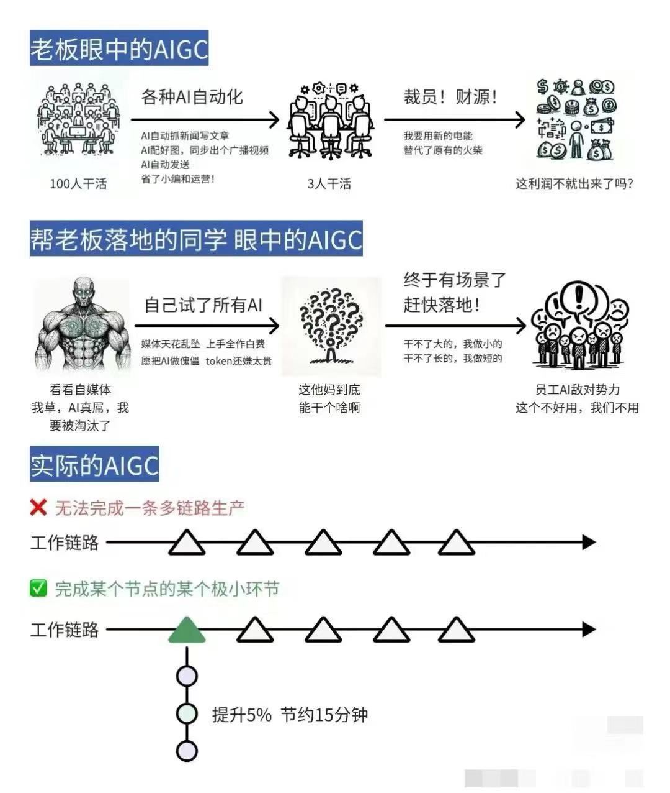
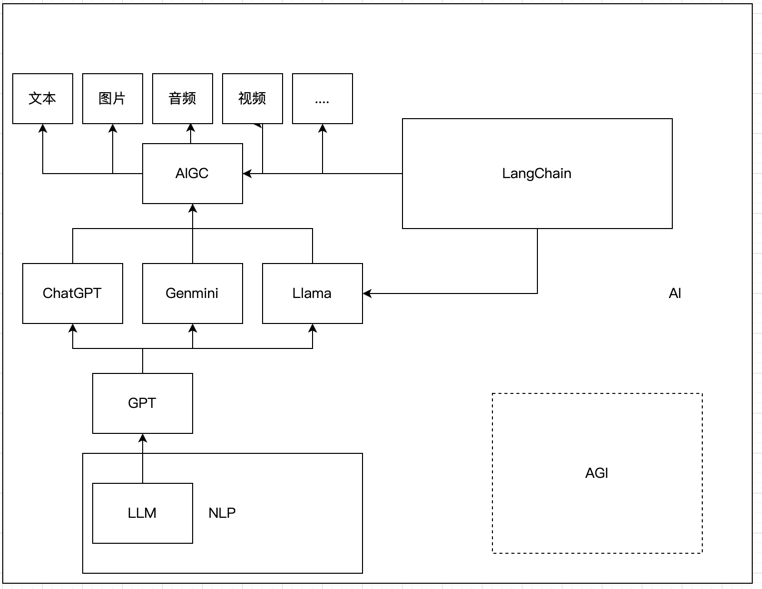
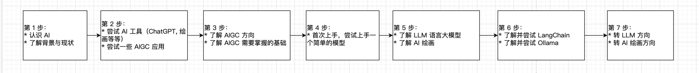

我是一个传统的开发者，应该如何学习`AI`相关的知识？应该如何转成 `AI Developer` 呢？ 
这个问题非常多人关注，作为一名程序员，我相信大多数同行都会有着相似的体验。从最初的好奇，到焦虑，再到试图理解和应用，这种心路历程几乎是共通的。
不论是从事IT行业还是其他行业，我们都在不同程度上努力去了解、学习和应用新技术。 
作为程序员，面对不断变革的技术，我们越发意识到系统化学习是理解和掌握它的关键途径，也是最有效的方法。
只有通过系统化学习，我们才能更好地理解技术，更好地适应变革，了解哪些方面的自己可能被取代，哪些方面的自己是独一无二的，同时也能减少焦虑情绪的困扰。

当我们谈到人工智能（AI）时，网络上的讨论和相关资料确实众多，涉及到入门 AI 的方式时，常常会提到诸如概率论、线性代数、统计学、优化算法、机器学习等等内容。
这些主题看起来非常庞大，一上来就是地狱难度，这确实可能让很多想学习 AI 的人望而却步。这些回答通常非常专业，但我认为它们缺乏清晰地阐述关于 AI 开发的方向。
我个人认为，目前 `AI` 有两个大方向：

1. `AI` 基建开发者
2. `AIGC` 开发者

## 本文概述

本博客中，您将了解到：

* AI 现状以及 AI 的种类
* AI 认知入门
* AIGC Developer 应该掌握什么技能
* AIGC Developer 发展方向与入门路线

## 学习目标

读完本博客，您将能够：

* 了解目前 AI 的趋势与发展方向
* 思考自己转成 AIGC Developer 的职业与方向
* 跟着 AIGC 学习指路学习

## `AI`现状分析

大家可以自己多搜索一下相关的资料，我这里根据自己的入门大概总结一下: 
首先 `AI` 开发是一个非常广泛的概念，相关的岗位与领域，不亚于`程序员`这个职业，也就是说它有很多细分的岗位

大家不要一听到再不学 `AI` 就要被淘汰了，首先 `AI` 虽然经过 `2023` 年的 `GPT` 发布，整个 `AI` 似乎爆炸性的增长了，实际上`AI`目前的处理能力，解决方案等，
还是不够成熟的。 

一个图总结一下目前 `AI` 的现状：

也就是说，`AI` 到目前为止，暂时还没有很好的落地，或者落地的成本很高，它只能走某个领域有一定的效率提升，`AI` 发展到后面，可能下面几个方向：

## AI, AIGC, AGI, GPT, ChatGPT, NLP，LLM, LangChain, Ollama 之间有什么关系？

AI（人工智能）是一个广泛的领域，它涵盖了多种技术和方法，旨在创建能够执行通常需要人类智能的任务的系统。AI包括机器学习、自然语言处理（NLP）、计算机视觉、机器人技术等多个子领域。

1. **NLP**（Natural Language Processing）: 是AI的一个子领域，专注于使计算机能够理解、解释和生成人类语言。GPT和ChatGPT都是NLP领域的技术成果。
2. **LLM**（Large Language Model）: 是指包含数亿甚至更多参数的语言模型，它们在大量文本数据上进行训练，以理解和生成自然语言。GPT系列模型就是LLM的代表。
3. **GPT**（Generative Pre-trained Transformer）: 是一种自然语言处理（NLP）的模型，由OpenAI开发。GPT的目标是理解和生成人类的自然语言，通过在大量文本数据上进行预训练，学习语言的各种模式和知识。
4. **ChatGPT**: 是基于GPT模型构建的聊天机器人，能够生成文本，回答问题和进行自然语言对话。它是GPT模型的一个具体应用实例，用于实现对话任务。除了 GPT 还有其他的很多优秀的模型，如 Google 的 Genmini，Meta 开源的 Llama 等等。
5. **AIGC**（AI Generated Content）: 是指利用AI技术自动生成的内容，例如文本、图像、音乐等。这是一种应用AI技术生成新内容的方法，可以看作是AI在创意产业中的应用。
6. **LangChain** : 是一个AI 开发框架，专注于构建由语言模型驱动的应用程序。它提供了一系列的组件和用例特定链，以帮助开发者创建聊天机器人、智能问答工具、摘要服务等应用程序。LangChain 可以与大型语言模型（如 GPT-3）结合使用，通过提供 Prompt templates、LLMs、Agents 和 Memory 等模块化的抽象组件，来构建高级的 AI 应用
7. **Ollama** 是一个开源的大型语言模型服务工具，它允许用户快速在本地运行大语言模型（如 Llama 3）。Ollama 旨在简化 AI 模型的开发和使用过程，使得无论是 AI 专业人士还是新手都能轻松地使用和开发 AI 应用。Ollama 支持多种主流模型，并且提供了与 OpenAI API 兼容的框架，让开发者可以更容易地将现有应用程序与 Ollama 相连接
8. **AGI**（Artificial General Intelligence）: 是指能够执行任何人类智能任务的机器智能，是一种理论上的AI形式，目前还未实现。AGI与目前普遍存在的专用或窄AI（ANI）不同，后者只能在特定任务上表现出智能。

这些概念和实体之间的关系可以概括为： AI是一个广泛的领域，NLP 是 AI 的一个子集，专注于语言处理；GPT和ChatGPT是NLP中的具体技术和应用；AIGC代表了AI在内容创作方面的应用；
LangChain 和 Ollama 简化与了 AI 模型的使用，可以理解成 LangChain 即将成为使用 AI 模型应用的标准框架，Ollama 则主要是为了简化 LLM 使用的工具，它没有 LangChain 提供的 AI 工具全面。
AGI是一个尚未实现的AI研究目标；LLM是实现GPT和ChatGPT等技术的大型语言模型。

AI 后续发展，可能会有以下几个大的方向：

### 领域专有 AI
比如专门的医学 `AI`，类似于现在大家用 `GPTs`，在上面上传一些医学的相关知识，它能回答用户一些医学问题。但是目前的`AI`还是离专业的医生有一段相当长的距离，
目前国内外许多公司也在研究某个领域专有的 `AI`，比如训练出一个`超级医生`之类的.

### 多模态 AI，终极形态 AGI
这种`AI`就是目前已 `GPT` 为代表的全能全知`AI`，这种`AI`可能是无所不能的，发展到到最后，可能就是黄仁勋说的，最后可能是资源的争夺（GPU 与 电量），谁能提供
超大规模的AI 资源，谁就能成为下一个`AI`巨头。

### 私有可部署小型 AI
现在比较多的人希望能出一个类似于私人助理的 `AI`，类似于`小爱同学`，或者 `Siri`，在手机或电脑上就能独立运行。将`AI`做小，做精细化，是目前`AI`比较大的一个
难题，因为`AI`目前的发展上看，需要的资源还是非常庞大的，尽管部分`AI`大模型能运行在个人电脑上，但是效果非常差。可能性可以看这篇文章：[ai手机-本地部署大模型](/projects/ai手机-本地部署大模型)

## `AI` 认知入门

如果你从来没有了解过AI 的相关东西，对`AI`的大部分术语与基础都不太了解，建议你先看看这个：
[通往 AGI 之路](https://waytoagi.feishu.cn/wiki/QPe5w5g7UisbEkkow8XcDmOpn8e)

这个网上收集了很多`AI`的相关资料与知识，适合绝大部分人`AI`入门，里面包含的东西也非常的多，看完之后对`AI`就有一个大概的印象了，这样对入门 `AIGC` 开发
打下了基础，方便自己转入`AI`开发。

需要指出的是这份资料目前也只是让你认识 `AI`，里面的东西太多了，我还是得强调一个问题，现阶段，大而全就就意味着不是很精，目前这份资料的每个领域还不是很系统化，
也不是很深入，但是作为入门`AI`的资料还是非常合格的。

作为开发者，我还建议你看看微软的这两篇 AI 入门文章，里面不仅有认知课程，还有使用 OpenAI 操作的经验，不过这对刚入门的同学来说可能有点难，不太懂，但是光看文章的话。
就能收获不少： 
AIGC： [Generative-Ai-For-Beginners](https://github.com/microsoft/generative-ai-for-beginners/blob/main/01-introduction-to-genai/translations/cn/README.md)  
AI: [AI-For-Beginners](https://github.com/microsoft/AI-For-Beginners)  

第一个主要是针对 AIGC 的，第二个是 AI 相关的，如果想入门 AI 基础建设的，卷算法的，可以看。

## 如何入门

`AI` 的相关知识浩如烟海，如果你想全部学会基本也是不太可能的事情，它有`机器学习`，`深度学习`，`自然语言处理（NLP）`,`计算机视觉`，`大模型 LLM`等等。 
相关的领域特别多，并且大部分的门槛也相当的，需要你精通数学或计算机基础。

### 具体方向
所以如果你需要入门`AI`开发，一定要先去了解，目前`AI`有什么领域与方向, 每个大方向上又有需要细分的领域，比如传统的后端开发者，也只是一个统称，包含的职业
不限于：`web 开发`，`api 开发`，`数据库管理`，`系统架构师`，`DevOps工程师`，`云计算`等等. 所以建议入门之前，先了解一下`AI`的大方向，以及具体每个方向
上的具体岗位与职业。

### `AI`基建开发者
AI 基建开发开发需要具备一系列技能和知识，除了编程语言，还需要精通机器学习和深度学习，数据处理和分析，算法和模型优化，深度神经网络等等。这些东西都需要
一定的数学功底，以及计算机基础，算法基础。

也就是说，如果一个普通的 `AI`，想要转变成这样的`AI`开发者，可以说非常难，大家可以看看我文章开头的链接，这里就不在展开了。

而且俗话说得好，万事开头难，中间难，结果也难。如果你一开始什么`AI` 基础都不会，只是一个普通开发者，想要直接过渡成`AI`开发者，可以说是非常难的，这种难度，
会直接卡着你的转变，凡事先易后难，先从入门相对较为容易的 `AIGC` 开发者入手，再慢慢过渡成`AI`基础建设开发者者，也是普通开发者更容易走的路。

### `AIGC` 开发者
生成式人工智能`AIGC（Artificial Intelligence Generated Content`）与`AI` 基础建设开发不太一样，AI基础建设开发主要集中在构建能够执行特定任务的模型，如分类、回归、聚类等。
而AIGC开发更侧重于生成内容，如文本、图像、音频等，通常使用生成式模型，如生成对抗网络（GANs）或变换器（Transformers）。 
AIGC开发更加强调模型的创造性和生成能力，能够生成新颖、有趣的内容，而AI基础建设开发更注重模型在特定任务上的准确性和效率。  需要更复杂的评估方法，如生成内容的质量、多样性、真实性等。
开发主要应用于内容生成、创意产业、艺术创作等领域, 可能涉及更多的伦理和道德考量，因为生成的内容可能会引发版权、隐私、虚假信息等问题，需要更谨慎地处理。

`AIGC` 开发者更注重的是应用领域，AI基础建设开发者开发的是`AI`相关技术的技术，基建，算法模型等等。而 `AIGC` 开发者 则更接近普通大众，是`AI` 算法模型的应用者。 
但不是说那些高数，算法，机器学习不重要，这是`AI`的基石。 
举个不太恰当的例子，AI基础建设开发就好比在开发操作系统，而 `AIGC` 则是在该系统上编写应用。那应用开发者需不需要理解底层系统原理呢？肯定是需要的，理解了底层的系统原理，
能够帮助我们写出更好的应用程序，但这是两个方向。一个人的精力是有限的，特别是底层`AI`技术的门槛更高，所以我建议普通开发者，应该学学会如何成本一个 AIGC 开发者，
在此基础上，再研究一些底层的原理，从而更好的帮助我们理解与开发`AI`应用。

## AIGC 方向
`AIGC`，目前主要关注利用生成式模型来创造各种类型的内容，如文本、图像、音频等。以下是关于`AIGC`方向的一些重要内容：

1. **文本生成**：在`AIGC`领域，文本生成是一个重要的应用方向。文本生成模型可以用于生成文章、故事、对话等文本内容，如`GPT`（生成式预训练模型）系列就是其中的代表。

2. **图像生成**：除了文本生成，`AIGC`还涉及图像生成。图像生成模型可以生成逼真的图像，`Stable Diffusion`，`Midjourney`，等模型可以生成艺术风格的图像。

3. **音频生成**：AIGC方向还包括音频生成，例如生成逼真的语音、音乐等，比如最近爆火的 Suno。

4. **视频生成**：生成式模型也可以用于视频生成，创造出逼真的视频内容。这涉及到对帧的生成和合成，例如最近非常火的 [Sora](https://openai.com/sora)。

5. **创意产业应用**：AIGC在创意产业中有着广泛的应用，如广告、艺术、设计等。通过AIGC技术，可以创造出新颖、有趣的内容，拓展创意空间, 比如[一键换衣](https://humanaigc.github.io/outfit-anyone/)

6. **安全，监管，对抗，伦理和道德考量**：在AIGC的发展过程中，也需要考虑伦理和道德问题，如内容真实性、版权问题、虚假信息等，需要加强监管和规范。 
这个领域可以说是一个确定的，且非常独特的领域。说到监管，很多人就想到政治问题，实际上监管包含的方面也很广泛，也不是说我国的`AI`才需要监管。 
首先安全这不必多少，必不可少。对抗也是，比如如何识别图片是`AI`生成的，如何识别文章，或者论文是`AI`生成的。监管就更不用说，如何让`AI`原理暴力，政治等，
这些都需要一些非常实际的需求。

## AIGC 基础技术
`AIGC` 由于领域与岗位不同，需要掌握的技术也不尽相同，这里说一下一些我认为作为一个普通的 AIGC 开发者，应该掌握的常规基础知识。
### Python 编程语言
Python 是`AIGC`领域中最常用的编程语言，具有丰富的库和工具，适合快速开发和实验。在这一部分，你可以探讨`Python`在`AIGC`中的具体应用、常用的库
（如`TensorFlow`、`PyTorch`等）以及如何利用`Python`进行数据处理、模型训练等。
可以这么说，目前几乎所有的`AI`相关的项目，都需要 `Python` 来作为入口运行，所以必须要掌握一定`Python` 基础。

### Linux/服务器基础知识
由于`AIGC`任务通常需要大量计算资源，哪怕一个项目能使用高性能的 PC 个人电脑跑，但它也是比较卡的，而我们作为开发者，是需要将项目部署到线上给用户用的，所以
掌握简单的服务器知识是必须的。熟悉`Linux`系统和服务器基础知识是至关重要的。

### Prompt Engineering
`Prompt Engineering`是指设计和构建用于生成式AI模型的输入提示（prompts）。这在训练和调整生成式模型时至关重要，可以影响生成内容的质量和准确性。你可以探讨如何设计有效的提示，如何优化提示以获得更好的生成结果等。
这个可能跟技术没什么关系，但是没一个入门的`AI`开发者都必须掌握的，好的提示词语差的提示词，对`AI`的效果是完全不同的，这里推荐一下吴恩达老师 联合 `OpenAI` 出品的
三个课程，每个课程非常值得学习： 
[《面向开发者的 Chatgpt 提示工程》](https://www.deeplearning.ai/short-courses/chatgpt-prompt-engineering-for-developers/)   [B站链接](https://www.bilibili.com/video/BV1e8411o7NP/?spm_id_from=333.337.search-card.all.click&vd_source=2f4061fc3b23895fcb9e8c4f34457290) 
[《使用 Chatgpt 构建系统》](https://www.deeplearning.ai/short-courses/building-systems-with-chatgpt/)   [B 站链接](https://www.bilibili.com/video/BV1zX4y187dw/?spm_id_from=333.788.recommend_more_video.12&vd_source=18fbb3e7f363c57cfeac5e175b356e96) 
[《LLM应用程序开发的LangChain》](https://www.deeplearning.ai/short-courses/langchain-for-llm-application-development/)   [B 站链接](https://www.bilibili.com/video/BV1zu4y1Z7mc/?spm_id_from=333.788.recommend_more_video.0&vd_source=18fbb3e7f363c57cfeac5e175b356e96) 

我认为每个` AIGC` 开发者都应该掌握上面的三个课程，甚至应该成为 `AIGC` 岗位的面试基础题。

### 数据处理与特征工程
在`AIGC`开发中，数据处理和特征工程是非常重要的环节。这包括数据清洗、特征提取、数据标注等工作，直接影响到模型的性能和生成内容的质量。 

### 模型训练与调优
了解如何训练和调优生成式模型是成为一名优秀的AIGC开发者所必备的技能。这包括选择合适的模型架构、调整超参数、优化训练过程等方面。 
并不是说成为 `AIGC` 开发者，就不需要优化`AI`模型的参数，如果是这样的话，那你跟只会调用 API 的程序员没有什么两样，很快就会被替代掉。以使用 `StableDiffusion` 为例，
我们需要知道如何训练大模型，Lora，以及出图的各种参数，这样成为某个AIGC 领域的专家，而不是一个 `CURD boy`.

另外有一个趋势是: 目前优秀大模型普通人或者普通公司都是玩不起的，它需要海量的资源支持，而非常优秀的`AI`模型通常都是闭源的。但是这不妨碍我们针对大模型进行
微调，`GPTs` 就是一个很典型的代表，只不过 `GPTs` 把微调的们门槛降低了，人人都可以是`AI` 的微调师。

**我在这里大胆的猜测，未来`AI`的模型很长一段时间应该都是闭源的，这个是`AI`公司的核心资产。但是它会开放一些微调能力，这些则需要每个`AI`相关的人都掌握，它不一定需要
编程能力，但是如果你理解了大模型与微调模型，底层基座之间的关系，对模型调优的帮助肯定非常大！！**

### 伦理与法律考量
在`AIGC`开发过程中，需要考虑到伦理和法律方面的问题，如数据隐私、版权问题、虚假信息等。我们用的大模型，或者某个`AI`项目是否是可以商用的，用的数据，是否是合法的。
或者是否会产生黄暴内容等等，这些都是需要相关的技术支撑。

## 入门路线

这个是我总结的入门路线：

1. 了解：先通过这篇文章，以及文章中的资料，以及网上的其他文章等等，先对 AI 有一个大概的了解。
2. 使用：如果你还没有尝试过对话模型： ChatGPT, Genmini, 或者是文心一言，豆包，Kimi, 或者是生成图片：liblib，吐司，妙鸭等等，那就赶紧去尝试一下，了解一下 AI 目前的发展，优缺点等等，再总结一下目前的 AIGC 的方方向，让自己心中有数。
3. 基础：按照这边文章的推荐基础，可以先学习 Prompt, 很多人可能都没有系统的学习过 Prompt，就看别人发的，然后复制一遍，为什么这些写，这些写有什么用，一无所知。再学习 Python，Linux 基础知识，以及会的可以跳过，但如果你连 Python 怎么定义变量，调用方法都不会，Linux 怎么下载文件，`cd` 命令行是什么意思都不知，那就需要掌握这些基础知识。
4. 入门尝试：尝试自己部署一个大模型：[手机部署大模型](/projects/ai手机-本地部署大模型)， 或者 [AI绘画入门](/draw/开发者-ai-绘画入门)
5. 更近一步：了解常用的 AI 相关工具或应用： LangChain, HuggingFace, Ollama ，或者了解绘画的 WebUI, ComfyUI, Midjourney, Stable Diffusion 等等
6. 深入学习：到了这一步，你对需要转那个 AIGC 方向有一个大概的方向了，然后朝着这个方向去深入学习即可

## AIGC 职业选择
就目前而言（2024.04），AIGC 的发展方向还是我上面提到的几个，如果你作为一名普通程序员，需要选择 AIGC 的方向，我有以下几点看法。

### 趋势比技术更重要
目前来说，国内还在大力发展 LLM 的，并且 LLM 也不是独立的文本生成，它也有图片等其他能力，目前整个 LLM 都是朝着多模态去发展的。 
总的来说 LLM 最复杂，但是前景最广，就业机会最多。

### 结合自身情况转行
比如你现在在的行业是做相册的，那无疑 AI 绘画是你的机会，结合自己所在的行业，去学习，借助公司或行业平台，以及自己原来的业务优势去转相关的产业，这样可能更容易成功。 
如果你本身是 QQ 音乐，网易云等音频相关行业的，那无疑研究 AI 音频赛道更加适合你转行。所以大家要根据自己的实际情况去转行，AI 每一个赛道的前景都不太一样，有时候选择比努力更重要。

## 本文总结
总的来说，想从一个普通开发者，转成一名 `AIGC` 开发者，需要：

1. 先了解一些`AI`的背景与方向
2. 再了解一些 `AIGC` 的领域与方向，现状与技术，略读并尝试[通往 AGI 之路](https://waytoagi.feishu.cn/wiki/QPe5w5g7UisbEkkow8XcDmOpn8e)中的例子与自己感兴趣的方向
3. 掌握 `AIGC` 基础开发知识
4. 根据自己当前的职业与技能，找一个自己感兴趣的领域入门，如：[AI绘画入门](/draw/开发者-ai-绘画入门)，或者：[手机部署大模型](/projects/ai手机-本地部署大模型) 等等

等基本了解差不多了，再根据`AI`发展的趋势，以及自己的职业规划，选择一个合适的方向，去深入研究与学习，这样在未来的`AI`浪潮中，自己就不会被`AI`所淘汰了。

## LLM 入门教程

### 入门
* [认知：普通开发者应该如何入门 AIGC 开发](/aigc/普通开发者应该如何入门-aigc-开发)
* [基础：大语言模型综述（比较复杂，但是能让你系统的了解 LLM）](https://github.com/RUCAIBox/LLMSurvey/blob/main/assets/LLM_Survey_Chinese.pdf)
* [Prompt: 面向开发者的 Prompt 工程 - AI 时代，必须掌握的 Prompt](https://github.com/GitHubDaily/ChatGPT-Prompt-Engineering-for-Developers-in-Chinese)
* [学会使用LLM 接口 - OpenAPI,LLM API](/llm/LLM-API-使用)
### 基础
基础篇主要是为了夯实基础，是对入门的一个补充，作为 AIGC 开发者，需要对底层技术有一定的了解

* [Understanding large language models ：理解大语言模型](https://www.wandb.courses/courses/take/building-llm-powered-apps/lessons/44341580-understanding-large-language-models)
* [NLP 入门课程](https://huggingface.co/learn/nlp-course/chapter1/1)
* [Transformers 入门课程](https://huggingface.co/docs/transformers/index)
* [Pytorch 入门课程1](https://github.com/xiaotudui/pytorch-tutorial)
* [Pytorch 入门课程2](https://fancyerii.github.io/books/pytorch/)

### 应用
应用是 AIGC 的重点，课程比较多：

* [云 LLM: 使用OpenAI 部署自己的 GPT](/llm/使用-OpenAI-部署自己的-GPT)
* [本地 LLM: 一文了解 Ollama](/llm/使用-OpenAI-部署自己的-GPT)
* [本地 LLM: Ollama 手机部署大模型]()
* [LLM 图片: 本地 LLM 实现图片问答]()
* [Huggingface： Huggingface 入门 ]()
* [LangChain：LangChain 详解]()

### 进阶
* [Function Calling：自然语言微调 LLM]()
* [RAG：检索增强生成 - 打造知识库]()
* [Fine-Tuning：微调 LLM - Ollama3 中文微调]()
* [Agent：打造自己的专属智能体]()
* [工具：LLM 应用开发工具链]()

## AI 绘画入门教程
