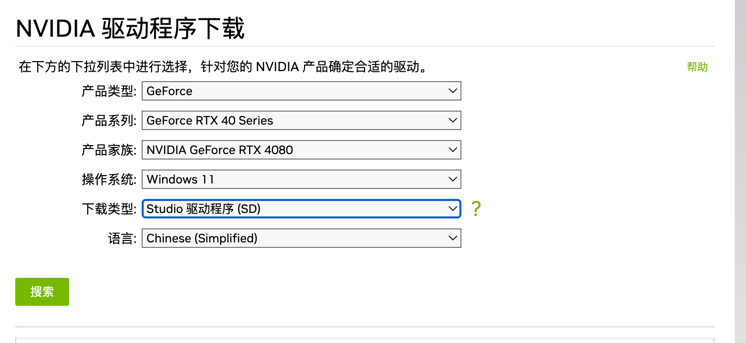
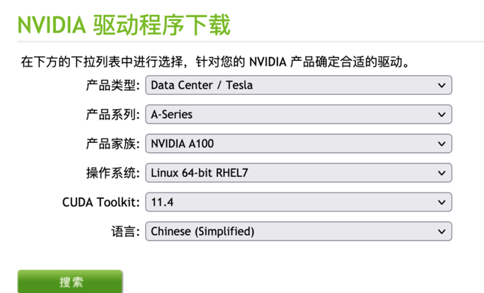
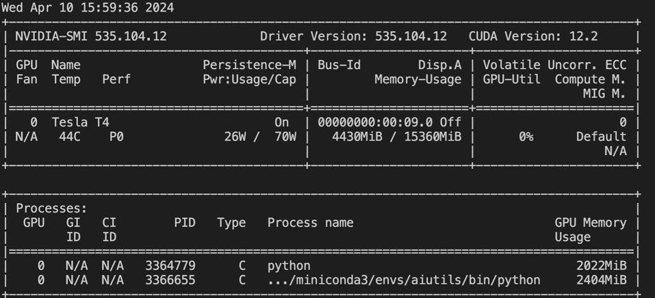
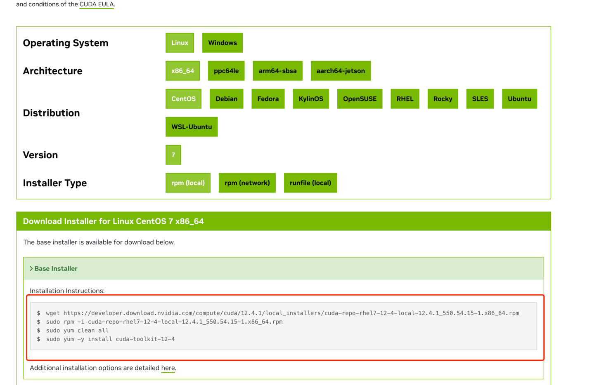
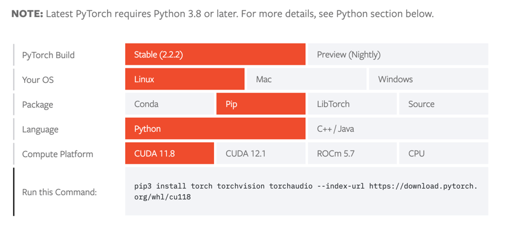
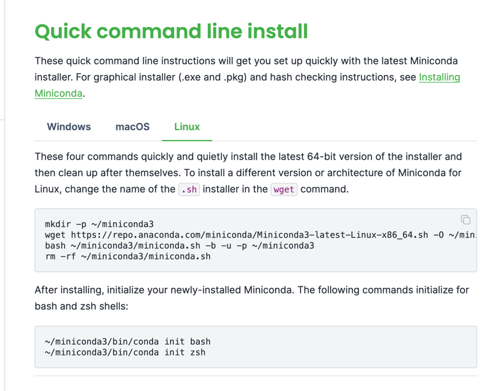
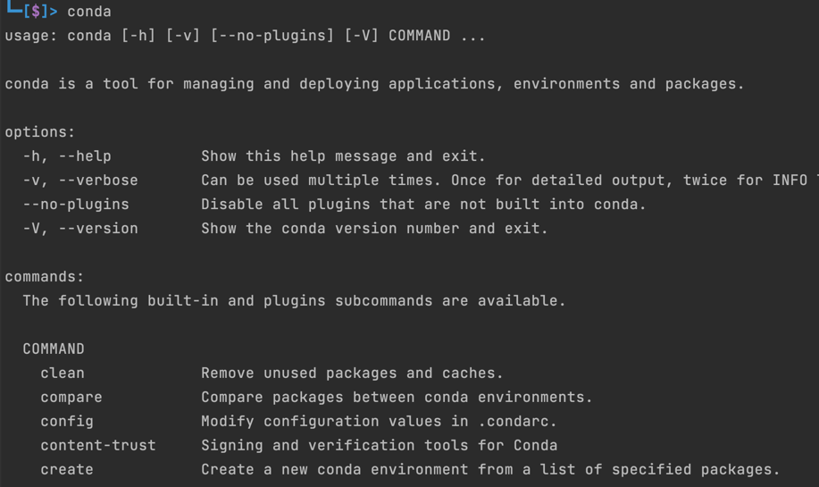

要部署 AI 项目，一定要学会 AI 的相关环境基础，不然遇到问题就束手无策，非开发者认为 [ComfyUI](https://github.com/comfyanonymous/ComfyUI) 才是 AI 的未来，那它是真的有那么好吗？下面我们就以它为例，
讲讲一个标准的 AI 项目，应该会有什么环境，或者它会依赖什么环境。<br>


## 现状
现在绝大多数的 AI 项目，基本上都提供一键运行能力，但是大部分人把它下载下来运行，都是运行不起来的，这是为什么呢？<br>
原因就是项目作者的环境，跟你当前的环境不一致，AI 项目相对于传统项目来说，要求的环境更加复杂，一般项目的 `README.MD` 文件中，会详细的说明安装运行所
需要的环境，依赖等。<br>
绝大多数的 AI 项目，基本都是依赖 Python 来完成相关的能力。Python 语法虽然简单，环境却非常复杂，再加上 AI 项目一般都需要用到 GPU，而 GPU 又是另外一个复杂的原因。

我们点开 [ComfyUI](https://github.com/comfyanonymous/ComfyUI) 的 `README.MD`，看看它对环境的要求：

```
NVIDIA
Nvidia users should install stable pytorch using this command:

pip install torch torchvision torchaudio --extra-index-url https://download.pytorch.org/whl/cu121

This is the command to install pytorch nightly instead which might have performance improvements:

pip install --pre torch torchvision torchaudio --index-url https://download.pytorch.org/whl/nightly/cu121

Troubleshooting
If you get the "Torch not compiled with CUDA enabled" error, uninstall torch with:

pip uninstall torch

And install it again with the command above.
```

这是一段摘自它的 `README.MD` 中的安装说明，我们来看看它的具体要求：

1. `torch` 以及 `torch` 相关的组件
2. 与 `CUDA` 相关

那什么是 `torch` 与 `CUDA` 呢？ 我们接下来分析。


## 基础知识

经常写代码的同学都知道，CPU 与 GPU 擅长的任务不一样。现在只要使用到 AI，基本上都必须用到 GPU, AI 相关的工作通常需要大量的并行计算和数值运算，这些运算需要高性能的硬件来实现。<br>
GPU（图形处理器）相对于CPU（中央处理器）在并行计算方面有着明显的优势，这就是为什么大部分AI相关的工作都倾向于使用GPU作为算力的原因:

1. 并行计算能力： GPU拥有成百上千个小型处理核心，这些核心可以同时处理多个任务，适合并行计算。相比之下，CPU的核心数量通常较少，更适合处理顺序计算任务。
2. 高性能计算： GPU设计用于处理图形和图像等大规模并行计算任务，因此在执行大规模矩阵运算和深度神经网络训练等AI任务时，GPU通常比CPU更高效。
3. 专门优化： GPU厂商（如NVIDIA）为AI和深度学习等任务专门优化了GPU架构和驱动程序, 例如 `CUDA`，使其更适合处理这些工作负载
4. 成本效益： 尽管GPU的价格通常比CPU高，但考虑到GPU在处理AI任务时的高效性能和速度，以及对大规模数据集的快速处理能力，使用GPU通常更加成本效益。
5. 深度学习框架支持： 许多流行的深度学习框架（如`TensorFlow`、`PyTorch`等）都针对GPU进行了优化，使得在GPU上运行这些框架更为高效。

总结就是: `先有显卡（GPU）后有天（CUDA），AI 更在天（CUDA）后面。`

也就是说，目前没有 GPU，就不要谈什么 AI 了，这也是为什么蔡崇信最近的讲话中提到，美国卡 GPU 的脖子导致阿里的 AI 发展很慢。现阶段，AI 仍然是大力出奇迹的时代，
 AI 的发展，背后需要庞大的算力与电力，有消息称微软测试 AI 把电力系统都搞崩了。 <br>
这也是为什么我在[普通开发者应该如何入门 AIGC 开发？](/blog/普通开发者应该如何入门-aigc-开发)文中说，AI发展到最后，可能就是能源之间的争夺。


## GPU 现状

回到算力，也就是 GPU，这个星球上最牛的，无疑是：Nvidia 英伟达，基本上所有的 AI 训练都是在英伟达显卡的基础上进行。<br>
那 AMD 有没有机会？AMD 部分型号的显卡，其实也是能跑 AI 的，但是一般都是适配了 `CUDA` 才跑起来的，并且性能远不如 Nvidia。这里我们又提到了
一次 `CUDA`， 先简单总结一下， `CUDA` 是英伟达开发的一个用于调用显卡能力的框架。<br>
也就是说，AMD 显卡是以非正常方式运行 AI 训练的，并且英伟达为了巩固自己的在 AI 的统治地位，放言后面会禁止修改 `CUDA`， 可能未来 AMD 就无法使用 `CUDA` 跑 AI 训练了。

### GPU 型号

常见的英伟达显卡有 A100、H100、GH200s、DGC GH200s、HGX H100s 等等，它们之间有什么区别？

H100是目前全球性能最高的专业级显卡，特别适合用来训练大语言模型这种超大规模参数的大模型。速度很快。在16-bit训练上，比A100快2.3倍，在16-bit的推理上比A100快3.5倍。
当然，与H100经常一起出现的还有H100s, GH200s, DGX GH200s, HGX H100s, 和 DGX H100s这些名称，其基本区别如下：<br>

H100 = 一个H100 GPU<br>
HGX H100 = Nvidia 的服务器参考平台，OEM厂商可用其构建一个包含4块GPU或8块GPU服务器。由像Supermicro这样的第三方OEM厂商制造。<br>
DGX H100 = Nvidia官方的H100服务器，配备8个H100 GPU。Nvidia是唯一的供应商。<br>
GH200 = 1x H100 GPU加上1x Grace CPU。<br>
DGX GH200 = 256个GH200，预计于2023年末推出。很可能仅由Nvidia提供。<br>


也就是说，H100只是一个显卡，但是尝试可以创建服务器，包含4个或者8个H100一起互联，用以提供给大模型训练等。这里还有一个注意的Grace CPU，这是英伟达自己基于ARM开发的服务端CPU。

### 厂商拥有的GPU数量
截至2023年11月，Nvidia GPU 的供应和需求情况大概如下：

* Meta 有 2.1万块A100，2.5万块H100，但是希望再买1万块
* Tesla有 7000块A100
* StabilityAI有5000块A100
* GPC有2.5万块H100
* Azure有1-4万块H100
* CoreWeavw有3.5-4万块H100
* OpenAI 可能有5万块H100
* Infection希望有2.2万块H100

**可以看到 OpenAI 在显卡上有绝对的优势，这也是它在 AI 上能先发一步的重要原因。**

## GPU驱动
显卡 GPU 需要驱动才能运行，由于厂家发布了非常多的型号的 GPU，所以我们需要根据自己的显卡去下载不同的驱动:[下载地址](https://www.nvidia.cn/Download/index.aspx?lang=cn),
一般来说买显卡的时候有光盘自带的驱动，如果没有的话，点刚才的链接也能下载。<br>
比如比较出名的 RTX 4080，应该怎么下载驱动呢？



产品：RTX 是 GeFore 系列<br>
系列：GeFore RTX 40 Series, 还有另外一个是笔记本的，我们这里选非笔记的<br>
家族：4080，没啥好说的<br>
操作系统：根据自己的操作系统选择，如果是开发者，一般是 Linux 服务器，linux aarch64 是 ARM 架构的， linux 64-bit 是 X64 架构的服务器<br>
类型：Studio 是美术，绘画等类，还有一个是 Game 类型，由于我们不是打游戏，所以选 Studio<br>
语言：中文简体<br>

作为开发者的话，在服务器用的比较常见的是工业显卡，一般是 A100，A100 的驱动安装大概是这样：



### 查看服务器显卡与驱动
如果不知道自己的服务器显卡型号，或者是否安装驱动了，可以输入`lspci | grep NVIDIA`：

```
00:09.0 3D controller: NVIDIA Corporation TU104GL [Tesla T4] (rev a1)
```

这说明我的目前服务器上有一个 `Tesla T4` 的显卡，查看自己安装了驱动没有，可以输入`nvidia-smi`：



如果有信息输出，就说明安装了驱动，从上图我们可以看到，我当前的服务器，驱动是 `535.104.12`， CUDA 版本是 ：`12.2 `, 另外还有一些其他信息，
比如我的显卡是  `Tesla T4`, 目前已经使用显存：`4430MiB`, 总共显存：`15360MiB`, 此外还列举了那些程序在用我的显存。<br>
CUDA 我们将在下一节讲，驱动的版本 `535.104.12` 类似于 Java 语言的 jdk6,jdk8，或者 Python2.0，Python3.10 等版本，一般来说下载的时候，选择的
CUDA Toolkit 会跟驱动的版本一一对应的。

## CUDA
CUDA（Compute Unified Device Architecture）是由NVIDIA开发的并行计算平台和编程模型，允许开发人员利用GPU的并行计算能力来加速应用程序的执行。
使用CUDA，开发人员可以编写C/C++或CUDA Python（PyCUDA）等语言的代码，利用GPU的并行性执行计算密集型任务。

说白了就是驱动只是基础，在它上面还有一个必须在装一个 CUDA 才能更好的进行编码，这也是英伟达最重要的护城河之一。现代 AI 项目基本上都是基于 CUDA 的基于上
来运行 AI 代码的。

以文中开头提到到 ComfyUI 为例，如果需要安装 `torch`, 那它就必定需要一个特定的 `CUDA` 版本才行. 下一节会详细介绍它们之间的关系。

正常情况下，需要运行 AI 项目，我们需要安装 `torch`，安装 `torch` 就要求 `CUDA` 版本，如果 `CUDA` 版本不对，那我们就需要升级：[升级链接](https://developer.nvidia.com/cuda-toolkit-archive)

先在上面找到自己想要的版本，然后选择点击进去，如下：
https://developer.nvidia.com/cuda-downloads?target_os=Linux&target_arch=x86_64&Distribution=CentOS&target_version=7&target_type=rpm_local



我们根据自己的机器环境，选择，就会生成特定的命令，然后执行命令安装即可。

### CUDA 与 Driver 版本关系

CUDA 也不能乱安装，比如说你当前的显卡版本是 460.xxx, 那直接安装最新的12.4, 会安装不成功，或者 AI 项目运行不起来。这个时候我们就会回到前面那一节，
安装或升级驱动，将驱动升级到我们需要的版本即可。怎么看他们之间是否能对应呢？<br>


我们可以看这个表格，CUDA 与驱动之间的兼容关系：https://docs.nvidia.com/cuda/cuda-toolkit-release-notes/index.html

| CUDA Toolkit                                      | Linux x86_64 Driver Version | Windows x86_64 Driver Version |
|---------------------------------------------------|-----------------------------|-------------------------------|
| CUDA 12.4 Update 1                                | >=550.54.15                 | >=551.78                      |
| CUDA 12.4 GA                                      | >=550.54.14                 | >=551.61                      |
| CUDA 12.3 Update 1                                | >=545.23.08                 | >=546.12                      |
| CUDA 12.3 GA                                      | >=545.23.06                 | >=545.84                      |
| CUDA 12.2 Update 2                                | >=535.104.05                | >=537.13                      |
| CUDA 12.2 Update 1                                | >=535.86.09                 | >=536.67                      |
| CUDA 12.2 GA                                      | >=535.54.03                 | >=536.25                      |
| CUDA 12.1 Update 1                                | >=530.30.02                 | >=531.14                      |
| CUDA 12.1 GA                                      | >=530.30.02                 | >=531.14                      |
| CUDA 12.0 Update 1                                | >=525.85.12                 | >=528.33                      |
| CUDA 12.0 GA                                      | >=525.60.13                 | >=527.41                      |
| CUDA 11.8 GA                                      | >=520.61.05                 | >=520.06                      |
| CUDA 11.7 Update 1                                | >=515.48.07                 | >=516.31                      |
| CUDA 11.7 GA                                      | >=515.43.04                 | >=516.01                      |
| CUDA 11.6 Update 2                                | >=510.47.03                 | >=511.65                      |
| CUDA 11.6 Update 1                                | >=510.47.03                 | >=511.65                      |
| CUDA 11.6 GA                                      | >=510.39.01                 | >=511.23                      |
| CUDA 11.5 Update 2                                | >=495.29.05                 | >=496.13                      |
| CUDA 11.5 Update 1                                | >=495.29.05                 | >=496.13                      |
| CUDA 11.5 GA                                      | >=495.29.05                 | >=496.04                      |
| CUDA 11.4 Update 4                                | >=470.82.01                 | >=472.50                      |
| CUDA 11.4 Update 3                                | >=470.82.01                 | >=472.50                      |
| CUDA 11.4 Update 2                                | >=470.57.02                 | >=471.41                      |
| CUDA 11.4 Update 1                                | >=470.57.02                 | >=471.41                      |
| CUDA 11.4.0 GA                                    | >=470.42.01                 | >=471.11                      |
| CUDA 11.3.1 Update 1                              | >=465.19.01                 | >=465.89                      |
| CUDA 11.3.0 GA                                    | >=465.19.01                 | >=465.89                      |
| CUDA 11.2.2 Update 2                              | >=460.32.03                 | >=461.33                      |
| CUDA 11.2.1 Update 1                              | >=460.32.03                 | >=461.09                      |
| CUDA 11.2.0 GA                                    | >=460.27.03                 | >=460.82                      |
| CUDA 11.1.1 Update 1                              | >=455.32                    | >=456.81                      |
| CUDA 11.1 GA                                      | >=455.23                    | >=456.38                      |
| CUDA 11.0.3 Update 1                              | >=450.51.06                 | >=451.82                      |
| CUDA 11.0.2 GA                                    | >=450.51.05                 | >=451.48                      |
| CUDA 11.0.1 RC                                    | >=450.36.06                 | >=451.22                      |
| CUDA 10.2.89                                      | >=440.33                    | >=441.22                      |
| CUDA 10.1 (10.1.105 general release, and updates) | >=418.39                    | >=418.96                      |
| CUDA 10.0.130                                     | >=410.48                    | >=411.31                      |
| CUDA 9.2 (9.2.148 Update 1)                       | >=396.37                    | >=398.26                      |
| CUDA 9.2 (9.2.88)                                 | >=396.26                    | >=397.44                      |
| CUDA 9.1 (9.1.85)                                 | >=390.46                    | >=391.29                      |
| CUDA 9.0 (9.0.76)                                 | >=384.81                    | >=385.54                      |
| CUDA 8.0 (8.0.61 GA2)                             | >=375.26                    | >=376.51                      |
| CUDA 8.0 (8.0.44)                                 | >=367.48                    | >=369.30                      |
| CUDA 7.5 (7.5.16)                                 | >=352.31                    | >=353.66                      |
| CUDA 7.0 (7.0.28)                                 | >=346.46                    | >=347.62                      |

## Torch/PyTorch

上一节中，我们提到了 Torch ，要运行Torch，就必须安装 CUDA，那 Torch 是什么？

Torch 是一个开源的深度学习框架，由 Facebook 开发和维护。它提供了灵活的深度学习开发工具，支持动态计算图和易于使用的API。
Torch 可以利用 CUDA 加速深度学习模型的训练和推理过程，通过在 GPU 上执行张量运算，提高模型的性能和效率。<br>

我们都知道 AI 项目基本上都是使用 Python 编译运行的， Torch 和 PyTorch 之间的关系是继承和接口的关系。PyTorch 是 Torch 的一个分支，
专门针对Python语言进行了优化和接口设计，使得Python用户能够方便地使用Torch库进行科学计算和深度学习研究。<br>

PyTorch 官方网站：https://pytorch.org/

我们说 Torch, 通常说的其实就是 PyTorch. 就好比我们说 AI 显卡，默认说的就是英伟达的显卡。

### ComfyUI 的 PyTorch 版本
我们回到文章的最开头，ComfyUI的安装中要求：

```shell
pip install torch torchvision torchaudio --extra-index-url https://download.pytorch.org/whl/cu121
```

意思是我们要安装 CUDA 12.1 版本的 对应的 Torch。

### 安装

安装 PyTorch 链接: https://pytorch.org/get-started/locally/




PyTorch Build：版本，通常选第一个，第二个是预览版，不稳定，bug 比较多<br>
Your OS：你的机器系统<br>
Package：意思是安装方式，一般选 pip 或者 conda， conda 是我们下一节要讲的重点<br>
Language：没有意外都是 Python<br>
Compute Platform：版本，根据 Comfy 的要求，选 CUDA 12.1<br>

如果选 12.1 现在默认是这样的：

```shell
pip3 install torch torchvision torchaudio
```

这表示使用最新的版本安装，如果 Torch 发布了最新的版本，那你安装的可能不是 12.1 这也是为什么 ComfyUI 项目后面加上了
`--extra-index-url https://download.pytorch.org/whl/cu121` 的原因, 作者已经考虑了，如果发布新的版本，项目未必支持，不愧是一个优秀的开源项目。

## Conda

首先我们都知道 AI 是使用 Python 语言来编译运行的，但是 Python 语言其实是一门非常老的语言，它的包/依赖管理一开始没有设计好，导致非常的混乱，各种 API 之间
没法很好的兼容。

如果 ComfyUI 要求的一个机器学习组件的版本是 1.3.0， 但是另外一个老照片修复，要求的版本是 3.4.0, 这个机器学习没有兼容好这两个版本，他们两个的 API 不相同。<br>
此时，你的机器，只能安装一个，如果安装了 3.4.0， 那 ComfyUI 没法运行，如果安装了 1.3.0，那老照片修复没法运行。
除非我们准备两台机器，那成本就很高了。

这个时候，Conda 横空出世，它可以创建多个不同的 Python 环境来运行不同的项目。比如 ComfyUI 我们在环境 `py_comfy` 下运行， 老照片修复在 `py_fix_old_photo` 下运行。
这样，我们就可以在同一个机器下运行多个不同的项目了。

Conda 也有很多个版本，一般来说，我们只需要安装 `MiniConda` 即可：https://docs.anaconda.com/free/miniconda/index.html <br>

大家根据自己的机器环境进行安装：



一般来说，**安装好 Conda 后需要重启 Shell，否则会提示命令不存在**，重启 Shell 之后，输入 Conda，有输入就说明安装成功了：



### 创建一个新的环境

```shell
conda create -n myenv python=3.10
```

其中 `myenv` 是环境的名字， `python=3.10` 意思是使用 Python 版本是 3.10，如果不写，默认是用机器当前的 Python 环境。

### 切换并激活环境

```shell
conda activate myenv
```

激活环境后，这个环境安装的任何 Python 组件或包，都不会影响当前机器，或者其他环境，可以说 Conda 是每个开发者的必备工具。

### Pip 与 conda
我们看到，ComfyUI 给我们的安装命令是 pip 而不是 conda，这是因为 ComfyUI 的作者考虑并不是每一个人都会使用 Conda，所以他给的是 Python 自带的安装
命令 pip 而不是 conda，我们只需要把 pip 改成 conda 即可:

```shell
conda install torch torchvision torchaudio --extra-index-url https://download.pytorch.org/whl/cu121
```

## Dependencies 依赖

上一节讲到了 Conda 创建了一个环境，用来安装分离项目依赖里的不同组件，避免因为版本冲突导致项目无法运行。其中依赖的组件，我们一般写在一个 `requirements.txt` 的文件里，
以 ComfyUI 为例，把 pip 替换成 conda：

```shell
conda install -r requirements.txt
```

通常 conda 能兼容 pip 中的 `requirements.txt` 的语法，另外如果 `requirements.txt` 中的组件依赖有版本冲突，它也能自动解决。

requirements 一行一个组件，如果不写版本，那默认就是拉最新的版本(这也是为啥有的项目当时能运行，过个半年一年再运行就报错的原因)：

```
transformers>=4.25.1
```

这句话就是说拉取 `transformers` 组件，版本大于等于 `4.25.1`


## 总结

到这里整个环境的介绍就结束了，如果一个 AI 项目，按照作者的运行说明，一键运行，运行不起来，很大的原因就是因为环境没有配置好，ComfyUI 本身是一个
非常优秀的项目，但是很多同学反馈直接导入别人的 json 文件运行不起来，大抵就是环境不正确。

总结一下大概的流程，我们运行一个 AI 项目：

1. 项目使用 Python 编写，依赖组件写在了 `requirements.txt` 文件中
2. `requirements.txt` 如果直接使用 pip 安装，可能会导致其他项目报错，需要用 conda 替换
3. AI 项目通常需要使用 PyTorch 来进行深度学习
4. PyTorch 需要特定的 CUDA 版本
5. CUDA 版本与显卡的驱动版本需要兼容
6. 查看显卡与驱动信息，使用`lspci` 与`nvidia-smi`

## 国产显卡

这一节跟环境无关，说点显卡的题外话。我们都知道现在国内的大厂的显卡都被卡脖子了，然后国内也在大力发展 GPU，但通过上面的介绍，我们除了在硬件上，其实在
软件上也有很多相关的组件需要大力发展。

假设国产显卡开发了一个很牛逼的显卡，媲美英伟达的最新显卡。然后它也有了自己的驱动，类似的调用程序，比如叫 C-CUDA，但是我们也是没法直接用的。<br>
比如 ComfyUI 要求安装 PyTorch, PyTorch 里面调用的 CUDA 接口跟 C-CUDA可能不一样，这时候，我们就需要 C-CUDA 的接口与 CUDA 的对齐，不然哪怕这个 AI 项目适配了 C-CUDA，其他 AI
项目呢？ 所以，现阶段 CUDA 就是 显卡/AI 的标准接口。

据我所知，国产显卡目前就是根据 CUDA 的接口，写一模一样的 API 来兼容项目的运行, 里面的则根据 API 的意思，自己实现一套。<br>
除了 CUDA，还有 Torch 等等一系列的基础框架，都需要考虑如何兼容，或者制定自己的标准。

同时我们可以弯道超车，英伟达在之前也不过是被人戏称为 `游戏公司`。之前大多数都是通用 GPU，也就是说除了能跑 AI 显示，还可以玩游戏等等，
国外目前在大力发展的 [TPU](https://www.wevolver.com/article/tpu-vs-gpu-in-ai-a-comprehensive-guide-to-their-roles-and-impact-on-artificial-intelligence)，
就是专门用来 AI 推理，这个方向，国外也刚发展不是很久，我们可以发展自己的 TPU，实现弯道超车。


