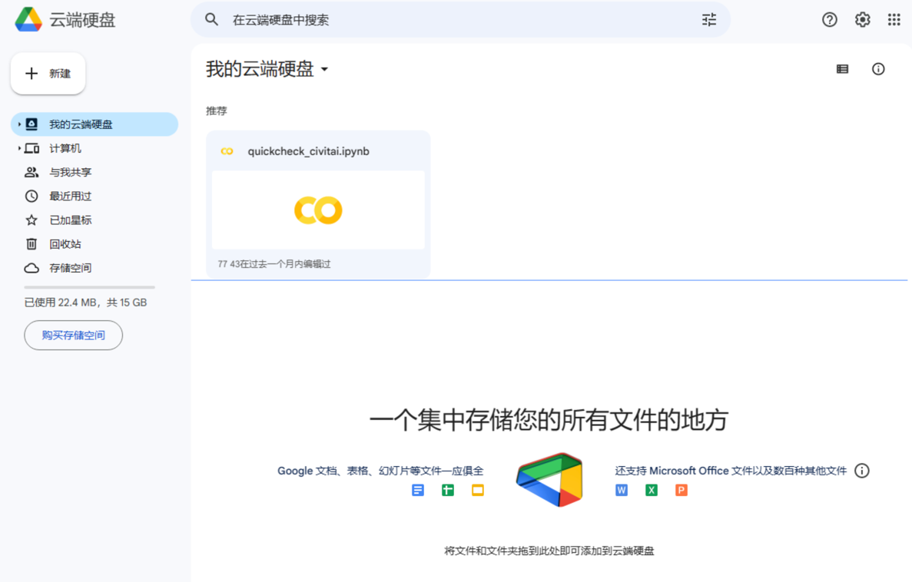
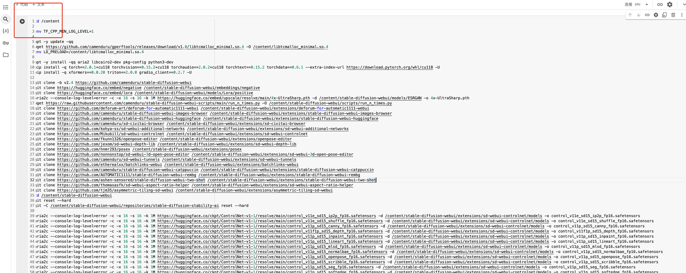
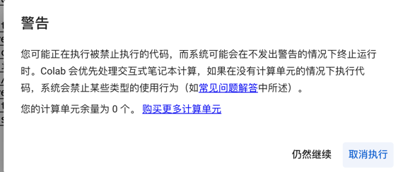
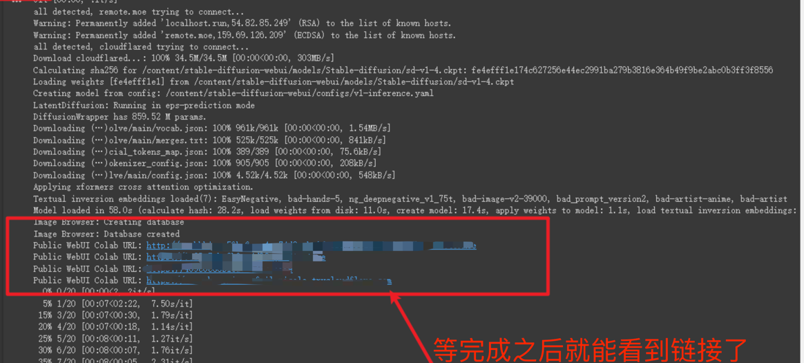

# 常用的两种生图工具
## WebUI
## ComfyUI
## 本地使用
### Windows
### Mac
## 云端使用
### 模型网站
### 云端服务商
#### 随用随走
随用随走主打的就是一个体验 SD 的生图，里面生成的图片，下载的大模型，训练的 Lora 是无法保存的，除非你把生成的东西挂在到对应的硬盘上，否则一旦
实例销毁了，生成的东西就再也找不到了！！！

1. google colab
google colab 每个月有一定的免费GPU 资源可以使用，超过限制就无法使用了，如果方法不行，大家可以尝试其他方式。 
另外 colab 一段时间不活动之后就会回收资源。 
申请谷歌云盘： 
  
打开这里：[stable-diffusion-webui-colab](https://github.com/camenduru/stable-diffusion-webui-colab)
  
点击左上角的运行按钮： 
  
运行的时候会弹出警告，大概得意思是，现在谷歌没钱了，GPU 可能不能免费给你用了，点：`仍然继续`: 
  
等完成之后，就能看到链接了: 
  
注意！链接没有加密的，谁都可以访问，所以一定不能暴露自己的链接给别人，特别是你选择用钱买的 Colab
2. 国内云厂商
腾讯云，阿里云等，有时候会推出一键部署 StableDiffusion 活动的功能，一般是按照小时收费，一个小时大概 3 到 6 块钱左右，看具体的服务器配置，大家可以
关注一下他们的官网活动，如果找不到可以咨询一下相关的客服。
为了避免打广告的嫌疑，我这里就不放链接了，大家可以自己去看。
#### 购买 GPU 服务器
GPU 购买需要有一定编程基础的同学，详细可以看这篇文章
[GPU 服务器部署 StableDiffusion](/blog/aigc/)  

