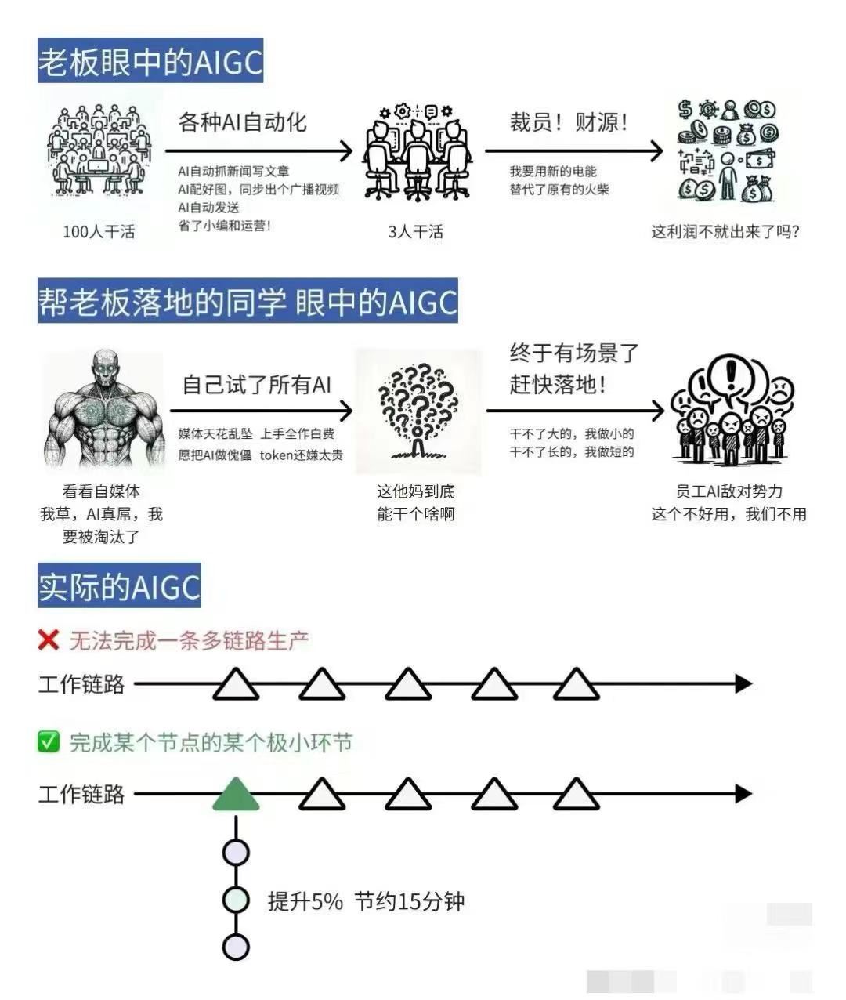

我是一个传统的开发者，应该如何学习`AI`相关的知识？应该如何转成 `AI Developer` 呢？ 
这个问题非常多人关注，毕竟作为一个开发者，肯定不想错过即将来临的 `AI` 浪潮，这个问题，可以看知乎的相关回答：
https://www.zhihu.com/question/263823175/answer/3157821046 

知乎上的前面几位答主回答的非常专业，但是我认为他们没有讲清楚 `AI` 开发的方向。我个人认为，目前 `AI` 有两个方向：

1. `AI` 基建开发者
2. `AIGC` 开发者

##`AI`现状分析

大家可以自己多搜索一下相关的资料，我这里根据自己的入门大概总结一下:

首先 `AI` 开发是一个非常广泛的概念，相关的岗位与领域，不亚于`程序员`这个职业，也就是说它有很多细分的岗位

大家不要一听到再不学 `AI` 就要被淘汰了，首先 `AI` 虽然经过 `2023` 年的 `GPT` 发布，整个 `AI` 似乎爆炸性的增长了，实际上`AI`目前的处理能力，解决方案等，
还是不够成熟的。 

一个图总结一下目前 `AI` 的现状：

也就是说，`AI` 到目前为止，暂时还没有很好的落地，或者落地的成本很高，它只能走某个领域有一定的效率提升，`AI` 发展到后面，可能下面几个方向：

### 领域专有 AI
比如专门的医学 `AI`，类似于现在大家用 `GPTs`，在上面上传一些医学的相关知识，它能回答用户一些医学问题。但是目前的`AI`还是离专业的医生有一段相当长的距离，
目前国内外许多公司也在研究某个领域专有的 `AI`，比如训练出一个`超级医生`之类的.

### 多模态 AI
这种`AI`就是目前已 `GPT` 为代表的全能全知`AI`，这种`AI`可能是无所不能的，发展到到最后，可能就是黄仁勋说的，最后可能是资源的争夺（GPU 与 电量），谁能提供
超大规模的AI 资源，谁就能成为下一个`AI`巨头。

### 私有可部署小型 AI
现在比较多的人希望能出一个类似于私人助理的 `AI`，类似于`小爱同学`，或者 `Siri`，在手机或电脑上就能独立运行。将`AI`做小，做精细化，是目前`AI`比较大的一个
难题，因为`AI`目前的发展上看，需要的资源还是非常庞大的，尽管部分`AI`大模型能运行在个人电脑上，但是效果非常差。可能性可以看这篇文章：[ai手机-本地部署大模型](/blog/ai手机-本地部署大模型)

## 如何入门

`AI` 的相关知识浩如烟海，如果你想全部学会基本也是不太可能的事情，它有`机器学习`，`深度学习`，`自然语言处理（NLP）`,`计算机视觉`，`大模型 LLM`等等。 
相关的领域特别多，并且大部分的门槛也相当的，需要你精通数学或计算机基础。

### 具体方向
所以如果你需要入门`AI`开发，一定要先去了解，目前`AI`有什么领域与方向, 每个大方向上又有需要细分的领域，比如传统的后端开发者，也只是一个统称，包含的职业
不限于：`web 开发`，`api 开发`，`数据库管理`，`系统架构师`，`DevOps工程师`，`云计算`等等. 所以建议入门之前，先了解一下`AI`的大方向，以及具体每个方向
上的具体岗位与职业。

### `AI`基建开发者
AI 基建开发开发需要具备一系列技能和知识，除了编程语言，还需要精通机器学习和深度学习，数据处理和分析，算法和模型优化，深度神经网络等等。这些东西都需要
一定的数学功底，以及计算机基础，算法基础。

也就是说，如果一个普通的 `AI`，想要转变成这样的`AI`开发者，可以说非常难，大家可以看看我文章开头的链接，这里就不在展开了。

而且俗话说得好，万事开头难，中间难，结果也难。如果你一开始什么`AI` 基础都不会，只是一个普通开发者，想要直接过渡成`AI`开发者，可以说是非常难的，这种难度，
会直接卡着你的转变，凡事先易后难，先从入门相对较为容易的 `AIGC` 开发者入手，再慢慢过渡成`AI`基础建设开发者者，也是普通开发者更容易走的路。

### `AIGC` 开发者
生成式人工智能`AIGC（Artificial Intelligence Generated Content`）与`AI` 基础建设开发不太一样，AI基础建设开发主要集中在构建能够执行特定任务的模型，如分类、回归、聚类等。
而AIGC开发更侧重于生成内容，如文本、图像、音频等，通常使用生成式模型，如生成对抗网络（GANs）或变换器（Transformers）。 
AIGC开发更加强调模型的创造性和生成能力，能够生成新颖、有趣的内容，而AI基础建设开发更注重模型在特定任务上的准确性和效率。  需要更复杂的评估方法，如生成内容的质量、多样性、真实性等。
开发主要应用于内容生成、创意产业、艺术创作等领域, 可能涉及更多的伦理和道德考量，因为生成的内容可能会引发版权、隐私、虚假信息等问题，需要更谨慎地处理。

`AIGC` 开发者更注重的是应用领域，AI基础建设开发者开发的是`AI`相关技术的技术，基建，算法模型等等。而 `AIGC` 开发者 则更接近普通大众，是`AI` 算法模型的应用者。 
但不是说那些高数，算法，机器学习不重要，这是`AI`的基石。 
举个不太恰当的例子，AI基础建设开发就好比在开发操作系统，而 `AIGC` 则是在该系统上编写应用。那需不需要理解底层系统原理呢？肯定是需要的，理解了底层的系统原理，
能够帮助我们写出更好的应用程序，但这是两个方向。一个人的精力是有限的，特别是底层`AI`技术的门槛更高，所以我建议普通开发者，应该学学会如何成本一个 AIGC 开发者，
在此基础上，再研究一些底层的原理，从而更好的帮助我们理解与开发`AI`应用。

## AIGC 方向
`AIGC`，目前主要关注利用生成式模型来创造各种类型的内容，如文本、图像、音频等。以下是关于`AIGC`方向的一些重要内容：

1. **文本生成**：在`AIGC`领域，文本生成是一个重要的应用方向。文本生成模型可以用于生成文章、故事、对话等文本内容，如`GPT`（生成式预训练模型）系列就是其中的代表。

2. **图像生成**：除了文本生成，`AIGC`还涉及图像生成。图像生成模型可以生成逼真的图像，`Stable Diffusion`，`Midjourney`，等模型可以生成艺术风格的图像。

3. **音频生成**：AIGC方向还包括音频生成，例如生成逼真的语音、音乐等。

4. **视频生成**：生成式模型也可以用于视频生成，创造出逼真的视频内容。这涉及到对帧的生成和合成，例如最近非常火的 [Sora](https://openai.com/sora)。

5. **创意产业应用**：AIGC在创意产业中有着广泛的应用，如广告、艺术、设计等。通过AIGC技术，可以创造出新颖、有趣的内容，拓展创意空间, 比如[一键换衣](https://humanaigc.github.io/outfit-anyone/)

6. **安全，监管，对抗，伦理和道德考量**：在AIGC的发展过程中，也需要考虑伦理和道德问题，如内容真实性、版权问题、虚假信息等，需要加强监管和规范。 
这个领域可以说是一个确定的，且非常独特的领域。说到监管，很多人就想到政治问题，实际上监管包含的方面也很广泛，也不是说我国的`AI`才需要监管。 
首先安全这不必多少，必不可少。对抗也是，比如如何识别图片是`AI`生成的，如何识别文章，或者论文是`AI`生成的。监管就更不用说，如何让`AI`原理暴力，政治等，
这些都需要一些非常实际的需求。

##`AI`印象
如果你从来没有了解过AI 的相关东西，对`AI`的大部分术语与基础都不太了解，建议你先看看这个：
[通往 AGI 之路](https://waytoagi.feishu.cn/wiki/QPe5w5g7UisbEkkow8XcDmOpn8e)

这个网上收集了很多`AI`的相关资料与知识，适合绝大部分人`AI`入门，里面包含的东西也非常的多，看完之后对`AI`就有一个大概的印象了，这样对入门 `AIGC` 开发
打下了基础，方便自己转入`AI`开发。

需要指出的是这份资料目前也只是让你认识 `AI`，里面的东西太多了，我还是得强调一个问题，现阶段，大而全就就意味着不是很精，目前这份资料的每个领域还不是很系统化，
也不是很深入，但是作为入门`AI`的资料还是非常合格的。

## AIGC 基础技术
`AIGC` 由于领域与岗位不同，需要掌握的技术也不尽相同，这里说一下一些我认为作为一个普通的 AIGC 开发者，应该掌握的常规基础知识。
### Python 编程语言
Python 是`AIGC`领域中最常用的编程语言，具有丰富的库和工具，适合快速开发和实验。在这一部分，你可以探讨`Python`在`AIGC`中的具体应用、常用的库
（如`TensorFlow`、`PyTorch`等）以及如何利用`Python`进行数据处理、模型训练等。
可以这么说，目前几乎所有的`AI`相关的项目，都需要 `Python` 来作为入口运行，所以必须要掌握一定`Python` 基础。

### Linux/服务器基础知识
由于`AIGC`任务通常需要大量计算资源，哪怕一个项目能使用高性能的 PC 个人电脑跑，但它也是比较卡的，而我们作为开发者，是需要将项目部署到线上给用户用的，所以
掌握简单的服务器知识是必须的。熟悉`Linux`系统和服务器基础知识是至关重要的。

### Prompt Engineering
`Prompt Engineering`是指设计和构建用于生成式AI模型的输入提示（prompts）。这在训练和调整生成式模型时至关重要，可以影响生成内容的质量和准确性。你可以探讨如何设计有效的提示，如何优化提示以获得更好的生成结果等。
这个可能跟技术没什么关系，但是没一个入门的`AI`开发者都必须掌握的，好的提示词语差的提示词，对`AI`的效果是完全不同的，这里推荐一下吴恩达老师 联合 openai 出品的
三个课程，每个课程非常值得学习： 
[《面向开发者的 Chatgpt 提示工程》](https://www.deeplearning.ai/short-courses/chatgpt-prompt-engineering-for-developers/)   [B站链接](https://www.bilibili.com/video/BV1e8411o7NP/?spm_id_from=333.337.search-card.all.click&vd_source=2f4061fc3b23895fcb9e8c4f34457290) 
[《使用 Chatgpt 构建系统》](https://www.deeplearning.ai/short-courses/building-systems-with-chatgpt/)   [B 站链接](https://www.bilibili.com/video/BV1zX4y187dw/?spm_id_from=333.788.recommend_more_video.12&vd_source=18fbb3e7f363c57cfeac5e175b356e96) 
[《LLM应用程序开发的LangChain》](https://www.deeplearning.ai/short-courses/langchain-for-llm-application-development/)   [B 站链接](https://www.bilibili.com/video/BV1zu4y1Z7mc/?spm_id_from=333.788.recommend_more_video.0&vd_source=18fbb3e7f363c57cfeac5e175b356e96) 

我认为每个` AIGC` 开发者都应该掌握上面的三个课程，甚至应该成 `AIGC` 岗位的面试基本题。

### 数据处理与特征工程
在`AIGC`开发中，数据处理和特征工程是非常重要的环节。这包括数据清洗、特征提取、数据标注等工作，直接影响到模型的性能和生成内容的质量。 

### 模型训练与调优
了解如何训练和调优生成式模型是成为一名优秀的AIGC开发者所必备的技能。这包括选择合适的模型架构、调整超参数、优化训练过程等方面。 
并不是说成为 `AIGC` 开发者，就不需要优化`AI`模型的参数，如果是这样的话，那你跟只会调用 API 的程序员没有什么两样，很快就会被替代掉。以使用 `StableDiffusion` 为例，
我们需要知道如何训练大模型，Lora，以及出图的各种参数，这样成为某个AIGC 领域的专家，而不是一个 `CURD boy`.

另外有一个趋势是: 目前优秀大模型普通人或者普通公司都是玩不起的，它需要海量的资源支持，而非常优秀的`AI`模型通常都是闭源的。但是这不妨碍我们针对大模型进行
微调，`GPTs` 就是一个很典型的代表。

**我在这里大胆的猜测，未来`AI`的模型很长一段时间应该都是闭源的，这个是`AI`公司的核心资产。但是它会开放一些微调能力，这些则需要每个`AI`相关的人都掌握，它不一定需要
编程能力，但是如果你理解了大模型与微调模型，底层基座之间的关系，对模型调优的帮助肯定非常大！！**

### 伦理与法律考量
在`AIGC`开发过程中，需要考虑到伦理和法律方面的问题，如数据隐私、版权问题、虚假信息等。我们用的大模型，或者某个`AI`项目是否是可以商用的，用的数据，是否是合法的。
或者是否会产生黄暴内容等等，这些都是需要相关的技术支撑。

## 开发实践
上面的基础技术掌握之后，我们可以先入门一个比较简单的领域，尝试一下 AIGC 的魅力。目前最简单，且可用，又最能提升成就感的`AI`领域，就是AI 绘画，让你不会从
《入门到精通》变成《入门到放弃》。 

`AI` 绘画入门，可以看我这边文章：[AI绘画入门](/blog/开发者-ai-绘画入门)

## 总结
总的来说，想从一个普通开发者，转成一名 `AIGC` 开发者，需要：

1. 先了解一些`AI`的背景与方向
2. 再了解一些 `AIGC` 的领域与方向，现状与技术，略读并尝试[通往 AGI 之路](https://waytoagi.feishu.cn/wiki/QPe5w5g7UisbEkkow8XcDmOpn8e)中的例子与自己感兴趣的方向
3. 掌握 `AIGC` 基础开发知识
4. 找一个自己感兴趣的领域入门，如：[AI绘画入门](/blog/开发者-ai-绘画入门)，或者：[手机部署大模型](/blog/ai手机-本地部署大模型)

等基本了解了差不多了，再根据`AI`发展的趋势，以及自己的职业规划，选择一个合适的方向，去深入研究与学习，这样在未来的`AI`浪潮中，自己就不会被`AI`所淘汰了。

加油！！！
