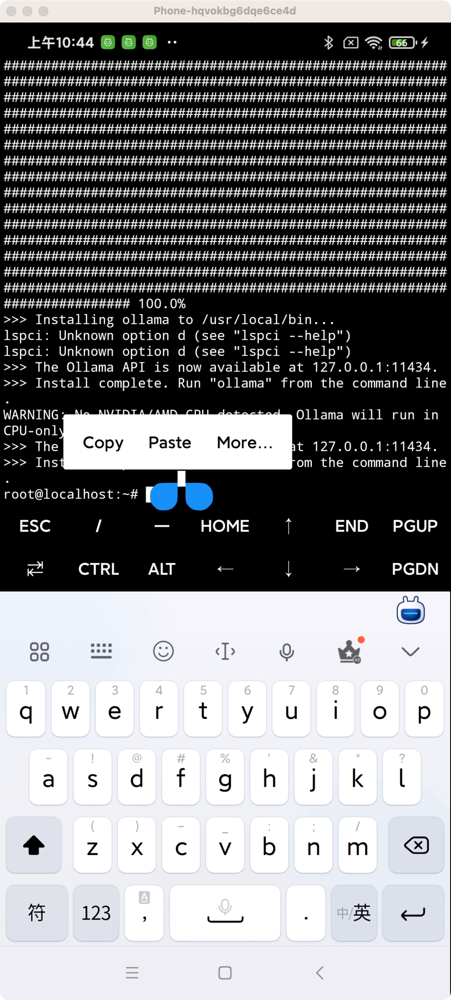
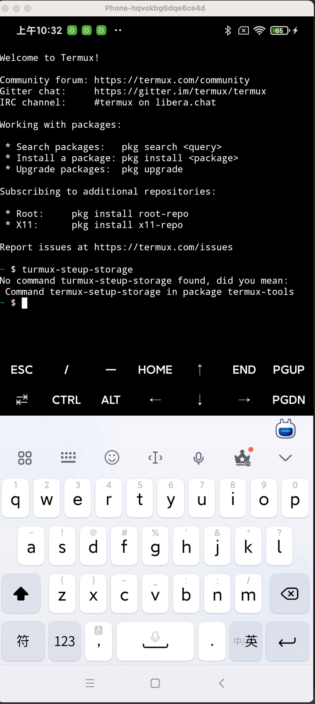
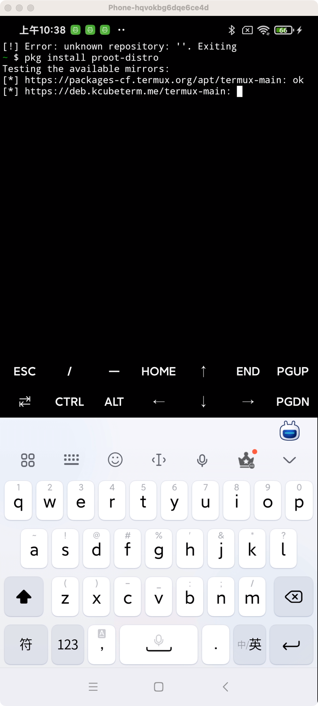
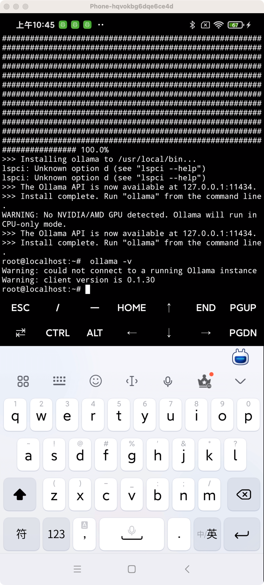
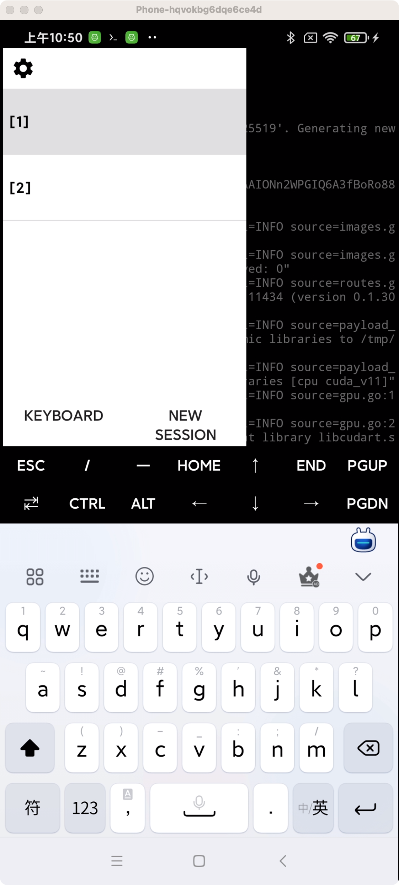
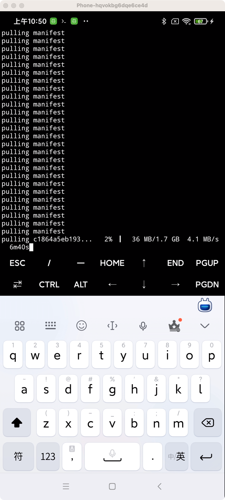
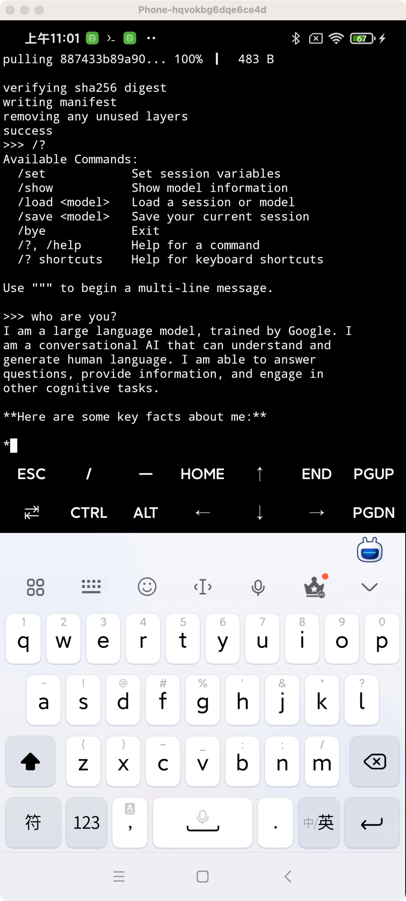
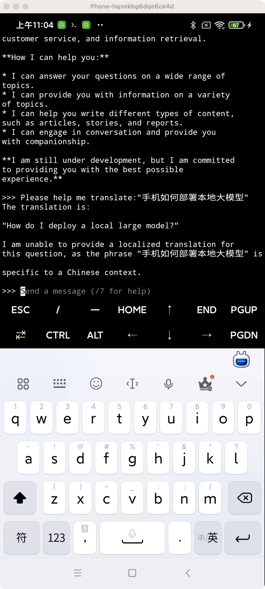

目前手机厂商都在压住 AI 手机，认为这是下一个风口。最新新闻：[消息称苹果选择百度为国行 iPhone 16 等设备提供 AI 功能，也曾和阿里洽谈](https://www.ithome.com/0/757/875.htm)<br>
这新闻有几个看点：<br>
1. 国内与国外的AI服务商不同
2. iPhone 16 很可能是 AI 手机

## 现状分析

先说第一点，这也是在预料之中的。<br>
首先国外 AI 相关的公司，无论是 OpenAI，亦或是 Google等，无一例外都是禁止中国使中的，加上中国也不允许数据外流，所以使用国内的 AI 公司的能力，是必定的

接着就是 iPhone 16 很可能是 AI 手机，这里很多人都是有疑问的。<br>
大家猜测 iPhone 16 的硬件可能会有一些适配 AI 的改动，但手机上跑AI，还是持怀疑态度的同学居多，所谓的 AI 手机，可能也仅仅是一个 AI 入口，还是得请求服务器来
完成 AI 能力。


那试试真正是如此吗？手机能部署 AI 大模型吗？我们来试一下

## 准备硬件
我手上有一台 Redmi Note 8 Pro, 上市是 2019 年，性能放在今天可以说是一般，甚至拉胯，让我来试试跑一下大模型效果如何。<br>

| 硬件     | 型号                       |
|--------|--------------------------|
| CPU型号  | 联发科 Helio G90T           |
| CPU频率  | 2.05GHz（大双核），2.0GHz（小六核） |
| CPU核心数 | 八核                       |
| GPU型号  | Mali-G76 MC4             |
| RAM容量  | 6GB                      |
| 出厂系统内核 | Android 9.0              |
| 操作系统   | MIUI 10                  |


## 下载 shell 应用

众所周知，Android 就是一台小型的 Linux 系统，但是它缺少一些 Linux 常规的组件与指令，Termux 是一个 Android 终端应用程序，提供了通用的 Linux 环境。
[termux-app](https://github.com/termux/termux-app/releases)

目前的大模型虽然说部分适配了手机环境，但是并没有基于 Android 系统特别适配了指令等配置，所以还是需要下载一个模拟 Linux 环境来运行。<br>

根据你的手机，下载指定的包即可，通常这几年出来的手机，都是 64 位，所以我们直接下载第一个 `termux-app_v0.118.0+github-debug_arm64-v8a.apk` 即可。

下载好之后，将手机连接到电脑，执行命令，即可安装：

`
adb install termux-app_v0.118.0+github-debug_arm64-v8a.apk
`

如果电脑上没有安装 adb 的，可以直接将文件用 QQ 或其他方式发送到手机，然后在手机上点击安装也是可以的。

## 电脑直接操控手机

这一节主要是为了方便，不需要的同学可以直接跳过。<br>

为了方便，我们可以直接用电脑操控手机，当然也可以直接在手机上操控，后面的步骤需要输入比较多指令，直接在手机上输入非常容易输错。<br>

为了避免这个问题，有两种一下办法：

1. 将文字通过微信的`文件传输助手`, 或者 QQ 的`我的电脑`等方式传递
2. 电脑直接连接手机操控

我个人一直有电脑操作手机的习惯，所以选的是第二种方式。
### 安装 QtScrcpy
这里就不得不用到另外一个牛逼的软件`QtScrcpy`了，它可以直接在电脑上操纵手机，有些场景需要在电脑上演示手机画面的，用它也很方便。<br>
大家可以自己对着这个文档下载：
[QtScrcpy](https://github.com/barry-ran/QtScrcpy/blob/dev/README_zh.md)<br>
由于这篇文章主要是讲如何部署大模型，这里就不展开对这个工具地安装与使用了，有一个关键点的设置提一下：<br>
一定要开启：`开发者选项里面开启USB调试（安全设置—允许通过USB调试修改权限或模拟点击)`, 如果没有设置，那就只能看，不能模拟点击与输入。<br>

<br>

双击连接即可

## 请求存储权限
Termux 下载安装一些组件，这都需要存储权限，我们都知道默认系统是没有给 APP 存储权限的，所以我们需要首先请求存储权限，点开 APP，输入:

```shell
termux-setup-storage
```

复制上面的命令，然后回到 Termux 窗口，按快捷键粘贴。注意此时并没有真正的粘贴到 Termux 中，我们需要长按，粘贴：

<br>

点输入法中的回车按钮，就可以执行了，然后会弹出一个请求权限的对话框，允许即可:<br>
<br>

## 安装必要组件
为啥要安装 `debian` 呢？ 因为安装大模型需要 `root` 权限，但是基本上现在所有的手机都是没有 `root` 权限的，debian可以模拟 `root` 权限。<br>
那为啥要安装 `ollama` 呢？ 因为 `ollama` 可以运行大模型<br>
那为啥要安装 `proot-distro` 呢？ 因为 `debian` 无法直接安装，我们要借助 `proot-distro` 安装 `debian` ，运行 `ollama`<br>
### 安装 proot-distro
先安装 proot-distro：

```shell
pkg install proot-distro
```

同样的方式复制粘贴，然后长按，粘贴，回车：

<br>


### 安装 debian
安装好 proot-distro， 再安装  debian:

```shell
proot-distro install debian
```

同样的方式复制粘贴，然后长按，粘贴，回车：

### 安装 ollama
注意，前面说了， ollama 必须 proot-distro 才能安装运行，所以我们需要进入到 `debian` 里面：

```shell
proot-distro login debian
```

这个时候就有模拟的 root 权限了，安装 `ollama`:

```shell
curl -fsSL https://ollama.com/install.sh | sh
```

<br>

最后检查一下 ollama 是否安装成功：

```shell
ollama -v
```

<br>


显示出版本就说明安装成功了。


## 安装大模型

1. 先执行模型，启动 `ollama`, 前面说了，ollama 是能能运行大模型的工具，所以先要启动它 ：

```shell
ollama serve
```

2. 在最左边，往右滑动，新建一个窗口，安装大模型。当前的窗口用来启动大模型，作为服务端，新的窗口用来请求对话：

<br>


点 `New Seesion` 就可以新建窗口了，我图中的诗经新建好的样子。

3. 在新的窗口中，先等于到 debian：

```shell
proot-distro login debian
```

在安装大模型 `gemma`:

```shell
ollama run gemma:2b
```

其中 gemma 是谷歌开源的的一个大模型，2b 是模型的参数，由于手机性能较差，我选择了参数较小的模型。

<br>

可以看到 gemma 正在下载中，注意：ollama 如果没有启动，这一步是无法进行的

<br>

```shell
ollama -v
```

## 开始对话

下载完成之后，直接在当前窗口，输入你想要问的即可，下面我们就测试一下。

### Who are you?


它会提示我是一个谷歌训练的大模型，然后输入了一些文档与提示。
总体表现非常慢，也正常，手机性能+大模型本身参数极少，生成速度慢也正常。

### Please help me translate:"手机如何部署本地大模型"




试了一下翻译效果，还行。速度比手机自带的小爱同学是要慢的，当然小爱本身是联网的，或者调用了手机自带的翻译功能，暂时没有可比性。

## 总结

目前大模型的发展方向仍然是朝着大而全的方向发展，配置的参数巨大，对资源与性能的要求也极高，未来的发展，其中一个方向必定会有一个全能的 AI 中心。
但是随着大模型的发展，算法更新，以及硬件从现有的通用GPU，改成 AI 专有的 TPU，可能也会出现本地大模型与服务器相结合方式。

特别是在一些特定的领域，本地部署的大模型是有一定优势的。 现有部署的大模型是一个通用语言大模型，什么都会，都是局限于当前的硬件与软件能力，可以说
什么都不精。如果我们专门训练它的某个方法的能力，比如辅助机主搜索手机文件与资料，专门训练它这么方向的能力，未必需要服务器的 AI 能力。

所以 AI 手机，未必就仅仅是一个AI服务器入口，也可能是一台真正的 **智能** 手机.
