---
title: "Stable Diffusion 最美大模型 Playground v2.5"
description: "Playground 多模型"
summary: "美学大模型Playground 评测"
date: 2024-03-18T16:29:23+08:00
lastmod: 2024-03-18T16:29:23+08:00
draft: false
weight: 200
categories: []
tags: []
contributors: []
pinned: false
homepage: false
seo:
title: "" # custom title (optional)
description: "" # custom description (recommended)
canonical: "" # custom canonical URL (optional)
noindex: false # false (default) or true


**Playground v2.5**是一款基于扩散原理的文本到图像生成模型，作为 [Playground v2](https://huggingface.co/playgroundai/playground-v2-1024px-aesthetic) 的升级版。

在美学质量方面，Playground v2.5 宣称自己是目前最先进的开源模型。根据相关文档研究显示，该模型在性能上优于 SDXL、Playground v2、PixArt-α、DALL-E 3 和 Midjourney 5.2。它采用了潜在扩散模型，同时使用了两个固定的、预先训练过的文本编码器（OpenCLIP-ViT/G 和 CLIP-ViT/L），其架构与 Stable Diffusion XL 相同。

# 对比

## 多个模型横向对比
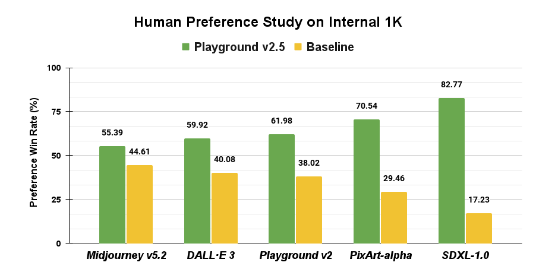

##  人物多尺寸对比
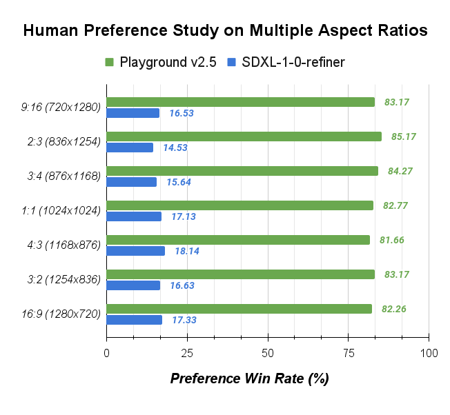


## 人物偏好
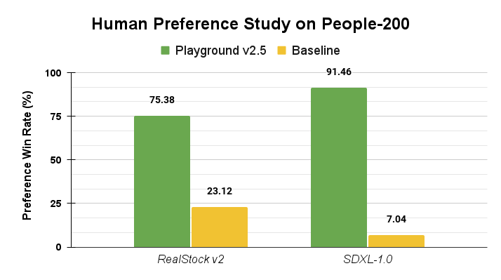

## MJHQ-30K基准测试
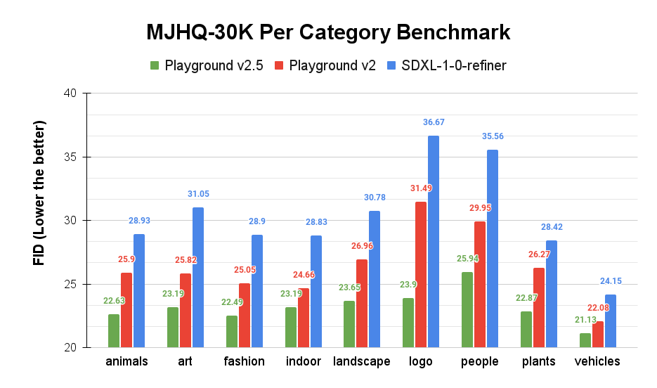


[详细技术报告](https://marketing-cdn.playground.com/research/pgv2.5_compressed.pdf)

# 安装

废话不说，既然宣传的这么牛逼，那我们来试试它的效果。
目前该大模型还无法直接应用到Automatic1111/ComfyUI ，但文章开头说了，**Playground v2.5**是一种基于扩散的文本到图像生成模型，作者也说会尽快发布支持。


## 使用 GPU 服务器

关于 GPU 服务器的申请与使用请看:

[ GPU 服务器申请与安装](/blog/aigc/use_gpu)

```shell
pip install git+https://github.com/huggingface/diffusers.git
pip install transformers accelerate safetensors
```

### 初始化
```shell
# 新建文本
echo "" > example.py
```

```shell
# 进入编辑
vim example.py
```

按 `i` 进入编辑模式，将下面的文本粘贴进去

```python
from diffusers import DiffusionPipeline
import torch

pipe = DiffusionPipeline.from_pretrained(
    "playgroundai/playground-v2.5-1024px-aesthetic",
    torch_dtype=torch.float16,
    variant="fp16",
).to("cuda")

# # Optional: Use DPM++ 2M Karras scheduler for crisper fine details
# from diffusers import EDMDPMSolverMultistepScheduler
# pipe.scheduler = EDMDPMSolverMultistepScheduler()

prompt = "Astronaut in a jungle, cold color palette, muted colors, detailed, 8k"
image = pipe(prompt=prompt, num_inference_steps=50, guidance_scale=3).images[0]

```

按`ESC` 退出编辑，按`shift + :`，输入：`wq`保存并退出

### 运行

```python
python example.py
```

## 使用ComfyUI
目前作者并没有放出 ComfyUI 的功能，但是国内大神已经开发了 ComfyUI 节点

[Playground 2.5 工作流](https://drive.google.com/file/d/1DKNvhf_4XOfbsDHj7ys5pKasi0F6wLIq/view)

将链接下来导入到 ComfyUI 即可使用

# 效果

生图配置：

```
num_inference_steps=50,
guidance_scale=3,
width=512,
height=768
```

以下所有 prompt 由 chatgpt 生成：

```
#描绘一幅宁静的湖泊景色，湖边有成排的柳树，远处是连绵起伏的山脉。
Depict a tranquil lakeside scene with rows of willow trees and a mountain range in the distance.
```


```
#画一位穿着复古服饰的女子，她的长发被风吹散，眼神中透露出一丝忧郁。
Paint a woman dressed in vintage clothing with her long hair blowing in the wind, her eyes revealing a touch of melancholy.
```


```#用大胆的色彩和线条来表现音乐的节奏和旋律。
Use bold colors and lines to express the rhythm and melody of music.
```

```
#描绘一片盛开的向日葵花田，阳光下的花朵熠熠生辉。
Depict a blooming sunflower field, with the flowers shining brightly in the sunlight.
```


```#画一幅宏伟的城堡，城堡前的广场上熙熙攘攘的人群。
Paint a magnificent castle with a bustling crowd in the square in front of it.
```
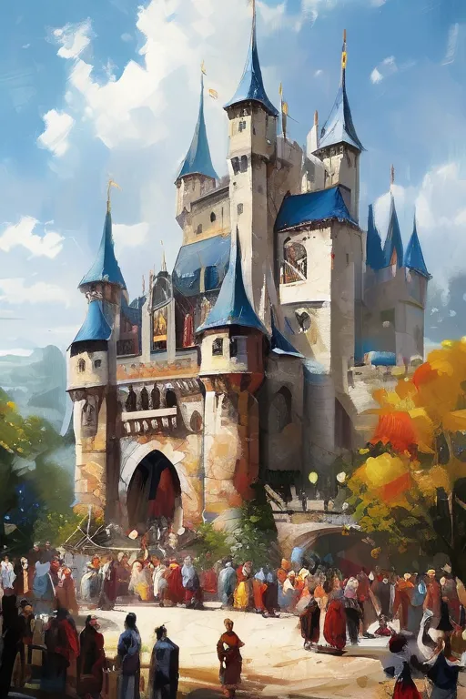

```#用铅笔勾勒出一只猫咪的轮廓，它正在打盹，身体蜷缩成一个圈。
Use a pencil to outline a cat that is napping, its body curled into a circle.
```
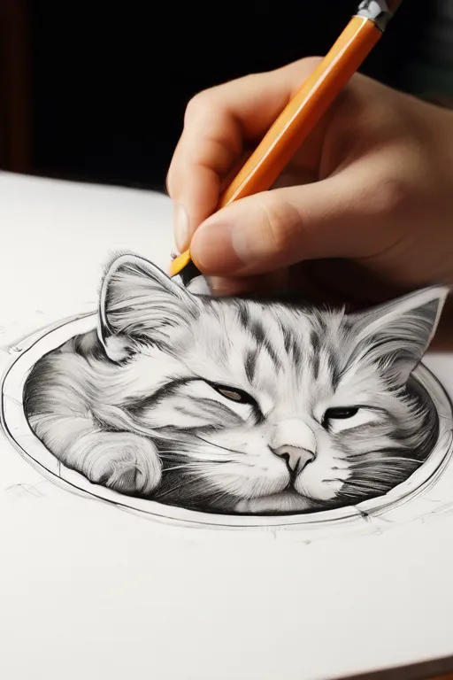

```#创作一幅有趣的卡通画，主角是一只会说话的猩猩，正在和一只穿着西装的企鹅探讨世界问题。
Create a fun cartoon featuring a talking gorilla discussing world issues with a penguin wearing a suit.
```


```#画一幅童话故事中的场景，小红帽在森林里与狼相遇。
Paint a scene from a fairy tale where Little Red Riding Hood encounters a wolf in the forest.
```
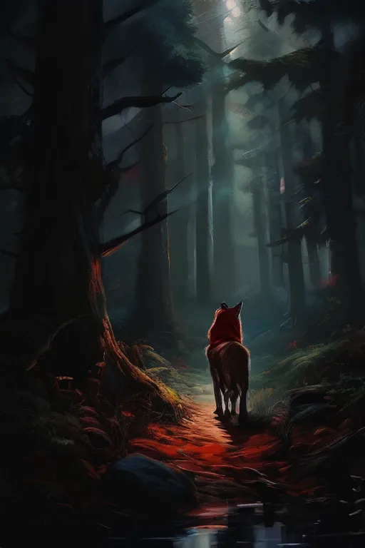

```#在墙上绘制一幅涂鸦作品，展现出青春洋溢的活力。
Create a graffiti artwork on a wall that exudes youthful vitality.
```
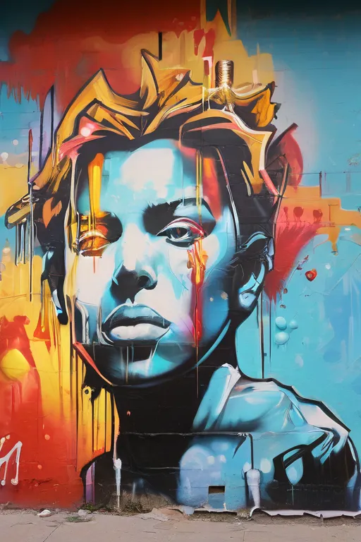

```
#描绘一群非洲草原上的动物，包括狮子、长颈鹿、斑马等，它们和谐共处在广袤的大地上。
Depict a group of animals on the African savannah, including lions, giraffes, and zebras, living in harmony on the vast land.
```
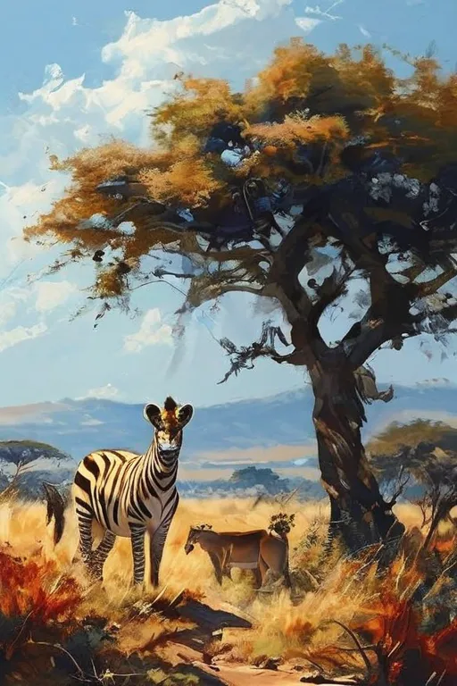

```
#画一幅精美的植物插画，主题为仙人掌，展现出各种形态的仙人掌。
Paint a delicate plant illustration with a cactus theme, showcasing various forms of cacti.
```
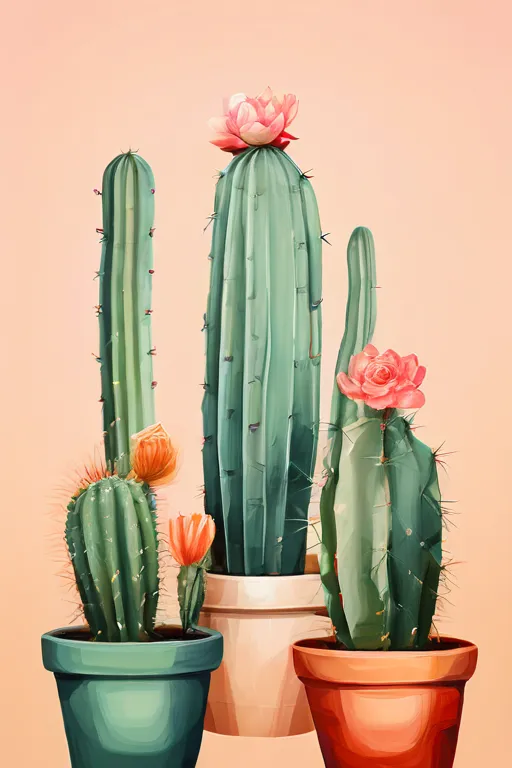

```
#描绘一座古老的欧洲教堂，阳光透过彩色玻璃窗，洒在神秘的空间里。
Depict an ancient European church with sunlight streaming through stained glass windows, illuminating the mysterious space.
```


```
#创作一幅未来科幻城市的画面，高楼林立，空中有飞行汽车穿梭。
Create a futuristic sci-fi cityscape with towering skyscrapers and flying cars.
```
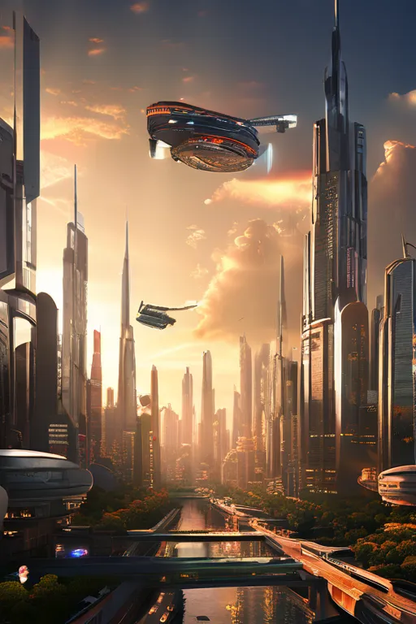

```
#画一幅非洲部落的场景，部落里的人们正在欢庆丰收节。
Paint a scene from an African tribe, where the people are celebrating the harvest festival.
```


```
#用毛笔书写一句古诗，体现出优美的书法艺术。
Use a brush to write a line of ancient poetry, showcasing the beauty of calligraphy.
```


```
#创作一幅木刻版画，主题为古代战争场面。
Create a woodcut print with the theme of an ancient battle scene.
```
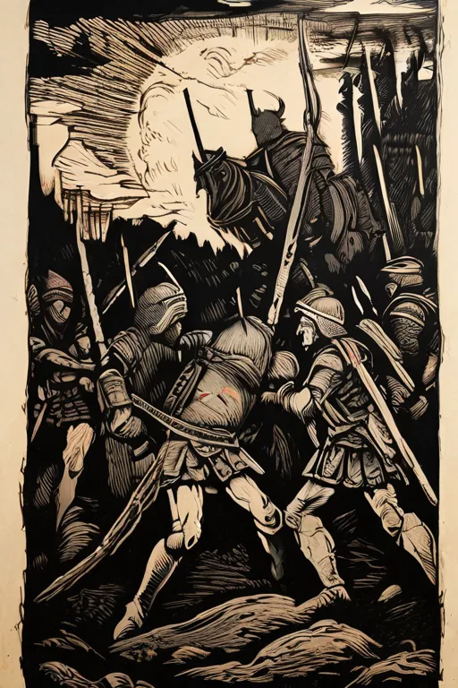

```
#用数字绘画技术创作一幅梦幻般的星空，星星璀璨夺目。
Use digital painting techniques to create a dreamy starry sky with dazzling stars.
```

```
#画一幅连环画，讲述一个勇敢的少年历经磨难，最终战胜邪恶势力的故事。
Draw a comic strip that tells the story of a brave young boy who overcomes hardships and eventually defeats evil forces.
```
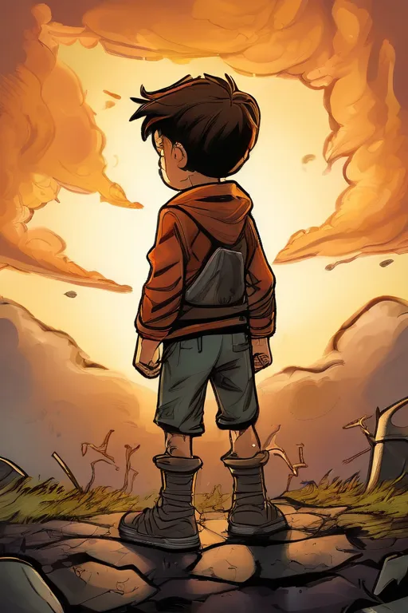
```
#创作一座以和平鸽为主题的雕塑，展现出对和平的期盼。
Create a sculpture with the theme of a peace dove, expressing the hope for peace.
```

```
#设计一件陶瓷
Design a ceramic piece with intricate patterns and rich colors
```

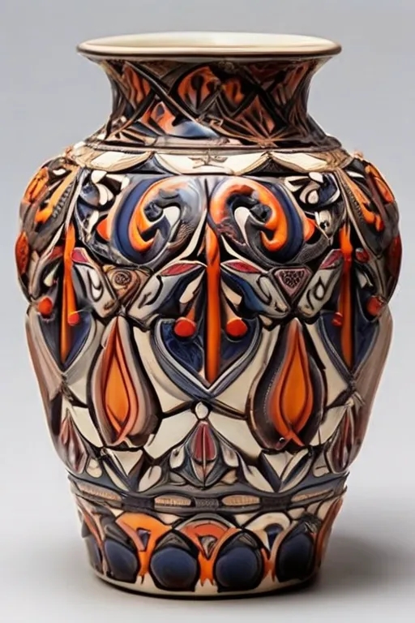

# 结论
Playground 2.5 总结有以下特点：
```
1. 解决了 Stable Diffusion 无法生成纯色图像，难以生成鲜艳色彩和对比度图像的问题

2. 更加均衡的采样策略保证在各种分辨率都能下生成高质量图像

3. 更加均衡的策略减少人物畸形问题
```

总体测试结果，以及网上其他的一些人评测横向对比，Playground 2.5 这个大模型确实非常漂亮, 比目前发布的绝大多数都要好看，是否超越 MJ 6.0, 以及 Stable Diffusion 3.0 仍待验证。

作者也表示，应用到 Automatic1111/ComfyUI ，开发 lora 等功能仍在开发中，会尽快发布。


