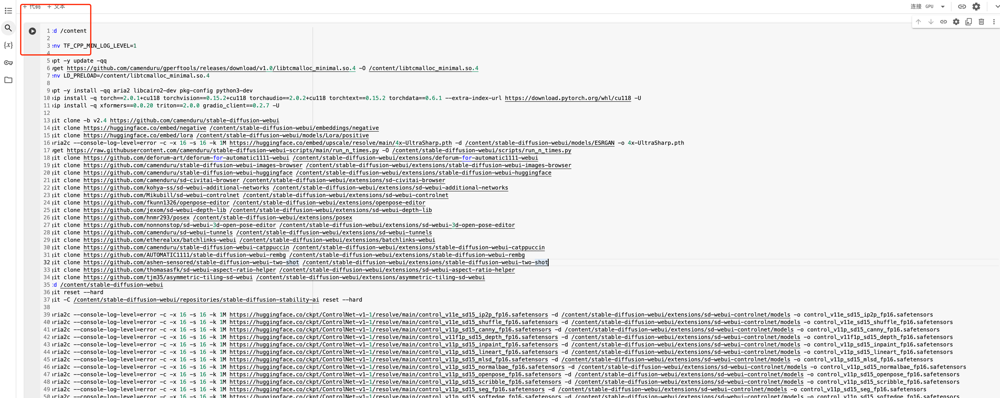
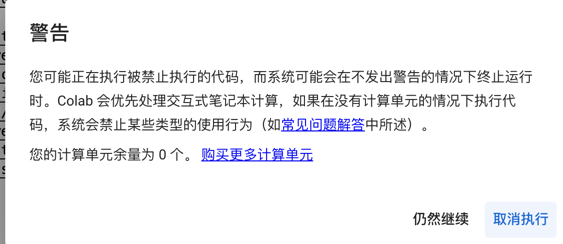
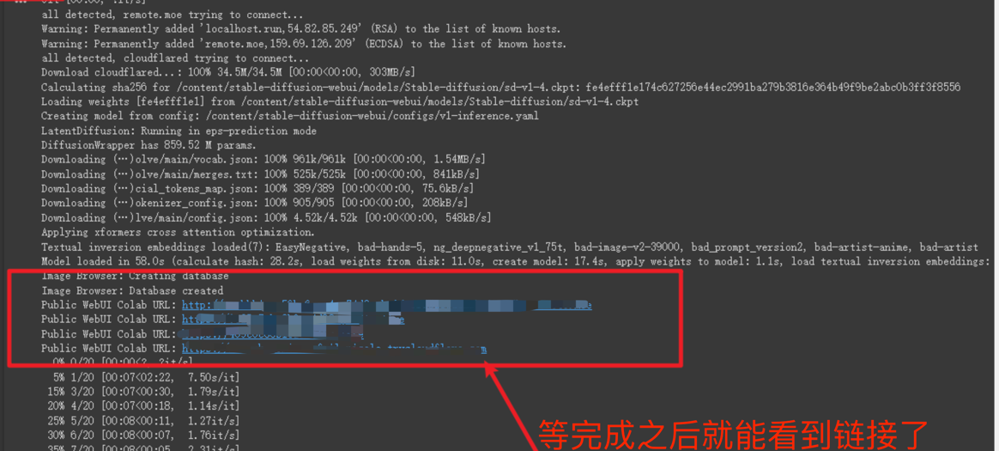

# 常用的两种生图工具

Stable Diffusion 发展至今，最优秀的两个使用框架当属： [WebUI](https://github.com/AUTOMATIC1111/stable-diffusion-webui) 与 [ComfyUI](https://github.com/comfyanonymous/ComfyUI)

## WebUI
地址：https://github.com/AUTOMATIC1111/stable-diffusion-webui

WebUI 目前仍然是使用的最广泛的 Stable Diffusion 封装框架，它的优点是提供了良好的 web 交互界面，有丰富的各种插件可以安装。

## ComfyUI

地址：https://github.com/comfyanonymous/ComfyUI

ComfyUI 推出较晚，但是有后来居中的确实，它主打工作流的概念，可以将一套完整的绘画流程包装成工作量并且分享给他人。

## 本地使用

如果你的电脑配置较高，可以尝试本地使用

### Windows

Windows 建议直接安装秋叶大佬的一键安装包：[秋叶整合包](https://www.bilibili.com/video/BV1iM4y1y7oA/?spm_id_from=333.337.search-card.all.click)

### Mac
Mac 的 intel 芯片，基本上很少能跑 SD 的，适配不好， ARM 系列的芯片，由于 SD 适配的也不是很好，很多东西都需要修改，最好还是用别人弄好的一键安装包。
这里提供一个地址：[diffusionbee](https://diffusionbee.com/)

目前 iPad 发布了 M4 芯片，同时还支持 AI 算力，未来可能会在 iPad 上能直接绘画，但是目前这方面的资料还较少

## 云端使用

云端的话，选择就比较多了

### 模型网站

[LibLib](https://www.liblib.art/)  
[吐司](https://tusiart.com)  
[Civitai](https://civitai.com)  

### 云端服务商

如果你有一定的变成基础，并且懂服务器的相关知识，可以尝试使用服务器自行搭建：

#### 随用随走
随用随走主打的就是一个体验 SD 的生图，里面生成的图片，下载的大模型，训练的 Lora 是无法保存的，除非你把生成的东西挂在到对应的硬盘上，否则一旦
实例销毁了，生成的东西就再也找不到了！！！

1. google colab
google colab 每个月有一定的免费GPU 资源可以使用，超过限制就无法使用了，如果方法不行，大家可以尝试其他方式。 
另外 colab 一段时间不活动之后就会回收资源。 
申请谷歌云盘： 
  
打开这里：[stable-diffusion-webui-colab](https://github.com/camenduru/stable-diffusion-webui-colab)
  
点击左上角的运行按钮： 
  
运行的时候会弹出警告，大概得意思是，现在谷歌没钱了，GPU 可能不能免费给你用了，点：`仍然继续`: 
  
等完成之后，就能看到链接了: 
  
注意！链接没有加密的，谁都可以访问，所以一定不能暴露自己的链接给别人，特别是你选择用钱买的 Colab

#### 购买 GPU 服务器
GPU 购买需要有一定编程基础的同学，详细可以看这篇文章：
[GPU 服务器部署 StableDiffusion](/blog/gpu-部署安装-stable-diffusion)  

