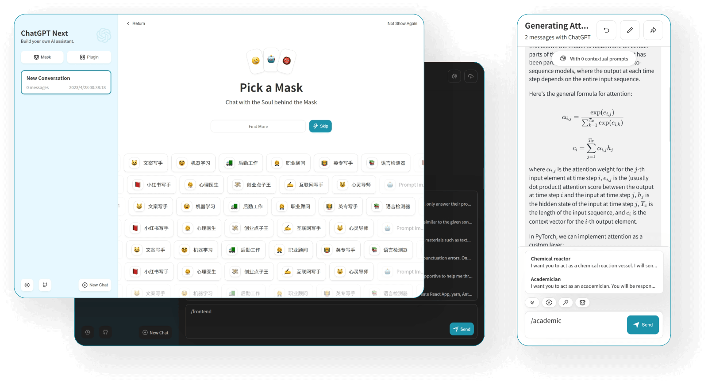
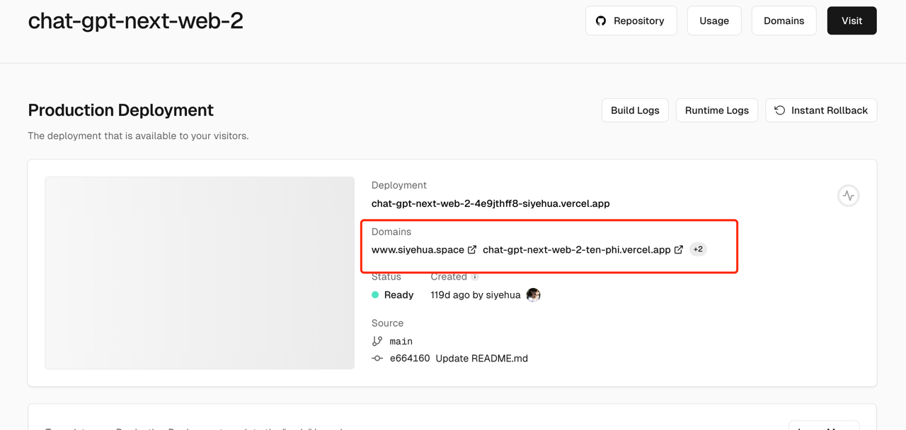
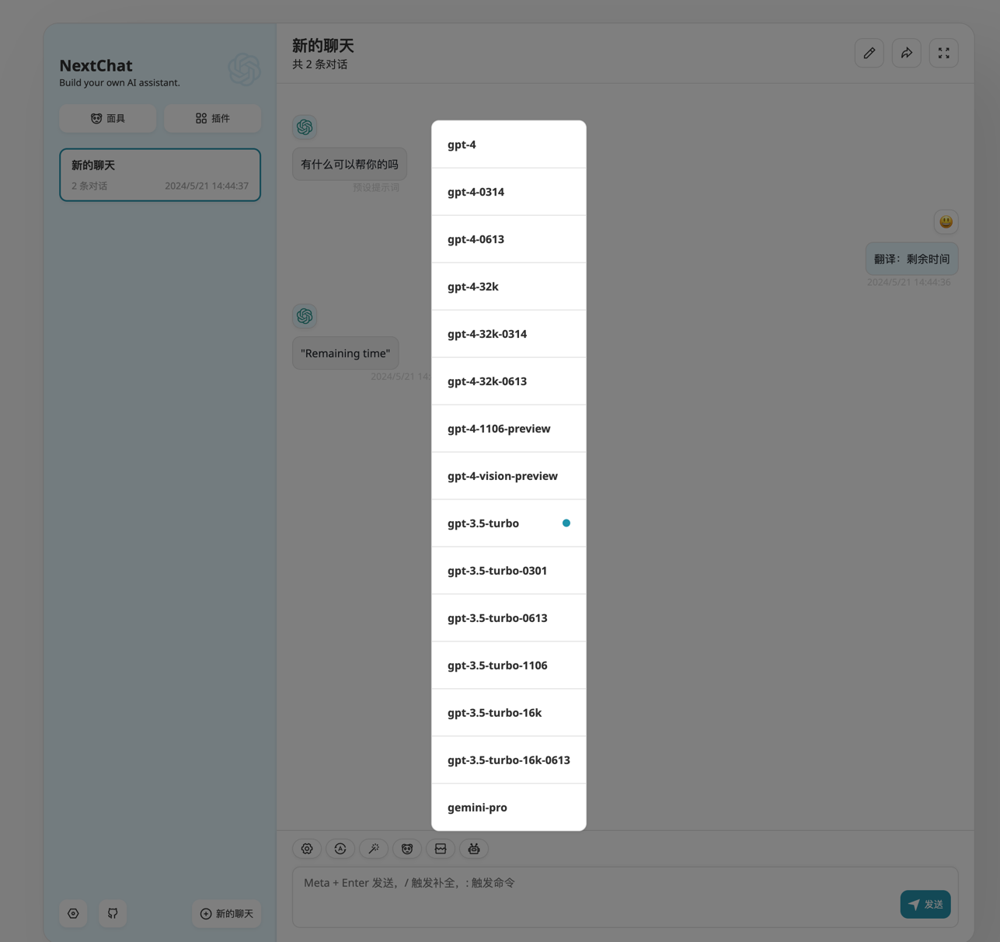

## 主题
- 使用OpenAI技术构建和部署个性化GPT模型

## 学习目标
- 解释为什么个人或企业可能想要部署自己的GPT模型
- 部署的方式，包括个人与企业
- 其他大模型部署与调用

## 个人或企业可能想要部署自己的GPT模型

LLM 并不是超级计算机，所以它并不总是完美的，这也是为什么 LLM 模型刚发布的时候，经常会出现一些简单的错误，比如无法算对一些很简单的算数问题。我们的计算机
早就已经实现了非常复杂且庞大的计算，对于 LLM 的目标而言，并不是追求成本一个超级计算机。

至少在目前来说，LLM 不是万能的，比如说某些模型比较擅长金融，有的比较擅长代码，有的擅长医学等等，甚至是语言，有的擅长中文，有的擅长英语。这也导致了不同的企业与
个人，需要的 LLM 模型也不相同，这也是为什么大多数的企业或个人，都需要部署自己的 GPT 模型。


时至今日，LLM 的模型已经百花齐放，OpenAI 不再是一枝独秀，但是无论后来者如何追赶，OpenAI 仍然是整个星球是最能打的 LLM，它的优秀不仅仅是在于模型上，
它的接口文档也同样的出色，让我们一起来了学习一下如何使用它。


## 部署前的准备
- 硬件和软件要求

### 硬件

个人：我推荐使用国内的免费的服务器：[Vercel](https://vercel.com/) 这个网站提供了免费的部署资源，对个人非常友好，我的当前博客网站，就是在上面托管的

企业：企业可以通过购买腾讯云，阿里云，或者是Azure 云等等方式来进行部署

### 软件

软件如果使用 OpenAI，Google gemini 国外大模型，因为它对于国内，是不开放的地区，是无法直接访问的。

个人用户，我的建议是寻找国内的代理商，他们通过服务器帮我们免费中转了，例如这个：[OpenAI 国内代理](https://referer.shadowai.xyz/r/120)<br>
企业用户，我强烈大家使用微软Azure 云提供的 OpenAI 服务：[Azure OpenAI Service](https://azure.microsoft.com/en-us/products/ai-services/openai-service/?ef_id=_k_Cj0KCQjw0ruyBhDuARIsANSZ3wqtMs0lUk-Y5f3FKbdVlzrVnqwuMK4csPGY4Kw9MRt0eaHGIcDHToIaAlVZEALw_wcB_k_&OCID=AIDcmm5edswduu_SEM__k_Cj0KCQjw0ruyBhDuARIsANSZ3wqtMs0lUk-Y5f3FKbdVlzrVnqwuMK4csPGY4Kw9MRt0eaHGIcDHToIaAlVZEALw_wcB_k_&gad_source=1&gclid=Cj0KCQjw0ruyBhDuARIsANSZ3wqtMs0lUk-Y5f3FKbdVlzrVnqwuMK4csPGY4Kw9MRt0eaHGIcDHToIaAlVZEALw_wcB)

## 访问 OpenAI API的步骤

地址：https://platform.openai.com/docs/introduction

如果你是 macos or linux 用户，打开 shell，输入：

```shell
export OPENAI_API_KEY='your-api-key-here'
```

`your-api-key-here` 就是你在 openai 中拿到的 key：https://platform.openai.com/account/api-keys

接着，在 shell 中再继续执行一下代码，就可以得到 gpt 的回答：

```shell
curl https://api.openai.com/v1/chat/completions   -H "Content-Type: application/json"   -H "Authorization: Bearer $OPENAI_API_KEY"   -d '{
    "model": "gpt-3.5-turbo",
    "messages": [
      {
        "role": "system",
        "content": "You are a poetic assistant, skilled in explaining complex programming concepts with creative flair."
      },
      {
        "role": "user",
        "content": "Compose a poem that explains the concept of recursion in programming."
      }
    ]
  }'
```

其中：

- model: 表示要选的模型：https://platform.openai.com/docs/models/model-endpoint-compatibility
- messages: 聊天内容
- role: 目前有三种形态
- system: 表示你作为一个开发者，给 GPT 模型发送了什么内容，这内容对用户来说是不可见的
- user：表示用户发送的聊天
- assistant: GPT 给我回复的消息


如果你需要跟 GPT 进行多轮对话，只要把 messages 的信息按照顺序添加进去请求即可，很明显，聊天越长，这个请求会越大，所以聊天一般都是有上限的

## 部署GPT模型
- 使用OpenAI API进行模型部署
- 配置和优化模型以满足性能需求

上面只是一个简单的请求例子，大于日常使用，或者企业，我们不可能这样子请求，所以我们一般需要部署一个图形界面，关于 GPT 的套壳 Github 上的项目也比较多，这里
只列出一个：[ChatGPT-Next-Web](https://github.com/ChatGPTNextWeb/ChatGPT-Next-Web)


具体部署也非常简单，对于个人用户,使用上文介绍的 Vercel，点击 `Deploy` 即可一键部署：
https://github.com/ChatGPTNextWeb/ChatGPT-Next-Web/blob/main/README_CN.md




需要注意的是，由于国内是无法直接访问 OpenAI 的，文章开头的部署前准备买的代理，就可以在这里用到了。


对于企业用户，它也提供了 docker 方式部署，详细可以看项目的主页，当然也可以用前面介绍的 Azure OpenAi 来进行部署，这样提供的接口在国内也是可以访问的。


### 集成与测试

Vercel 部署完成好，会生成链接, 点击链接后即可访问（有的人的网络可能访问不了这个链接，国内的运营商有的能访问，有的不能，建议自己绑定一个国内能访问的域名）



下面就是可以访问的状态，点击聊天框的最后一个机器人，还可以选择不同的模型：



## 其他部署
除了 OpenAI 之外，OLlama 还可以部署自己的本地大模型，也提供接口访问，详见：https://github.com/ollama/ollama/blob/main/docs/api.md

### 结论

总的来说，部署一个自己的专属 GPT，已经是一个非常简单且低成本的事情，建议初学者都先从这个课程下手，先尝试一个最简单的 AIGC 开发
