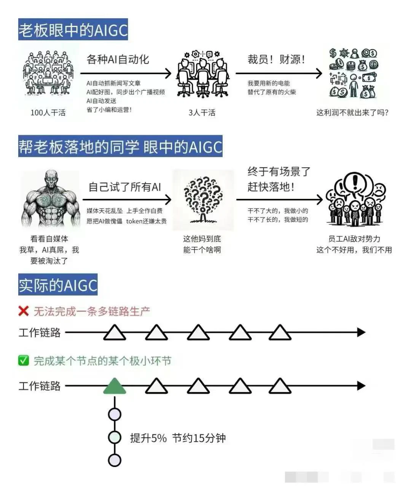
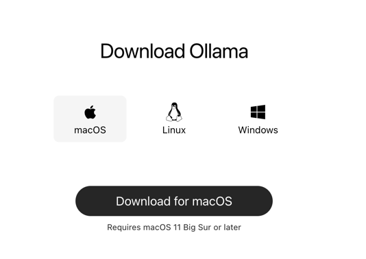
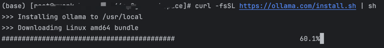
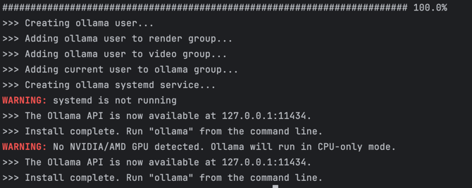
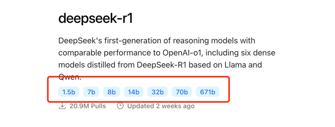

## 主题

- 使用 OLlama 构建本地 LLM

## 学习目标

- 解释为什么需要本地大模型
- 常见的本地大模型以及特点
- OLlama 本地大模型详细介绍

## 为什么需要本地大模型

以 GPT 为首的闭源 LLM 已经非常优秀了，那么我们为什么还需要一个本地的 LLM 呢？我的答案是需要的。

目前，AI 发展的方向是朝着 AGI 的方向发展：

（Artificial General Intelligence）: 是指能够执行任何人类智能任务的机器智能，是一种理论上的AI形式，目前还未实现。AGI与目前普遍存在的专用或窄AI（ANI）不同，后者只能在特定任务上表现出智能。

但是就目前的研究表明，AI 目前还不具备真正的智能：https://time.com/collection/time100-voices/6980134/ai-llm-not-sentient/

我们先不讨论 AGI 未来能不能实现，就目前而已，LLM 远没有我们想象中那么强大，入门的文章也说了，你以为的 AI 跟你想象中的
AI，还有很长的一段距离要走：



回到我们的问题：为什么我们需要本地的大模型？因为现有的云端 LLM 大模型还有很多问题，也没有足够的智能，从而我们需要不同的大模型来满足不同的需求。

比如目前专有领域的模型有：<br>

* 生图模型：[StableDiffusion](https://stability.ai/)
* 音乐模型：[Suno](https://suno.com/)
* 写论文模型：[Elicit](https://elicit.com/)
* 金融模型：[SAP Business AI](https://www.sap.com/products/artificial-intelligence.html)
* 医疗模型：[医疗大模型分析](https://pdf.dfcfw.com/pdf/H3_AP202312211614644812_1.pdf)
* 编程模型：[Copilot](https://github.com/features/copilot)

可以看到，每个专有的模型擅长的领域都不太一样，对比目前全球地表最强的 `GPT4o` 模型，在某些领域其实也要甘拜下风。所以当云 LLM
满足不了需求的时候，就需要
这些专有大模型进行补充。<br>
那这些专有大模型仍然可以部署在云端，为啥还需要本地大模型呢？原因如下：

1. 所谓本地大模型，是相对于云端的各大公司而言，实际上这些 AI 大模型，最终一般也是部署在服务器上<br>
   我们将这些模型归结为本地大模型，是因为它需要的硬件要求比较低，有个性化的需求，我们可以自己修改源码，或者重新训练模型，而不需要依赖云厂商的
   API<br>
2. 有些敏感信息不得不本地化<br>
   比如公司让你根据公司内部的文档，构建一个全新的智能知识库，理论上你可以提供接口给 GPT 等云端 LLM
   来访问，但是老板认为一些核心资料，不能让外面的公司获取，
   这样就必不可免的需要将 LLM 本地化了，更不要说一些敏感的单位，更不可能使用云端的 API<br>
3. 资源限制<br>
   全民 AI 使用的资源，将一个海量的数字，目前没有一个公司能够负担的起。这也就导致了部分算力不得不分开来，比如假设一个 AI
   私人助理，管理你电脑里的所有问题，
   你问 AI
   帮我找到我电脑某个文件，这事情如果让云端做，它需要先将你电脑的所有文档信息都同步到远端才能做到，这成本无疑是巨大的，而且你也不想自己的小电影呗上传上去吧？<br>
   所以现在的 AI 私人助理，通常是本地RAG+本地/云端 LLM结合来做

综上所述，在实际的AIGC 生成过程中，仍然需要借助本地 LLM 来完成。

## 常见的本地大模型以及特点

能支持本地的大模型框架也比较多，目前比较好用，受用比较广的有：[vllm](https://docs.vllm.ai/en/latest/)
,[chatglm.cpp](https://github.com/li-plus/chatglm.cpp),
[LM studio](https://github.com/lmstudio-ai),[Ollama](https://ollama.com/), 他们各自的特点如下：

|        | Ollama      | vllm | chatglm.cpp | LM studio   |
|--------|-------------|------|-------------|-------------|
| 功能特点   | 简单易用，本地化    | 推理加速 | C++优化性能，多平台 | 简化操作，本地化    |
| 操作系统   | 多平台         | 多平台  | 多平台         | 多平台         |
| 硬件要求   | GPU/CPU     | GPU  | GPU/CPU     | GPU/CPU     |
| 易用程度   | 5           | 4    | 4           | 4.5         |
| Docker | 支持          | 支持   | 支持          | 不支持         |
| 使用场景   | 开发/验证/非技术人员 | 开发   | 开发          | 开发/验证/非技术人员 |

## OLlama 本地大模型详细介绍

个人：我推荐使用国内的免费的服务器：[Vercel](https://vercel.com/) 这个网站提供了免费的部署资源，对个人非常友好，我的当前博客网站，就是在上面托管的

企业：企业可以通过购买`腾讯云`，`阿里云`，或者是 `Azure` 云等等方式来进行部署

### 下载安装

进入到官网， 点击下载，选择自己的平台： https://ollama.com/



我这里选择 linux 平台，因为是在我购买的服务器进行的，windows 与 mac 更简单，这里就不再演示了。

执行：

```shell
curl -fsSL https://ollama.com/install.sh | sh
```

等待下载中：



### 启动运行

下载完成之后会自动启动运行的，我们看到这个就说明成功启动了：




Ollama 启动之后，并不能直接使用，因为里面还没有模型。

### 加载模型

模型地址：https://ollama.com/search ，以现在最火的 DeepSeek-R1 为例，链接为：https://ollama.com/library/deepseek-r1


里面有各种不同的量化参数，大家经常说得满血版本，就是 `671b` 参数的，但是这个对硬件要求特别高，我们通常用 `1.5b` 或者 `7b` 的，大家根据
自己的硬件条件，下载不同的模型， 我这边下载的是 `7b` 的：



注意下载的时间比较长，大家可能开个梯子比较快：

```shell
ollama run deepseek-r1:7b
```

### 对话

### WebUI

## 总结
