本地搭建 LLM 大模型有很多方式，我这里以 `Ollama` 为例，在它的基础上来实现本地 LLM 生成图片，关于如何本地部署 Ollama，可以看这篇文章：[本地 LLM: 一文了解 Ollama](/blog/一文了解 Ollama)


## 学习目的

让本地 LLM 支持生成图片

## 学习目标

自己动手生成搭建一个可以生成图片的 LLM

## 本地部署 OLlama LLM

Ollama 的不是是非常简单的，直接打开[官网](https://ollama.com/), 点击`下载`， 大家根据自己的环境选择下载，我这里以 `Linux` 为例, 如果你还没有自己的 GPU 服务器，建议
在线购买或租赁一台：

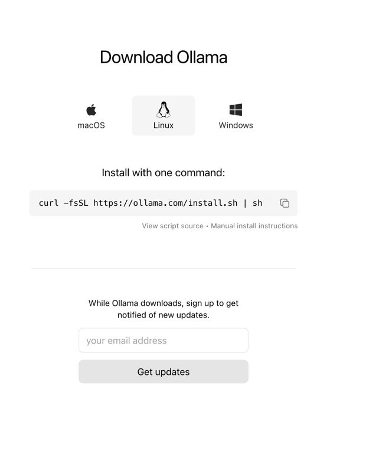

点复制，然后执行即可：

```shell
curl -fsSL https://ollama.com/install.sh | sh
```

### 暴露 OLlama 给其他机器

默认的 OLlama 是本地访问的，如果是你 Linux 服务器，通常是不能直接访问，这个时候我们需要暴露ip 让外面的机器访问，如果你是 Windows 或者 MacOs，就跳过这个步骤

通过调用 `systemctl edit ollama.service` 编辑 `systemd` 服务, 这将打开一个编辑器。

对于每个环境变量，在 [Service] 部分下添加一行 `Environment`：

```shell
[Service]
Environment="OLLAMA_HOST=0.0.0.0"
```

保存并退出，如果你有其他的环境变量，记得不要覆盖掉。 这个配置是配置全局环境变量，配置好之后以后每次都能使用的。


### 启动 OLlama

```shell
ollama serve
```

## 部署 OpenWebUI

OLlama 默认是通过命令行来交互的，非常难用，有一个项目能通过 webui 交互，那还等什么，直接搞起：[Open-WebUI](https://github.com/open-webui/open-webui)

### 安装 docker

如果你的服务器没有 docker，建议你先安装 docker，已经安装了跳过这一节。

安装 docker 每个系统都不一样，大家直接看官网或搜索资料：https://docs.docker.com/get-docker/

### 安装 OpenWebUI
安装好 docker， 同一台电脑，直接安装执行这个安装：

```shell
docker run -d -p 3000:8080 --add-host=host.docker.internal:host-gateway -v open-webui:/app/backend/data --name open-webui --restart always ghcr.io/open-webui/open-webui:main
```

然后我们就可以直接访问了，docker 默认就能支持其他的机器访问，所以不需要配置什么，假设你的 ip 是 `123.4.5.6`, 那你的 OpenWebUI 的访问地址是：
`123.4.5.6:3000`

打开后的样子：

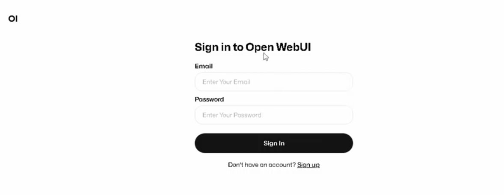

### 注册管理账号
第一次进来就是上面那个样子，点右下角的 `sign up` 注册，随便填写即可，注意，第一个账号默认是管理员账号。


### 配置

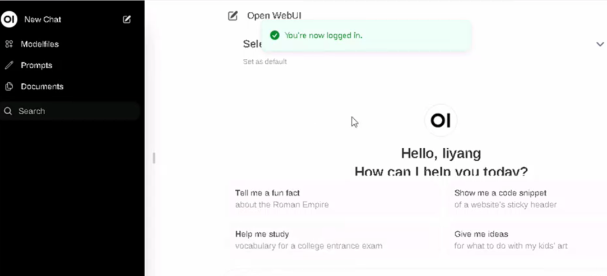

上图是进来之后的样子， 点击坐下角的设置，选择：

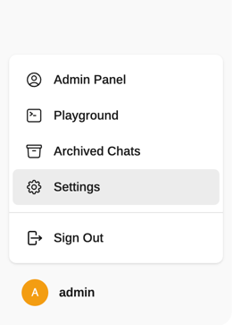

啥也不说，先把简体中文搞出来：

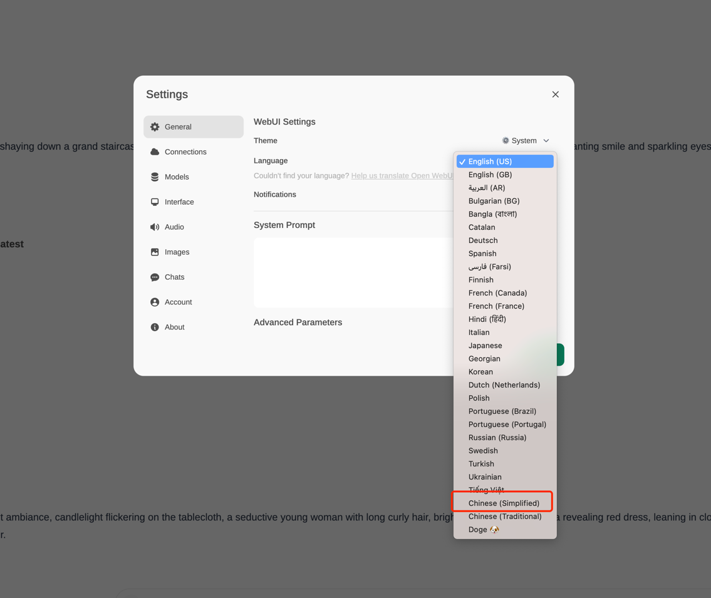

#### OLlama 配置

这里的 ip 假设是上面的 `123.4.5.6`， 其他的不便，点右边的刷新，如果提示链接成功，那说明你没有配置错，如果失败了，那建议你直接把导致丢到浏览器中打开，
打不开就说明前面的 OLlama 没有配置成功，外网机器不能访问：

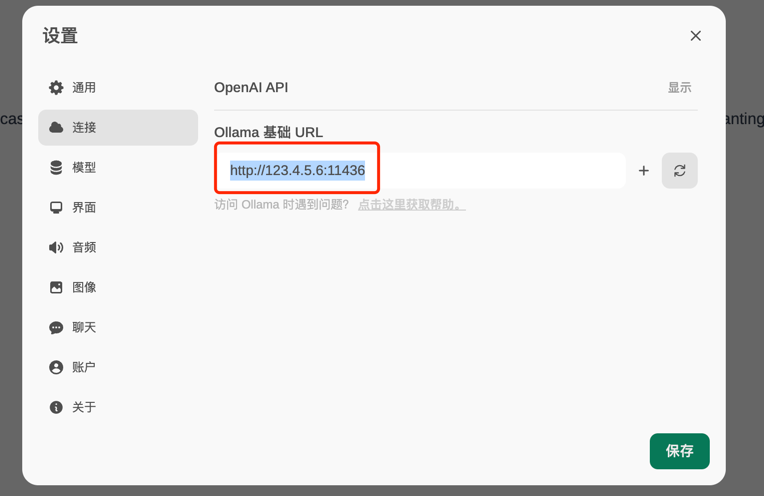

#### 生图大模型下载

生图大模型：https://ollama.com/impactframes/llama3_ifai_sd_prompt_mkr_q4km

点击模型，在`从 Ollama.com 拉取一个模型` 里面输入`impactframes/llama3_ifai_sd_prompt_mkr_q4km`, 点右边的下载，即可。

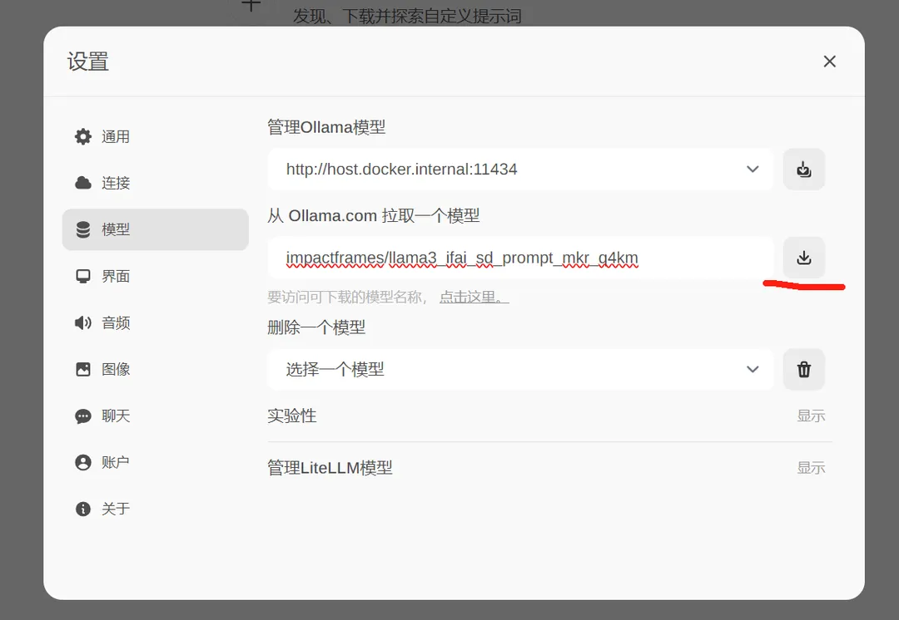


它会自动下载大模型，可能时间比较长，我们先搞其他的

#### 图片模型配置

回到服务器这里， 生图能力可以使用 Stable Diffusion WebUI 或者 ComfyUI，我这里以 Stable Diffusion WebUI 为准，Stable Diffusion WebUI 怎么配置，大家看这篇文章：
[部署安装-Stable-Diffusion](/blog/gpu-部署安装-stable-diffusion/)

安装好之后，我们直接启动 webui:

```shell
./webui.sh --api --listen
```

这样生图模型就启动好了，我们再回到网页这里，选择图片：

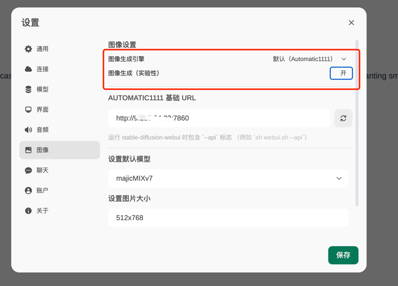

生图模型，默认的 `Automatic1111` 就是 webui，不需要改，然后把`图像生成（实验性）` 开关打开，输入地址：
`http:123.4.5.6:7860` 其他的不变，就是端口改成 `7860`

然后大模型，我这里选择了`麦橘v7` 的，分辨率大小根据你的硬件能力，一般是512*768 或者是 512*512。

往下滚，有一个步骤，默认是 50，没必要 ，改成 28 即可，然后点`保存`：

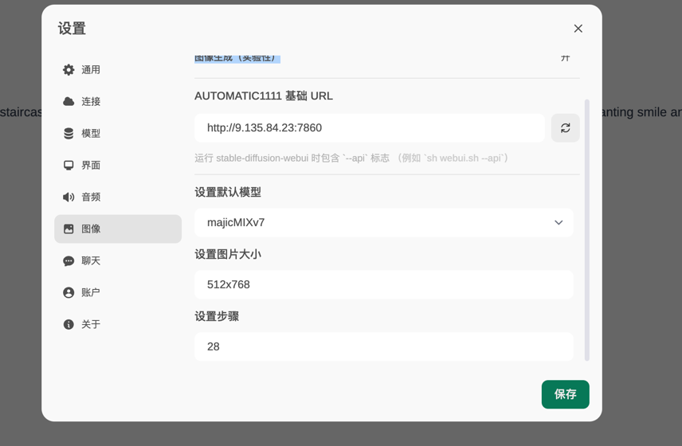


## 开始生图

等你弄图片模型后，相信前面生图大模型也下载完了，我们回到网页这里：

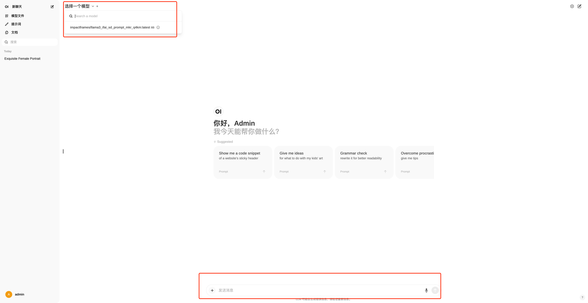

点击生图大模型，然后在下面的输入框输入：`画一个美女`，再点击下图中的`图片` 图标：

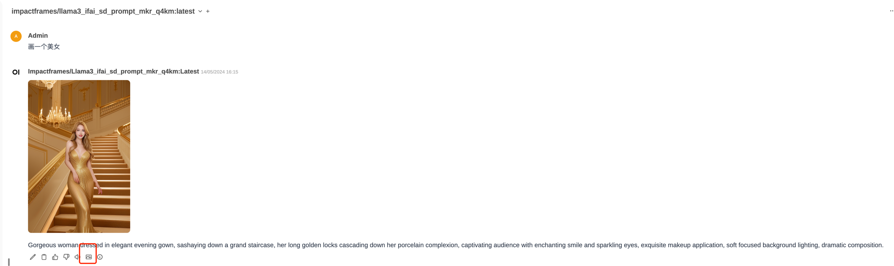

一个美女就出来了，我们再来一组：

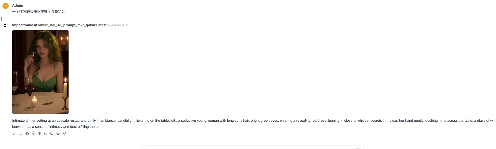

然后你对中文的翻译不翻译，你可以点赞成左边的编辑图片自己修改，然后点击`图片` 图标重新生成即可。

## 参考链接

OLlama: https://ollama.com/

本地部署 OLlama： https://docs.dify.ai/v/zh-hans/guides/model-configuration/ollama

LLM 生图大模型：https://ollama.com/impactframes/llama3_ifai_sd_prompt_mkr_q4km

Open-WebUI: https://github.com/open-webui/open-webui

Stable Diffusion WebUI: https://github.com/AUTOMATIC1111/stable-diffusion-webui


