这个项目主要有以下几个应用场景：

1. 在公司内进行私有化部署，构建 AI 知识库
2. 在自己的博客，或者某个技术系列文档，搜索或总结
3. 在本地电脑，搜索文档或资料
4. 构建 AI 智能客服

## 本文概述

本文通过 [MaxKB](https://github.com/1Panel-dev/MaxKB) 项目来演示 LLM 对传统知识库的补充与应用。

* 如何适合 LLM 搭建知识库
* 知识库如何构建数据系统
* 知识库关键技术解析

## 阅读目标

* 理解 LLM 对传统知识库的优势
* 学会使用 MaxKB 项目 LLM 改造或创建自己的知识库
* 展望知识库的发展方向

## 传统知识库

### 知识库搜索

知识库其实最核心的还是数据，数据的准备是非常重要的，大型公司一般都有自己的 `wiki` 知识库，但是搜索功能，总的来说不尽人意。跟传统搜索一样，知识搜索，
一般只能围绕某个关键字去搜搜，当你想问：`我刚入职，怎么申请工作电脑？`

一般出来的内容包括：`入职事项`,`电脑故障xxx`,`申请加班xx` 等等，这些搜索结果对应的链接，有的是能找到你想要的结果的，有的不能。如果是搜索做的比较
差的公司，可能会直接显示：`暂无搜索结果`。

原理很简单，就是将输入的文章直接存到数据，或者会摘取一些片段，关键词，存到数据库中，加上索引。

然后当用户搜索的时候，做的比较烂的，直接匹配整个搜索，在数据库查找，有就返回，无就显示无结果。比较好的，则会根据用户的输入，进行词组的拆分，然后根据
之前的索引，关键词等来匹配，这样就能大大提高了搜索结果准确性。

但是这样的结果对于目前来说，仍然是不够的。仍然是上面的那个例子：`我刚入职，怎么申请工作电脑？`， 这个问题，在`入职事项`
的文档，一般是能找到的。用户
只只需要点击入职事项，然后翻看整篇内容，查找关于`申请电脑`部分，大概率是能找到自己想要的信息，这跟传统的百度、谷歌搜索也是类似的。

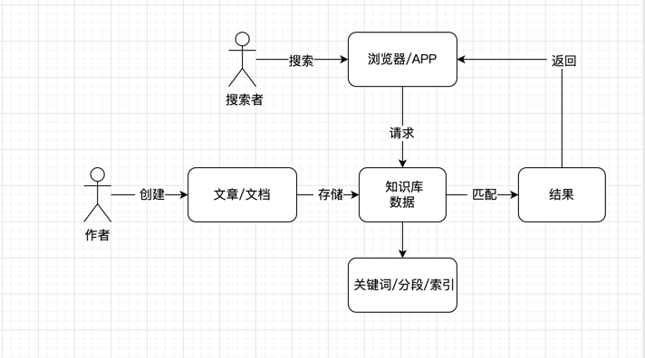

### 本地电脑搜索

本机文件很多的时候，通常我们要查找或搜索一个文件，只能通过文件名查找，而且速度非常慢。部分电脑系统，也能搜索简单的文本信息（例如macos），整理来说，
目前的本地搜索是不好用的，比传统搜索更不如

### 智能客服

目前各大 APP 或产品的智能机器人，其实本质上就是一个搜索工具，它很难理解用户的语言，对于常用的问题是能给出答案，但是一旦遇到复杂的问题智能客服一点
都不智能。目前大部分用户使用客服系统，直接输入`人工`,就是因为目前的只能客服太难用了。

上面的这些问题，我们都可以结合 LLM 来给其增效，给用户更好的体验，接下来我们看看 MaxKB 是如何实现LLM 结合数据库构建自己的知识库体系的。

## MaxKB LLM 知识库与部署

MaxKB 主要是把传统数据库转成了向量数据库，然后加上LLM 对语言的理解，从而能够直接回答用户的问题，避免了无效搜索，省略了需要用户自己点击进入文章/文档
来查看自己
想要的内容的步骤。

我们来看看它是如何工作的:

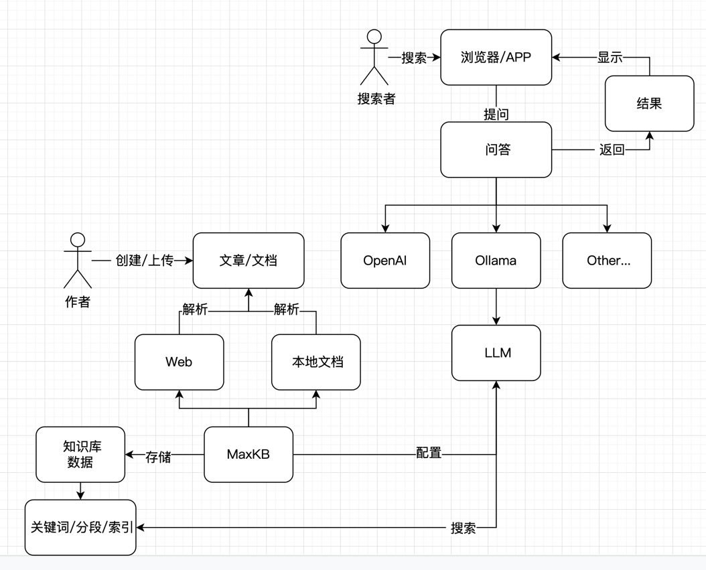

通过上面的流程图我们可以知道，MaxKB 主要是承载了两个工作：

1. 建立知识库向量书库库，包括网页端或者本地文档
2. 通过配置 LLM 与数据库结合，来给用户使用，提高体验

[MaxKB](https://github.com/1Panel-dev/MaxKB) 自带将数据映射成向量数据的能力，同时支持使用不同的 LLM 来对数据库内容进行搜索，因为
LLM
自动支持理解用户的自然语言，所以它能直接回答用户的问题，在理解了用户的问题的基础上，再从已经构建好的数据库里搜索用户想要的内容并返回，从而构建自己的知识库。

## 如何部署

关于部署，有两种方式，一种是直接使用  [MaxKB](https://github.com/1Panel-dev/MaxKB) 推荐的自己的平台部署：


<iframe style="width: 700px; height: 400px;" src="//player.bilibili.com/player.html?aid=1652847783&bvid=BV1BE421M7YM&cid=1501208194&p=1" scrolling="no" border="0" frameborder="no" framespacing="0" allowfullscreen="true"> </iframe>

如果不想使用 1Panel 平台，也可以自己部署。

### 本机部署

本机部署主要是两个部分，一部分是如何准备数据，一部分是如何使用 LLM 来搜索映射准备好的数据。

#### 数据解析

数据这块，它这个项目直接就自带了能力了，所以我们只需要安装项目即可：

```shell
docker run -d --name=maxkb -p 8080:8080 -v ~/.maxkb:/var/lib/postgresql/data 1panel/maxkb
```

**如果你没有安装 docker，请按照网上的教程安装 docker，这里不再说明**

安装好之后，上面的命令，默认是8080端口，你也可以修改成其他的，直接打开即可：

`
http://x.x.x.x:8080/ui/login
`

其中 `x.x.x.x` 是你的服务器 ip 地址，打开以后页面长这样：

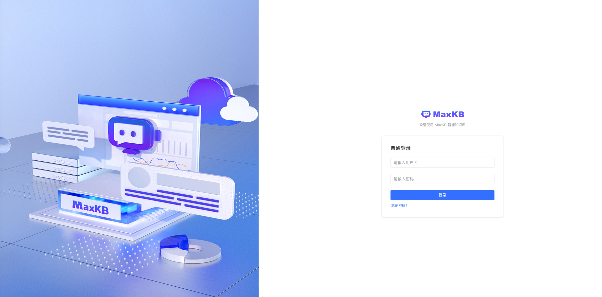

输入用户名密码即可登录：

```
用户名: admin
密码: MaxKB@123..
```

#### 大模型 LLM

MaxKB 与它自带的向量数据库系统就可以搭好了，接着我们配置 LLM， 大模型一般分两种，一种是使用 API，一种是本地大模型。

#### 使用 Ollama

本地大模型我们推荐使用 [Ollama](https://ollama.com/), 顺便说一下，在我写这个文章的时候 Ollama 推出了 ollama-3 模型，看评测超越了
`GPT` 与 `Calude`，更多细节大家自己访问查看。

Ollama 安装：

```shell
curl -fsSL https://ollama.com/install.sh | sh
```

Ollama 安装比较简单，就一句话就启动起来了，但是 Ollama 只是一个框架，我们还要在上面下载具体的大语言模型才能使用，这个在后面说。

##### (节选，可不配)配置 Ollama 远程可访问

Ollama 默认只能本机访问，如果想远程访问，要配置一下：

1. 创建配置：

```shell
systemctl edit ollama.service
```

2. 设置 ip 与端口号：

```shell
[Service]
Environment="OLLAMA_HOST=0.0.0.0:11434" # 11434 是默认端口，也可以用其他的
```

3. 保存退出，重启 Ollama：

```shell
systemctl daemon-reload
systemctl restart ollama
```

打开浏览器测试 Ollama:

```shell
http://x.x.x.x:11434/
```

#### MaxKB 里面配置使用 Ollama

接着我们在这里配置 Ollama：

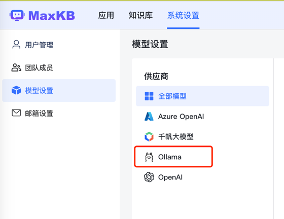

然后输入：

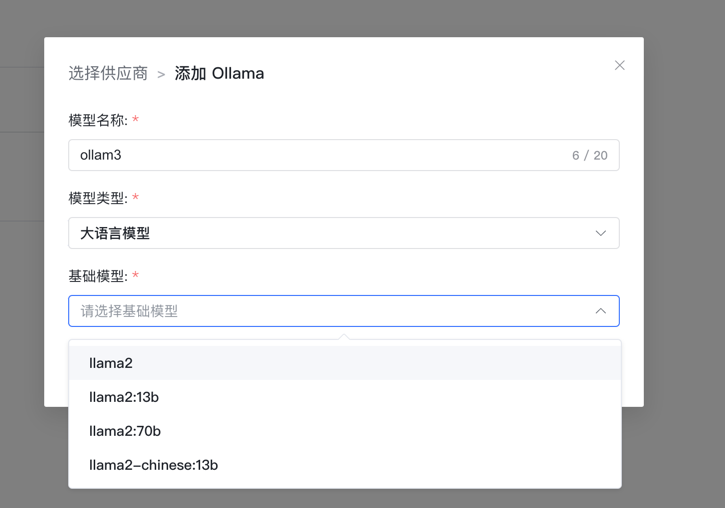

其中模型要根据你当前的机器选自己合适的配置，目前它这里的模型只能选，不能随意输入，比如最新的 3 就不能用。
添加好之后会自动下载的对应的模型，好了之后我们就能用了：

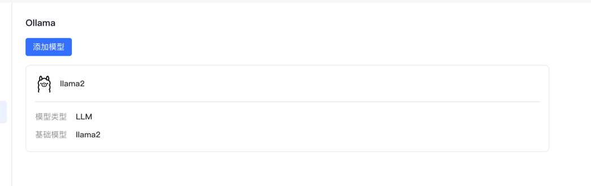

#### 使用 OpenAI

OpenAI 更加方便，直接输入域名+key 即可, 注意域名要以 `/v1` 结尾，不然会添加不成功：

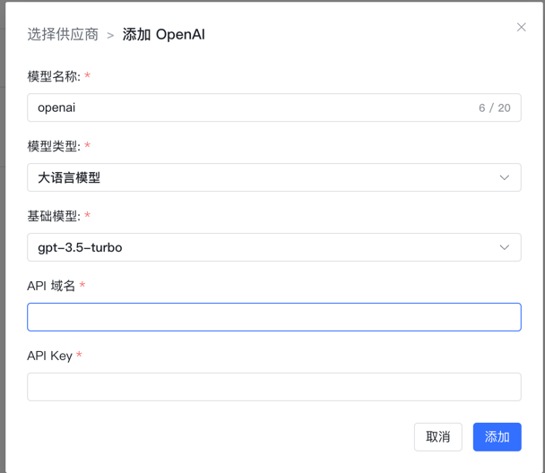

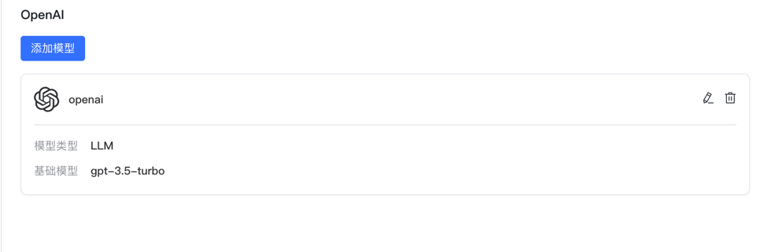

## 简单使用

### 数据提取

我们创建一个本地数据库，把我下载的 2024 年斯坦福 AI 指数报告上传了上去


接着它自动分段，提取了关键字，这一步很重要，如果关键字与数据没有分割好，那后面的搜索就可能就不怎么好：

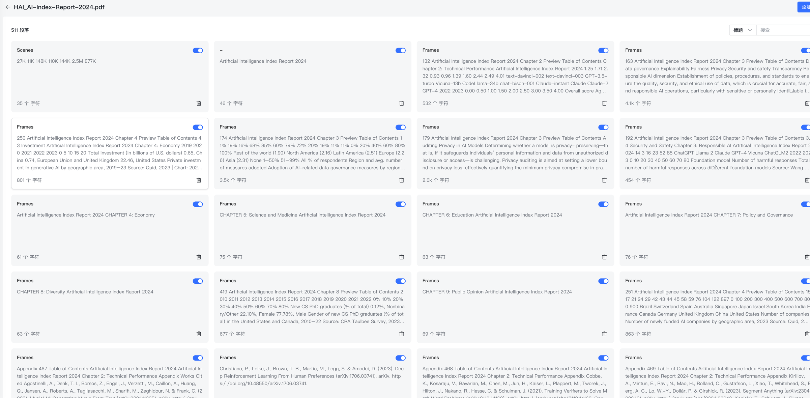

接着我们再来一个网页 [接入 Ollama 部署的本地模型](https://docs.dify.ai/v/zh-hans/guides/model-configuration/ollama) ,
它也自动分段了。

最终我们得到两个知识库，一个 web 网页，一个是本地文档：


### LLM 关联

创建一个应用，有两点要注意，1：选择大模型，2：添加（添加知识库）

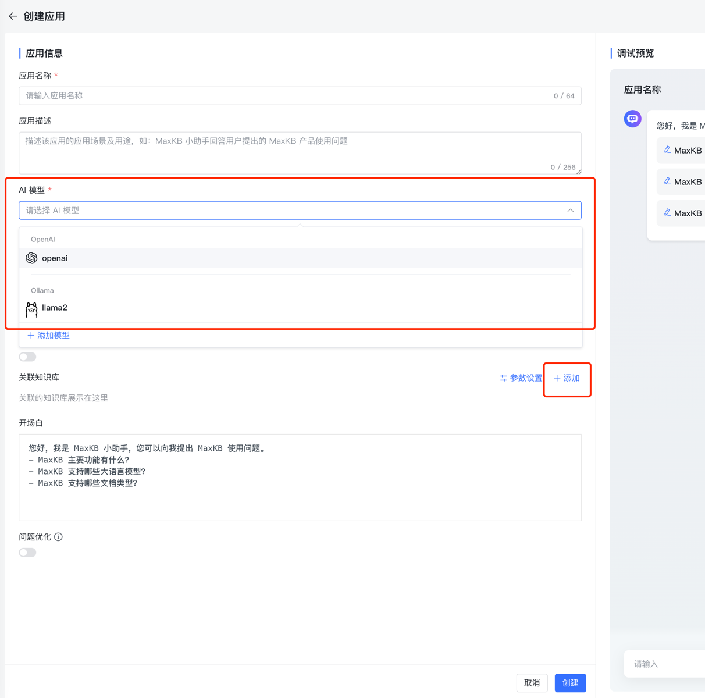

要想大模型能搜到你刚刚建立的知识库，要把刚才建立的两个知识库关联上：


## 测试

### Ollama

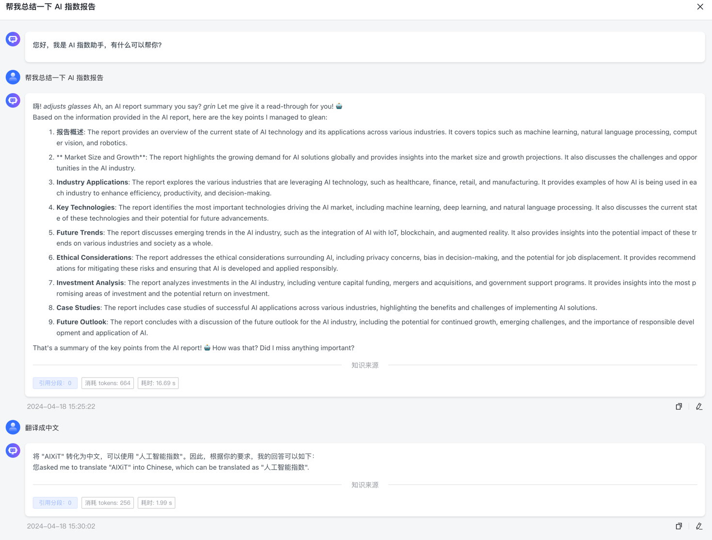
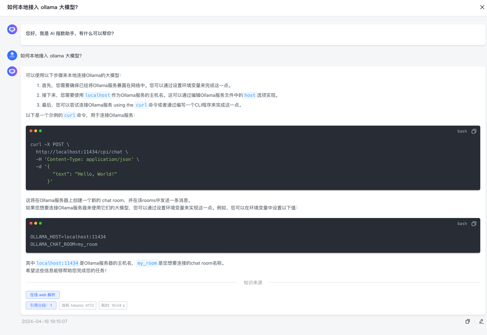

### OpenAI


## 分析

总的来看，用 OpenAI 的命中与理解能力都要比 Ollama 好很多，当然，一个是本地模型，一个是云端，算力都不一样。但是可以说明的是，这个知识库还是
建立起来了，只是并没有我们想象中的那样，秒杀传统搜索。

这个是很正常的，依赖我们用的 LLM 不是最强的，二来我们建立的向量数据也有限，这两块都是需要我们去补充与完善的。

## 未来展望

总的来说，通过 LLM 来建立企业知识库，或者更加智能的客服，是可行的。随着模型的进一步发展，在百度、Bing 中，我们已经能看到了 AI
回答。<br>
只要我们给当前的项目调优后，加上之前的传统搜索能力相结合，一定能让知识库更加智能。


