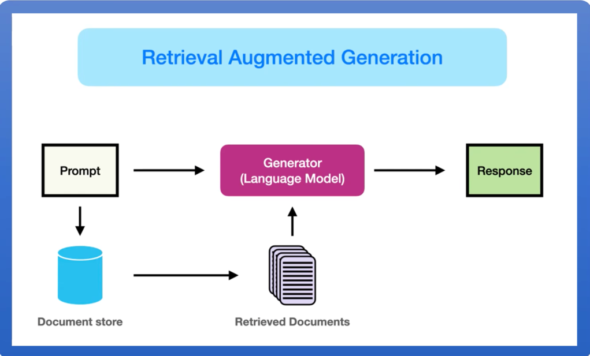

## 什么是 RAG？

RAG（Retrieval-Augmented Generation，检索增强生成）是一种结合了信息检索（Retrieval）和自然语言生成（NLG）的技术。它通过从外部知识库中检索相关信息来增强大型语言模型（LLM）的输出，从而提高生成文本的准确性、相关性和时效性

目前我们所以的大模型 LLM，也就预训练模型，也就说是 LLM 目前的数据并不是最新，假设你问它今天的新闻，它是不知道的，这时候它就无法回答，或者
只能瞎编乱造，就会产生幻觉。

如果我们问它更加专业的知识，而这些知识，是 AI 训练过程中无法获取的，比如政府数据，企业数据，这些非公开的数据，就无法通过 LLM 获取，
这时候我们就需要用到 RAG 技术了。

你马上就能联想到目前主流对话 AI 都有的功能：`联网搜索`， 这两者在技术原理上有相同的共性，将在下文中介绍。

## RAG 原理

用户的问题过程，就是将我们的提问，先文本规范化，再分词，向量化成 `token`之后，与 LLM 对话。而 RAG 的作用就是，提供一个向量数据库，
将用户提问的 token 在向量数据中查找已经向量化好的相关的 token，然后一起发送给 LLM 大模型，大模型再做出回答。



说白了 RAG 就是对用户提的的一个补充，好让 LLM 能更加明白用户的问题。比如公司的规章制度，晋级制度，项目管理手册等等，
这些资料与数据一般都是非公开的，所以 LLM 通常无法直接回答用户。
但是我们如果提前将这些知识，添加到了向量数据库中，当用户提问：

```
在公司中，应该如何晋级？
```

此时我们将用户的提问 token 化，然后通过算法，查找到数据中已经 token 化的晋级资料，比如:`如果需要晋级，需要年终绩效 A`这种数据，就会将数据添加到提问 token
中，一起传给LLM，LLM 就知道应该如何回答了。

## RAG 应用场景

* 垂直领域：医疗、法律、金融 的专业知识回答
* 长尾问题（“根据本公司2023年安全规范，员工出差报销标准是什么？”）

举一个更加贴近生活的场景，比如现在一般比较现代化的大型医院，都会有导航机器人，我们可以将医院的一些资料，使用 RAG 知识关联 LLM，
这时候有病人来问：`儿科在几楼?`, 机器人就会回答：`儿科在二楼`， 这样的对话，是非常实用的。

## 常见的 RAG

* [Dify](https://dify.ai/):Dify 是一个开源 LLM 应用开发平台。使用 RAG 引擎编排从代理到复杂 AI 工作流的 LLM 应用。 比 LangChain 更具生产准备。
* [FastGPT](https://tryfastgpt.ai/)：一个免费、开源且功能强大的 AI 知识库平台，提供开箱即用的数据处理、模型调用、RAG 检索和可视化 AI 工作流。轻松构建复杂的 LLM 应用程序。
* [Ragflow](https://github.com/infiniflow/ragflow)：RAGFlow 是一款基于深度文档理解构建的开源 RAG（Retrieval-Augmented Generation）引擎。RAGFlow 可以为各种规模的企业及个人提供一套精简的 RAG 工作流程，结合大语言模型（LLM）针对用户各类不同的复杂格式数据提供可靠的问答以及有理有据的引用。
* [MaxKB](https://maxkb.cn/):MaxKB = Max Knowledge Base，是一款基于大语言模型和 RAG 的开源知识库问答系统，广泛应用于智能客服、企业内部知识库、学术研究与教育等场景。
* [ima](https://ima.qq.com/): 腾讯开发的基于微信公众号数据的知识库整理平台

以下是Dify、FastGPT、RAGFlow和MaxKB这四个基于RAG技术的平台的对比表格，从功能、特点、应用场景等方面进行分析：

| 特性/平台      | Dify                       | FastGPT                             | RAGFlow                                                 | MaxKB                        | ima                        |
|------------|----------------------------|-------------------------------------|---------------------------------------------------------|------------------------------|----------------------------|
| **开源情况**   | 开源                         | 开源                                  | 开源                                                      | 开源                           | 闭源                         |
| **主要功能**   | LLM应用开发，从代理到复杂AI工作流的编排     | 数据处理、模型调用、RAG检索、可视化AI工作流            | 深度文档理解、知识提取、问答、引用                                       | 知识库问答、智能客服、企业内部知识库           | 会思考的知识库                    |
| **技术特点**   | 生产准备度高，比LangChain更适合生产环境   | 功能强大，开箱即用                           | 基于深度文档理解，支持复杂格式数据                                       | 基于大语言模型和RAG                  | 基于公众号数据                    |
| **应用场景**   | 通用LLM应用开发                  | 构建复杂LLM应用程序                         | 企业及个人的问答系统                                              | 智能客服、企业知识库、学术研究、教育           | 个人知识整理，希望用到腾讯的数据           |
| **数据处理能力** | 未明确提及                      | 支持多种格式文档导入，自动处理文本预处理、向量化和QA拆分       | 支持复杂格式数据的深度理解                                           | 未明确提及                        | 目前只有 pdf 与 word            |
| **模型兼容性**  | 兼容多种LLM模型                  | 兼容多种LLM模型，支持OpenAI API兼容模型          | 支持多种LLM模型                                               | 支持多种LLM模型                    | 混元/DeepSeek                |
| **部署方式**   | 未明确提及                      | 支持Docker部署                          | 支持Docker部署                                              | 支持Docker部署                   | 只支持安装包安装                   |
| **官网链接**   | [Dify官网](https://dify.ai/) | [FastGPT官网](https://tryfastgpt.ai/) | [RAGFlow GitHub](https://github.com/infiniflow/ragflow) | [MaxKB官网](https://maxkb.cn/) | [ima](https://ima.qq.com/) |


总的来说，目前开源中比较好用的是 Dify 与 RagFlow, ima 的功能特别强大，但是是闭源的， 推荐个人使用。


## 对比联网搜索

上面提到的联网搜索，其实联网搜索跟 RAG 有很多共性，但是也有一些不同：

联网搜索主要是通过抓取公开的网页，新闻等内容解析，或者通过 API 调用来解析，更加偏向于实时性，比如（“俄乌战争最新进展”“，"今天天气如何？”），诸如此类的问题。
它的原理跟 RAG 差不多，RAG 知识提前将数据向量化存到向量数据库，而联网搜索，则是通过对用户语义的理解，通过搜索网上公开的资料解析得到数据，在由lLM
加工整理，来回答用户。


这样子看来如果 AI 部署到私有服务器，或者内网，是不是可以替换 RAG 了？ 实际上是不同的。
前面说了，联网搜索的内容，是基于用户提问语义的理解，比如你问：`实习生要怎么晋级？`，根据语义理解，可能会去搜搜`晋级，实习生`等等相关的词，等搜索 api 或者引擎去
内网联网搜到了 10 篇相关的文档，然后再解析，转义，最后 token 化丢给 LLM 总结。这个过程中，非常依赖语义理解 + 搜索模块，如果搜出来的内容不相关，或者
没有搜到关键点，就有可能回答不了用户的提问。


而 RAG 的数据已经向量化了，它会根据文本转向量模型，获取向量数据库中的向量数据与提问中关联最高的数据，然后向 LLM 提问。此时数据已经是向量，切割好的，它回答的
好坏，取决于我们切割文本的算法，参数等等。

对比关键点就是：联网搜索的能力依赖语义语法+搜索模块，而RAG 的能力依赖文件转向量模型，这是两者最大的不同，各自有各自的应用场景。


## RAG 未来发展

我们都知道 LLM 的上下文是有一定的长度的，这个窗口目前还不是很大，所以只能通过 RAG 这种技术来链接外部知识，但是随着 AI 的技术在不断地，这个窗口如果扩大，是否就不再
需要 RAG 了呢？

我的观点是，即使模型上下文窗口扩大，RAG在实时性、可控性、垂直领域支持等方面的优势仍不可替代。文中已经说明了一些私有领域，或者垂直领域中的作用。
模型的知识存储永远存在物理限制（如训练数据截止时间、存储成本），而外部世界的信息是动态且无限的，RAG将成为连接两者的关键桥梁。

另外假设窗口是无限大的，我们还要考虑成本的文本，你将一部几百万的小说丢给 LLM 尚能处理，如果是一个平台的小说呢？ 再进一步，如果每个用户每次对话，都一股脑的把自己
几百G甚至是更大的资料喂给 LLM，这本身就需要存在巨大的成本问题。所长未来一定是 RAG 结合 LLM能力一起的，形成“通用知识+实时扩展”的混合架构，而非相互替代的观察。

##

目前这个系列的教程大概的线路是：

* RAG 基础：先认识与了解 RAG
* 向量数据库入门
* 本地部署大模型（可选）
* 大模型 API 调用
* 文件转向量存储到向量数据库
* 提问结合向量数据库知识

下一节将讲解向量数据库的基本使用
