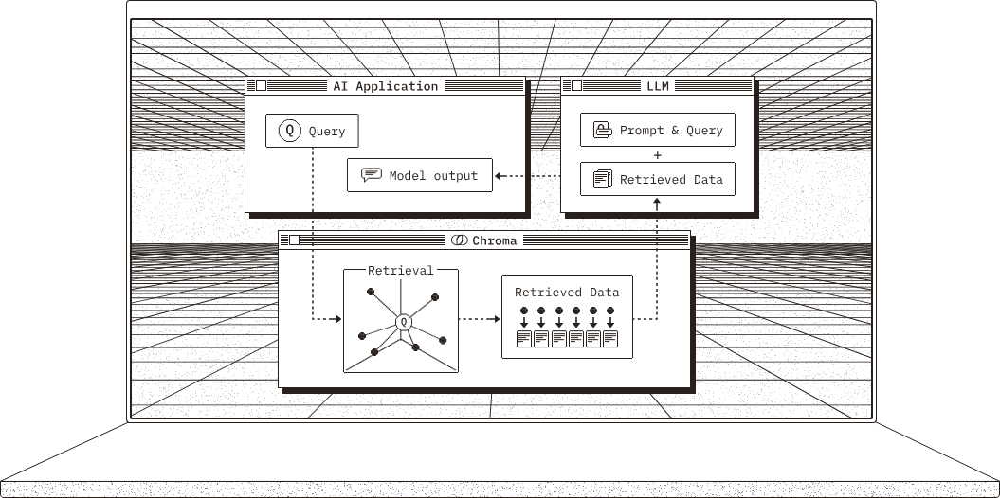
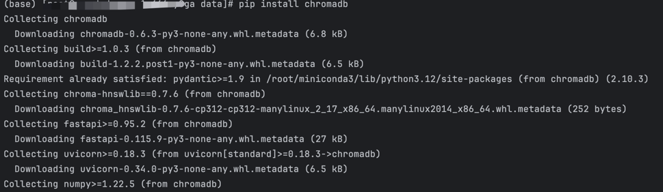
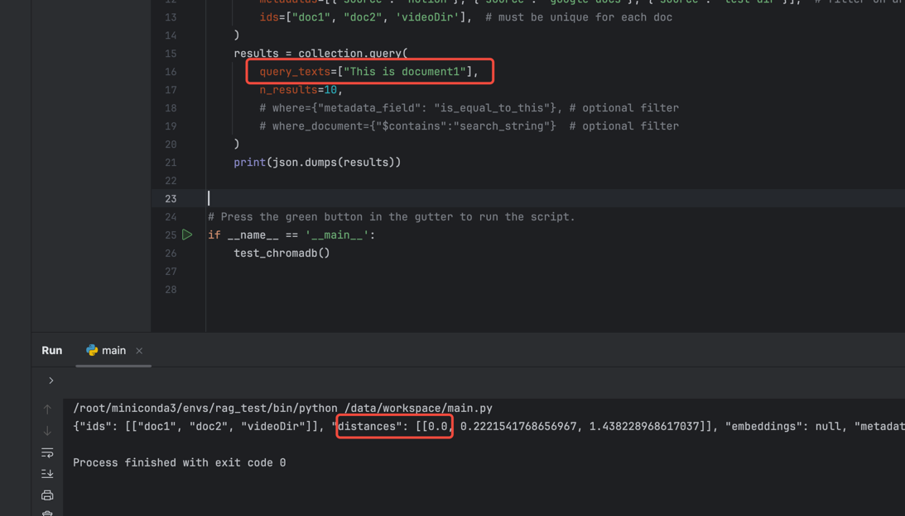

## 基础介绍

向量数据库（Vector Database）是专为处理高维向量数据设计的数据库系统，其核心技术在于将非结构化数据（如文本、图像、音频）通过深度学习模型转化为多维向量（如768维的文本嵌入向量或1024维的图像特征向量），并基于向量间的相似性实现高效检索。





### 核心特性
- **语义理解能力**：通过向量嵌入（Embedding）技术捕捉数据间的语义关联，例如“苹果”与“iPhone”的向量距离小于“苹果”与“水果”。
- **相似性搜索算法**：采用HNSW（分层可导航小世界图）、IVF（倒排文件）等索引技术，将十亿级向量的搜索耗时从小时级压缩至毫秒级。
- **多模态支持**：支持跨模态数据统一编码（如将图文对映射到同一向量空间），实现“以图搜文”或“以文搜图”。

### 应用场景
- **大模型增强**：解决GPT类模型的“幻觉”问题，通过向量检索注入实时知识（如ChatGPT调用行业报告数据）。
- **智能推荐系统**：电商平台利用用户行为向量匹配商品特征向量，提升点击率30%以上（案例：某头部电商平台）。
- **生物医药**：比对蛋白质结构向量库加速药物靶点发现（如Moderna新冠疫苗研发）。


## 对比传统数据库
### 数据模型差异
| **维度**         | **传统数据库**                | **向量数据库**                |
|------------------|-----------------------------|-----------------------------|
| **数据类型**      | 结构化数据（表格、JSON）       | 非结构化数据的高维向量表示       |
| **查询方式**      | 精确匹配（SQL WHERE语句）      | 相似度计算（余弦/欧氏距离）       |
| **索引技术**      | B树、哈希索引                 | HNSW、LSH、KD树等近似最近邻算法 |


### 常见的 AI 向量数据库对比

| **数据库**    | **核心优势**                                  | **适用场景**                      | **性能指标**                  |
|-------------|---------------------------------------------|---------------------------------|-----------------------------|
| **Milvus**  | 开源生态最完善，支持十亿级向量规模与混合查询        | 工业级推荐系统、基因序列分析        | 延迟<50ms @10亿向量          |
| **Pinecone**| 全托管云服务，分钟级部署                      | 初创企业快速搭建AI应用              | 99.9% SLA，支持毫秒级响应     |
| **Weaviate**| 内置图神经网络，支持知识图谱与向量联合检索        | 金融风控（如反洗钱关联网络分析）      | 实时数据更新，支持多模态       |
| **Chroma**  | 与LangChain深度集成，开发者友好                | 本地化知识库（如企业文档智能问答）    | 轻量级（内存占用<1GB）        |
| **Qdrant**  | 分布式架构支持PB级数据，开源商业化双轨制          | 物联网设备实时数据分析              | 吞吐量10万QPS/节点           |

下面就介绍一下比较简单的 Chroma 数据库是如何使用的：

## Chroma 介绍与安装
Chroma 特点：开源、轻量级架构，与LangChain框架深度集成，支持快速搭建RAG应用。
适用场景：原型验证（如智能问答系统）、中小企业内部知识库管理。

官网地址：https://www.trychroma.com/


### 安装

```shell
pip install chromadb
```




### 运行

运行，其中 `host` 与 `port` 是可选的：

```shell
(base) [root@-1m466ey0ga data]# chroma run --host 127.0.0.1 --port 8000


                (((((((((    (((((####
             ((((((((((((((((((((((#########
           ((((((((((((((((((((((((###########
         ((((((((((((((((((((((((((############
        (((((((((((((((((((((((((((#############
        (((((((((((((((((((((((((((#############
         (((((((((((((((((((((((((##############
         ((((((((((((((((((((((((##############
           (((((((((((((((((((((#############
             ((((((((((((((((##############
                (((((((((    #########


Running Chroma

Saving data to: ./chroma_data
Connect to chroma at: http://127.0.0.1:8000
Getting started guide: https://docs.trychroma.com/getting-started


WARNING:  [28-02-2025 17:47:14] chroma_server_nofile is set to 65535, but this is less than current soft limit of 1000000. chroma_server_nofile will not be set.
INFO:     [28-02-2025 17:47:14] Anonymized telemetry enabled. See                     https://docs.trychroma.com/telemetry for more information.
DEBUG:    [28-02-2025 17:47:14] Starting component System
DEBUG:    [28-02-2025 17:47:14] Starting component OpenTelemetryClient
DEBUG:    [28-02-2025 17:47:14] Starting component SqliteDB
DEBUG:    [28-02-2025 17:47:14] Starting component SimpleQuotaEnforcer
DEBUG:    [28-02-2025 17:47:14] Starting component Posthog
DEBUG:    [28-02-2025 17:47:14] Starting component SimpleRateLimitEnforcer
DEBUG:    [28-02-2025 17:47:14] Starting component LocalSegmentManager
DEBUG:    [28-02-2025 17:47:14] Starting component LocalExecutor
DEBUG:    [28-02-2025 17:47:14] Starting component SegmentAPI
DEBUG:    [28-02-2025 17:47:14] Starting component SimpleAsyncRateLimitEnforcer
INFO:     [28-02-2025 17:47:14] Started server process [903657]
INFO:     [28-02-2025 17:47:14] Waiting for application startup.
INFO:     [28-02-2025 17:47:14] Application startup complete.
INFO:     [28-02-2025 17:47:14] Uvicorn running on http://127.0.0.1:8000 (Press CTRL+C to quit)
WARNING:  [28-02-2025 17:47:20] Retrying (Retry(total=1, connect=None, read=None, redirect=None, status=None)) after connection broken by 'SSLError(SSLError(1, '[SSL: WRONG_VERSION_NUMBER] wrong version number (_ssl.c:1010)'))': /batch/

```

看到这里，就说明运行成功了

## 基本使用

跑起来之后我们来测试一下：

```python
import json
import chromadb

def test_chromadb():
    # 初始化
    client = chromadb.HttpClient()
    # 创建之前先删除 collection，并且二次运行代码报错
    client.delete_collection("sample_collection")
    # 创建 collection
    collection = client.create_collection("sample_collection")
    # Add docs to the collection. Can also update and delete. Row-based API coming soon!
    collection.add(
        documents=["This is document1", "This is document2"],  # we embed for you, or bring your own
        metadatas=[{"source": "notion"}, {"source": "google-docs"}],  # filter on arbitrary metadata!
        ids=["doc1", "doc2"],  # must be unique for each doc
    )
    results = collection.query(
        query_texts=["This is a query document"],
        n_results=2,
        # where={"metadata_field": "is_equal_to_this"}, # optional filter
        # where_document={"$contains":"search_string"}  # optional filter
    )
    print(json.dumps(results))


# Press the green button in the gutter to run the script.
if __name__ == '__main__':
    test_chromadb()

```

这是输出结果, 可以看到两个关联的结果都被查出来了:

```
{
    "ids": [
        [
            "doc1",
            "doc2"
        ]
    ],
    "distances": [
        [
            0.9026352763806998,
            1.0358158255050436
        ]
    ],
    "embeddings": null,
    "metadatas": [
        [
            {
                "source": "notion"
            },
            {
                "source": "google-docs"
            }
        ]
    ],
    "documents": [
        [
            "This is document1",
            "This is document2"
        ]
    ],
    "uris": null,
    "data": null,
    "included": [
        "distances",
        "documents",
        "metadatas"
    ]
}
```

其中  distances 表示相关性的距离，距离越大，就标明相关性越低，我们可以举例一个反例：

```python
def test_chromadb():
    client = chromadb.HttpClient()
    client.delete_collection("sample_collection")
    collection = client.create_collection("sample_collection")
    collection.add(
    # 增加一条新的文档 video
        documents=["This is document1", "This is document2", "This is a video"],
        metadatas=[{"source": "notion"}, {"source": "google-docs"}, {"source": "test-dir"}],
        ids=["doc1", "doc2", 'videoDir'],
    )
    results = collection.query(
        query_texts=["This is a query document"],
        # 查询结果，最多返回 10 条
        n_results=10,
    )
    print(json.dumps(results))
```

结果如下：

```
{
    "ids": [
        [
            "doc1",
            "doc2",
            "videoDir"
        ]
    ],
    "distances": [
        [
            0.9026352763806998,
            1.0358158255050436,
            1.6698303861664785
        ]
    ],
    "embeddings": null,
    "metadatas": [
        [
            {
                "source": "notion"
            },
            {
                "source": "google-docs"
            },
            {
                "source": "test-dir"
            }
        ]
    ],
    "documents": [
        [
            "This is document1",
            "This is document2",
            "This is a video"
        ]
    ],
    "uris": null,
    "data": null,
    "included": [
        "distances",
        "documents",
        "metadatas"
    ]
}
```

我们可以看到，第三条的结果是的距离是 1.6，可以说相关性是非常小了，如果把 `n_results=10`, 只返回两条的话，那数据库
就只会返回前面两个结果，第三个结果不会返回。

## 什么是 distances ?

`distances` 是一个浮点数列表，表示查询向量与每个返回结果向量之间的距离。
`ChromaDB` 默认就是使用欧氏距离来判断查询向量与结果向量之间的距离，距离越小，相似度越高。

我们稍微修改一下差距的句子，改成跟第一条一样的：`This is document1` ,就会发现 `distances` 返回的是 0， 说明这两个文本是一样的：



当然，也可以使用余弦相似度（`cosine similarity`） 来计算：

```python
def test_chromadb():
    # Use a breakpoint in the code line below to debug your script.
    client = chromadb.HttpClient()
    client.delete_collection("sample_collection")
    collection = client.create_collection("sample_collection", metadata={
        "hnsw:space": "cosine", # 改成使用余弦相似度
    })
    # Add docs to the collection. Can also update and delete. Row-based API coming soon!
    collection.add(
        documents=["This is document1", "This is document2", "This is a video"],  # we embed for you, or bring your own
        metadatas=[{"source": "notion"}, {"source": "google-docs"}, {"source": "test-dir"}],
        # filter on arbitrary metadata!
        ids=["doc1", "doc2", 'videoDir'],  # must be unique for each doc
    )
    results = collection.query(
        query_texts=["This is a query document"],
        n_results=10,
        # where={"metadata_field": "is_equal_to_this"}, # optional filter
        # where_document={"$contains":"search_string"}  # optional filter
    )
    print(json.dumps(results))
```

结果：

```
{
    "ids": [
        [
            "doc1",
            "doc2",
            "videoDir"
        ]
    ],
    "distances": [
        [
            0.45131760715362124,
            0.5179078862603612,
            0.8349151851116271
        ]
    ],
    "embeddings": null,
    "metadatas": [
        [
            {
                "source": "notion"
            },
            {
                "source": "google-docs"
            },
            {
                "source": "test-dir"
            }
        ]
    ],
    "documents": [
        [
            "This is document1",
            "This is document2",
            "This is a video"
        ]
    ],
    "uris": null,
    "data": null,
    "included": [
        "distances",
        "documents",
        "metadatas"
    ]
}
```

我们可以看到使用余弦相似度的话，也可以判断，数值不一样而已。

### 区别

欧氏距离和余弦相似度各有优缺点，选择哪种方式取决于数据特性和应用场景。

#### 欧氏距离（L2 距离）：
* 衡量的是向量之间的绝对距离，适用于数值差异较大的场景。
* 范围是 [0, +∞)，值越小表示越相似。
#### 余弦相似度：
* 衡量的是向量之间的夹角，只关注方向，不考虑向量的大小。
* 范围是 [-1, 1]，值越接近 1 表示越相似。

#### 总结

* 如果你的数据向量大小差异较大，或者你更关注向量的绝对位置，建议使用欧氏距离。
* 如果你的数据向量大小差异较小，或者你更关注向量的方向，建议使用余弦相似度。
* 最终选择哪种方式，可以通过实验验证召回率和精度来决定

详细可以看这里的文档：

https://docs.trychroma.com/docs/collections/configure#configuring-chroma-collections

## 嵌入模型
