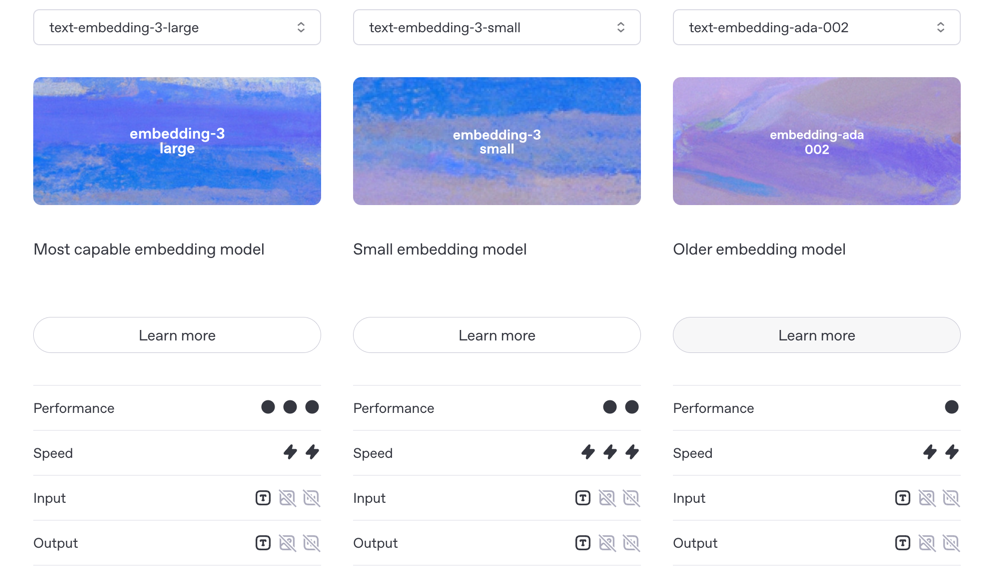
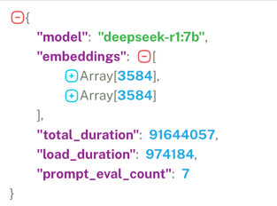
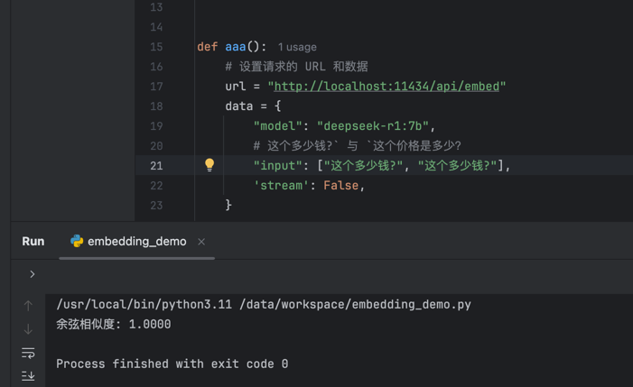
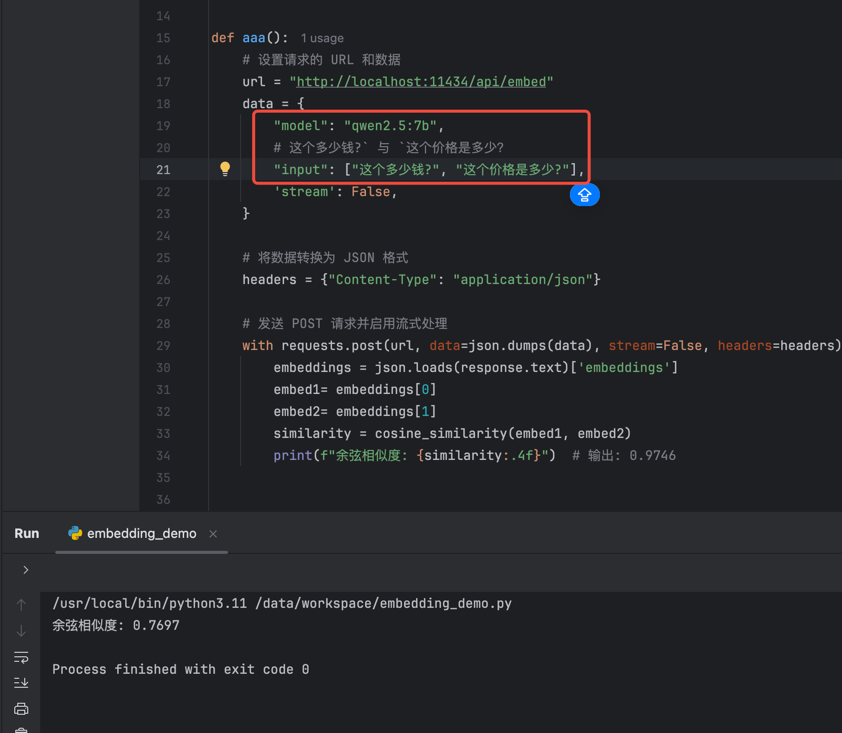

当用户向 LLM 提问为例，流程如下：
`原始文本 → Token → 嵌入向量 → 模型处理 → 输出 Token → 解码为文本`

其中 `Token` 的意思是将文本转成数字，然后这些数字通过`嵌入向量`模型, 得了一个连续的向量维度，用来描述`Token`,
在把这些丢给 `LLM`, `LLL` 通过`上下文关联`, 输出`Token`, 然后再转成文本，展示给用户。

## Tokenization 分词

那什么是 token 化呢？ 或者说，如何将文本转成数字？其实就是分词，切割，将文本分割为模型认识的单元。<br>
例如：句子 `"Hello, world!"` → Tokens `["Hello", ",", "world", "!"]`（具体取决于分词器）。<br>

接着进行数字化映射：每个 `Token` 被转换为整数 `ID`。 例如：`"Hello"` → `ID 12345`，`"world"` → `ID 67890`。

一般来说，分词器是配合嵌入向量合在一起用的，如果我们要单独使用分词器，可以运行额外的分词模型。这里举个简单的例子，看看
分词器是如何分词的。


先安装分词器：

```shell
pip install transformers sentencepiece  # 安装依赖
```

接着运行，第一次运行可能比较慢，需要耐心等待：

```python
from transformers import AutoTokenizer

# 加载 Qwen 分词器（例如 qwen-7b）
tokenizer = AutoTokenizer.from_pretrained("Qwen/Qwen-7B", trust_remote_code=True)

text = "Hello"
tokens = tokenizer.tokenize(text)
token_ids = tokenizer.encode(text)

print("Tokens:", tokens)      # 输出 Token 列表
print("Token IDs:", token_ids) # 输出对应的数值 ID
```

输出结果：

```
/usr/local/bin/python3.11 /data/workspace/token_demo.py
Tokens: [b'Hello']
Token IDs: [9707]

Process finished with exit code 0
```


结果是 `[9707]`。

但是知道这个对我们来说没什么用，不同的分词器，结果 `Token` 数量，值都是不一样的，此外，得到了分词后的映射 `ID`，我们也不知道它的具体意义。
所以一般需要配合 `嵌入向量` 来共同作用。

`Token` 是嵌入向量的基础，嵌入向量根据分词器得到的 `Token` `ID`，转成高维度向量，是 `Token` 的语义升级.


## Embedding 嵌入向量
嵌入向量是语义的连续表示，关注上下文和关系，所以嵌入向量也可以叫语义理解。举个例子：`这个多少钱?` 与 `这个价格是多少？`, 正常情况下，我们认为这两句话的语义是一样的，
在高维度的向量中，他们的值应该也是趋近的，我们可以用嵌入向量的模型来验证这一点。

嵌入向量有很多模型，我们用的比较多的是：`SentenceTransformers`，`OpenAI Embeddings`，以及 `HuggingFace `上的`BAAI/bge-small-en`

* SentenceTransformers： https://sbert.net/
* OpenAI Embeddings：https://platform.openai.com/docs/models
* BAAI/bge-small-en：https://huggingface.co/BAAI/bge-m3

一般来说，嵌入向量模型的维度越多，则它对语义的理解就越强，因为维度越多表示它对语义的描述的细节越多。

举个例子，假设：`妈妈` 这个词最终经过嵌入向量的转换后，生成的结果如下：

```
# 模型 1
[9708] # 假设 9708 表示妈妈的意思

# 模型 2
[9708,9709] # 假设 9708 表示妈妈的意思，假设 9709 表示母亲的意思
```

我们可以看到，`模型 1` 的维度只有 `1`，所以它只能表示一种意思，但是`模型 2` 的维度有 `2` 个，所以它能表示两种意思。

而用户在搜索的时候，搜:`爱迪生的妈妈叫什么名字?`，如果 `AI` 仅仅学了到 `爱迪生的母亲叫艾玛`，这时候，用`模型 1`，就无法回答用户，但是用了`模型 2`，就能回答
用户，可见，嵌入模型对用户的提问过程中，起非常关键的作用，好的嵌入模型能极大的提高 `LLM` 的能力。

目前公认的最好的模型应该还是 `OpenAI` 的那几个模型，维度高达 `1500+`， 而 `bge` 的维度只有 `1024`， 但目前`OpenAI` 的嵌入模型是收费的，而且没有开源，所以
我们要根据自己的实际业务需求，选择合适的嵌入模型：


下图是 `OpenAI` 的三个嵌入模型，其中 `large` 对语义的理解是最强的，但是它最贵，比较也比较慢，我们在实际的生产中，一般都是用 `small` ，速度快，价格比低：



### 模型对比

| 特性         | SentenceTransformers                                | OpenAI Embeddings          | HuggingFace BAAI/bge-small-en |
|------------|-----------------------------------------------------|----------------------------|-------------------------------|
| **模型类型**   | 开源（本地部署）                                            | 闭源（API 调用）                 | 开源（本地部署）                      |
| **典型模型**   | `all-mpnet-base-v2`                                 | `text-embedding-3-small`   | `BAAI/bge-small-en`           |
| **训练数据**   | 通用英文语料                                              | 大规模多语言混合数据                 | 中英文混合优化                       |
| **向量维度**   | 768                                                 | 1536                       | 512                           |
| **语义理解能力** | 高                                                   | 极高                         | 中高（中文优化）                      |
| **多语言支持**  | 需特定多语言模型（如 `paraphrase-multilingual-mpnet-base-v2`） | 支持（100+ 语言）                | 中英文为主                         |
| **速度**     | 较快（本地 GPU 加速）                                       | 依赖网络延迟（约 100-300ms/请求）     | 极快（轻量级设计）                     |
| **成本**     | 免费                                                  | 按调用量付费（约 $0.00002/千 token） | 免费                            |
| **隐私与合规**  | 完全本地处理，数据无外传                                        | 需上传数据至云端                   | 完全本地处理                        |
| **可定制性**   | 支持微调                                                | 不支持                        | 支持微调                          |

### 测试嵌入模型

`Ollama` 本身支持测试向量模型，官方用例：

```shell
curl http://localhost:11434/api/embed -d '{
  "model": "all-minilm",
  "input": ["Why is the sky blue?", "Why is the grass green?"]
}'
```

转成 python 后：

```python
import json

import requests


def aaa():
    # 设置请求的 URL 和数据
    url = "http://localhost:11434/api/embed"
    data = {
        "model": "deepseek-r1:7b",
        # 这个多少钱?` 与 `这个价格是多少？
        "input": ["这个多少钱?", "这个价格是多少?"],
        'stream': False,
    }

    # 将数据转换为 JSON 格式
    headers = {"Content-Type": "application/json"}

    # 发送 POST 请求并启用流式处理
    with requests.post(url, data=json.dumps(data), stream=False, headers=headers) as response:
        for line in response.iter_lines():
            if line:
                print(json.loads(line).get("response"))


if __name__ == '__main__':
    aaa()

```

结果如下：

```
{'model': 'deepseek-r1:7b', 'embeddings': [[-0.0025235526, -0.01901969, -0.018454643, -0.0039711054, 0.0077189836, -0.0023009726, -0.018039182, -0.011503955, -0.032006823, 0.02485924, -0.0048791533, 0.006145271, 0.0025916332, -0.006168392, 0.001041633, -0.008324594, 0.0017008941, 0.0017069805, -0.013247196, -0.0057647377, 0.007684458, 0.014061387, -0.013574904, 0.008071824, 0.013953541, -0.007168137, 0.0050165923, -0.019988252, -0.013895274, -0.003986475, -0.0019780595, -0.0099051045, 0.008129556, -0.0025644102, -0.008892117, 0.0005316697, -0.0012943088, 0.021532621, 0.00987024, -0.01167172, -0.013097491, 0.0066685835, -0.0055979337, -0.0028298995, 0.021996, -0.016528023, 0.0019344726, -0.005843465, -0.016344013, 0.019525118, 0.014070451, -0.0055901115, 0.005651729, 0.011355905, 0.0057323687, 0.00030432467, -0.0018968856, -0.016419103, 0.014209726, 0.011349289, -0.00026507775, -0.00081920205, 0.0034591882, -0.0050430144, -0.010326, -0.014720899, -0.010900608, -0.013193159, -0.00541685, 0.006878432, -0.016812665, 0.032728452, 0.0120651545, -0.00093273964, 0.009751038, -0.002224901, -0.031863596, -0.006330379, 0.013041529, -0.011439677, -0.0024008963, 0.022742813, -0.020885684, -0.004519587, 0.030090403, -0.027455756, 0.016346734, -0.013306372, -0.010847098, -0.011736636, 0.021823356, 0.011249142, -0.014331574, 0.014902455, -0.009270419, -0.0012794995, -0.005633942, -0.008998618, 0.020664034, -0.006442879, -0.008024237, 0.016455617, -0.01712561, -0.011365583, -0.0035546038, -0.008060607, 0.0060778037, -0.006834058, 0.027849646, 0.008475001, 0.0073757987, 0.0057009324, -0.00035521976, 0.008535285, 0.009033371, -0.06346503, -0.01983855, -0.021138526, 0.009121062, -0.0015677762, -0.0068113613, -0.00043751136, 0.0072167125, -0.003579985, 0.01574337, 0.041801672, 0.012772555, 0.010171939, 0.0130160535, 0.0041608675, -0.008160723, -0.0011044737, -0.0015829965, 0.008872886, -0.03521938, 0.0038103473, 0.014872121, 0.018851327, 0.014343094, -0.008421115, -0.0043588136, -0.011706223, 0.0042181336, -0.008740515, -0.008402624, -0.013940043, 0.008228396, 0.002348134, -0.010716633, 0.009176464, 0.0016190618, -0.009232641, 0.0019080978, -0.018657858, -0.0062380508, -0.004050875, 0.009626726, -0.00059346907, 0.006900616, 0.010983216, 0.016632088, 0.009438206, 0.045645766, -0.0018784722, 0.059100334, -0.02377645, 0.008785147, 0.0010881816, 0.00020485603, 0.00087307964, -0.024724895, -0.013136678, 0.038653728, 0.0018302584, 0.012776023, 0.026460748, 0.0030393, 0.0103875045, 0.017809128, -0.019854479, -0.002551754, 6.2751083e-06, 0.002657789, 0.018009726, -0.018259678, 0.033387642, 0.0029433286, 0.030296741, 0.008487496, -0.0344255, -0.019622643, -0.0034465748, 0.009336967, -0.016195688, -0.014528181, 0.00017797326, -0.002041231, 0.026175877, -0.005305787, -0.004107165, 0.022060608, -0.030496327, 0.00707883, -0.022260804, 0.004727148, 0.007195466, -0.023906136, -0.004017171, 0.0041769757, -0.0057969685, 0.012175261, 0.012097147, 0.003712651, 0.020355865, 0.010318335, 0.003309701, -0.020285845, -0.0015379904, 0.0066869403, 0.0022857343, 0.011115992, -0.014988566, 0.0061787446, -0.016795835, 0.007448052, -0.0063425577, -0.01179582, 0.013421158, 0.009343941, -0.016469134, 0.02413272, -0.007950796, 0.0033231755, 0.023315286, -0.004920952, 0.0032448778, -0.012796681, -0.0144954305, -0.014354711, 0.016940195, 0.011687371, 0.005821883, -0.005433619, 0.0025685458, -0.025295518, 0.0023155082, -1.4532622e-05, 0.0070797694, 0.007169998, -0.0153798545, 0.0033965737, -0.005275198, -0.004195275, -0.014608423, -0.004095999, -0.0070663784, 0.009282257, 0.01515264, 0.014123812, 0.01995818, -0.0046189185, -0.012557747, -0.012814644, -0.0038768128, 0.007894258, 0.009450222, -0.008501098, -0.009002079, 0.02725722, 0.006470101, 0.0004893131, 0.021903196, -0.010338688, -0.01274309, -0.0025169933, -0.016729148, -0.016975796, 0.0627076, -0.0014648288, 0.014577614, 0.017603619, -0.020480506, 0.075861506, 0.010021126, -0.010112673, 0.009057749, -0.030052448, -0.0016031137, -0.0039769667, -0.0044011855, 0.00025375513, 0.0038953805, 0.013286162, 0.0023450905, 0.026935454, -0.0050841244, -0.015151034, 0.009989433, -0.008319064, -0.0026677528, 0.013019071, -0.0076290304, 0.0067636375, -0.0019748255, 0.0042049047, -0.006858454, 0.0044892114, -0.009804932, -0.0036245037, 0.019313136, 0.074113004, -0.008359973, 0.0045110513, -0.008408975, -0.0040523, 0.002033599, 0.0015336382, 0.0021934118, 0.03059601, -0.009545915, 0.013563332, -0.018919492, -0.0031047806, -0.013411984, -0.0023935647, -0.027621215, 0.02532169, 0.022467414, 0.011112074, -0.016799206, -0.01599247, 0.009752671, -0.010914009, 0.012035615, 0.0040208306, -0.010347334, 0.021516275, 0.021549132, 0.0017118646, 0.0069761905, -0.057533916, -0.007357461, -0.001081391, -0.019060228, -0.073130734, -0.0008885473, -0.020675588, 0.0047348095, 0.010500914, -0.005221688, -0.0068374956, -0.006921383, 0.012477131, -0.03139516, -0.013307148, 0.017918777, 0.010277778, -0.016788332, -0.01278544, -0.011681937, 0.0043369853, 0.00017641649, 0.057155475, 0.00024227792, 0.027430493, -0.013417564, 3.7602145e-05, 0.0031404041, -0.012597718, 0.009622121, -0.0045975, -0.005334588, 0.0075775334, -0.006572385, 0.002077433, 0.0098213535, 0.00017906161, 0.0019002175, -0.006554231, -0.011413869, -0.0018513253, -0.007640382, -0.0015213733, 0.00069738925, 0.021155141, 0.005629015, -0.013865415, -0.0068336907, -0.0042926543, 0.02716728, -0.023143463, 0.037766732, 0.04674388, -0.02518404, -0.008051155, -0.015128415, -0.004746552, 0.0017729478, 0.008156263, -0.013178404, 0.0046647675, -0.012977954, 0.014754369, 0.011551829, -0.015508138, -0.009031652, 0.009328991, 0.008897769, -0.021565704, 0.00051243725, 0.0067781014, 0.015765477, 0.0034516691, -0.0108029265, -0.007778099, -0.0124514755, 0.0102214925, -0.010174745, 0.010899287, 0.008122579, 0.0056331307, 0.017597875, 0.008634361, 0.0002863569, 0.009396405, -0.020532254, -0.009542028, -0.010174658, 0.0074599963, -0.0022436378, -0.0061840657, -0.00047242182, 0.02309701, -0.0099410415, -0.0049469937, 0.011060453, -0.007424277, -0.0029489654, 9.12534e-05, -0.014363626, 0.060644716, -0.00985059, 0.008944059, -0.01339392, 0.010330045, 0.016570024, -0.0013163476, -0.027491713, -0.0017279518, -0.013988868, -0.018792333, 0.0054676556, 0.009333847, -0.014215551, -0.007978667, -0.014800449, -0.0038437971, -0.0066004293, 0.047996238, -0.0051437607, 0.020163128, -0.018616874, 0.018509088, 0.003117292, -0.011718636, 0.0072340136, -0.0058434224, -0.0076069436, 0.016373111, 0.019972539, 0.011500094, 0.4190595, 0.018532446, -0.02340403, -0.015230963, -0.0031882578, -0.0013118574, -0.0079130605, 0.02633436, -0.022298712, 0.0016720099, -0.0006004435, 0.029341782, 0.012762513, -0.007149582, -0.013187042, 0.021131411, 0.0018023277, 0.0032150103, 0.003033347, 0.041011922, 0.007938354, 0.0093593495, -0.02535316, -0.0011533328, -0.005207993, -0.00822019, -0.023657791, 0.003718681, -0.008947608, -0.008915358, 0.02215899, -0.0016450273, -0.0025903627, -0.013986328, -0.006552874, 0.018723795, 0.0010776506, -0.016997444, 0.020648548, 0.0025411253, -0.013255185, -0.015004366, -0.0007458852, 0.0009346596, 0.010921463, -0.006283193, -0.0019729717, -0.02174756, -0.019210473, 0.008468649, -0.0024986335, 0.005311389, 0.011051334, -0.011551308, 0.021725815, -0.006095485, -0.015888002, 0.0045764297, 0.00150247, -0.019501302, -0.0014978078, 0.012452864, 0.006779523, -0.008815556, 0.0030492812, -0.01897481, -0.029735174, 0.0016876401, 0.005826519, 0.0021220061, -0.028439004, 0.010404997, -0.018637303, -0.03210369, 6.188337e-05, -0.007933984, -0.014504077, -0.024290364, 0.0036487665, 0.007500638, 0.004590507, -0.0065359185, 0.043107502, -0.0336461, 0.0046364996, -0.0050080004, -0.0020402626, -0.0025327995, -0.0030739275, 0.008071008, -0.012258395, 0.0055948305, -0.021707749, -0.0085029425, -0.0109412605, -0.0036397988, 0.0033475296, 0.0016010184, -0.0073654936, -0.010409575, 0.019924164, -0.012856578, 0.025070019, 0.015781814, 0.004818393, 0.005414596, -0.0027710553, -0.0023660904, 0.019969335, 0.023030857, -0.01796383, 0.012263245, -0.008663167, -0.0072882874, 0.012909434, 0.0037766618, 0.001970895, 0.035059523, -0.009080759, -0.006145879, 0.010784393, -0.0099468855, 0.0060094167, -0.029213779, -0.004671579, -0.001506844, 0.022806957, -0.020668631, -0.0026571483, 0.0025787426, -0.0024789062, 0.030703623, 0.0057300366, 0.008363849, 0.0030621013, -0.006055913, -0.009279448, 0.017813955, 0.0040580616, -0.021379124, -0.016661692, 0.0057023205, -0.026231268, -0.011357241, -0.007930162, 0.036316033, 0.015837057, 0.0020543886, 0.0078020506, -0.011335905, -0.009237766, -0.0030093475, -0.031237155, -0.17942798, -0.008760453, 0.0002204412, 0.014040525, 0.00864142, -0.0037845555, -0.013309044, 0.0037857278, 0.012147189, 0.016357891, 9.654369e-05, -0.012535682, 0.007942696, -0.00067114877, -0.010998041, 0.007082274, 0.0036756392, 0.01504954, -0.016514635, 0.018576799, 0.014541475, 0.0012977389, 0.0062430473, 0.02324011, -0.003521247, 0.0047776243, -0.028686486, -0.0074547133, 0.00817831, -0.011013096, -0.013449902, -0.0057157543, -0.0062568546, -0.009258765, -0.00037808536, -0.007838438, 0.0060972553, -0.013983309, -0.010646496, 0.00015005106, 0.021008523, 0.007379593, 0.021487957, -0.007303836, 0.0040215384, 0.008688643, 0.009506253, -0.008750796, 0.008764449, 0.0062507354, 0.015397871, -0.0042879125, -0.004558764, -0.017696986, -0.0078036734, 0.00480469, -0.003765514, 0.0021052815, -0.008533264, -0.00246574, 0.010318675, 0.0030565953, 0.004380922, -0.016443025, 0.008820715, -0.0014434118, -0.022525845, 0.0046835067, -0.01824606, 0.022879481, 0.0076001403, -0.0023456586, -0.039343767, 0.0022367185, 0.0094951205, 0.01124035, -0.015604393, -0.010011251, -0.020332301, 0.021759586, -0.0107340785, -0.009035927, 0.00062431465, 0.0074184546, 0.0046398854, -0.006508041, -0.00511577, 0.023121117, -0.010014898, 0.020114603, 0.002578697, 0.016537473, 0.007676071, -0.0058469307, 0.00080142845, 0.0045554247, -0.004662161, 0.023761502, -0.0050509423, -0.003792875, 0.00033354847, 0.02531329, -0.011167376, 0.01694682, 0.029431373, -0.0140852565, -0.012617061, 0.0018446883, -0.00989583, 0.0128898425, 0.0091426335, 0.00017294618, -0.01608399, -0.010418958, -0.00343058, -0.0113472, 0.0053036856, -0.017335214, 0.0029829952, 0.009009645, -0.0027330962, 0.013727594, -0.0063632284, -0.00092248584, 0.0009499769, 0.0068831183, 0.009785611, -0.020691678, 0.0062818965, -0.008280743, 0.014558834, 0.006849956, -0.021671679, -0.03682851, -0.0031144668, -0.033008106, 0.010496171, 0.0076173707, -0.0057343356, 0.0033113474, -0.0174356, 0.032920454, 0.01793181, -0.0036574213, 0.020166745, 0.023896335, -0.0026522577, 0.01660802, 0.060832642, 0.004939384, 0.0067063137, 0.09343497, 0.012658755, -0.015329444, -0.011744801, 0.009419951, 0.005990042, -0.02567826, -0.004886157, -0.016844394, -0.0038899523, 0.009310429, -0.022200191, 0.01824225, -0.0015202, 0.022835964, -0.000118019365, -0.014604595, 0.079748094, -0.012906975, 0.017152518, -0.00075815443, 0.008379299, -0.00808262, -0.01492066, -0.0024110298, -0.0014041763, 0.014486928, -0.010727413, -0.005472006, -0.007518601, -0.001053891, 0.01724831, 0.0039168964, 0.0024274334, -0.0027327132, -0.010088558, -0.009620688, 0.0043043736, -0.0068834014, 0.004831572, -0.003149782, -0.018140834, 0.0026231464, 0.008255914, 0.0065412316, -0.010408702, 0.006843723, 0.008863307, -0.008662224, 0.034095112, -0.0031465732, 0.02001379, 0.007386063, 0.009517283, 0.0011910608, 0.01497933, 0.001419812, -0.012666408, 0.009127682, 0.011922413, 0.00622291, -0.012260389, -0.020028234, 0.0032481432, 0.0019305822, -0.01357264, -0.021200651, 0.008879414, 0.009834059, -0.0014857043, 0.0006294851, -0.0034105736, 0.0048137787, -0.014943202, 0.0046893917, -0.0063345716, 0.0057299403, -0.032700013, 0.016902242, -0.021826917, -0.0047102445, 0.015872318, 0.013818666, 0.01039261, 0.027120702, -0.007531466, -0.018145654, 0.010909349, -0.008152586, -0.0071596154, 0.014289913, 0.006645797, 0.024838584, -0.017145157, 0.017886179, 0.007315068, -0.002090405, 0.005617589, 0.003312096, 0.0015142624, 0.011835884, 0.004172891, 0.036502693, 0.010070532, -0.30902797, 0.022739872, -0.028588325, -0.004769353, -0.0002951447, 0.01595241, 0.015842589, 0.023346905, 0.009276892, -0.018020405, 0.016411973, 0.16964278, 0.012501348, -0.0025131807, 0.016263306, 0.019404495, 0.011376782, 0.0010709395, -0.0028745453, -0.046065476, 0.009796031, -0.0066693267, 0.0053893765, 0.0077381213, -0.0007065954, -0.016893048, 0.011256494, 0.008988272, -0.014645205, -0.017533975, 0.01242564, -0.011383492, -0.005870936, -0.002418207, -0.012466957, -0.004907509, -0.006372822, -0.02481387, -0.02396915, -0.008515899, -0.0008724326, 0.0046060695, -0.0030165303, 0.0017669431, -0.010068719, -0.011497781, 0.010063608, -0.015996477, -0.023692928, -0.019404812, 0.0070887106, 0.0036946663, -0.005723177, 0.0023117096, 0.0050674076, -0.012178461, -0.020213652, -0.040418014, 0.00840286, -0.014844723, 0.001487624, 0.011408106, 0.0021917238, -0.0055183903, -0.02913401, 0.072514154, 0.027554274, -0.016942108, -0.0031114495, -0.037965547, 0.007148411, -0.0029452813, 0.025024107, 0.011560002, -0.013613335, 0.008938529, 0.018156147, -0.01331564, -0.0018521836, 0.019870663, -0.011241558, 0.0020759355, -0.02296229, -0.0006468569, 0.013179586, 0.012023175, 0.003424249, -0.0013332262, 0.012302838, -0.011351027, -0.015778061, -0.012971123, 0.0024163635, -0.030098947, 0.0031534855, 0.010311187, 0.010407983, -0.0036831952, -0.008911242, 0.0067356024, 0.0023904715, -0.011213707, -0.0142527735, -0.017315377, 0.1551377, -0.006725866, 0.020994226, 0.013642051, -0.002802539, -0.010296797, -0.001665511, -0.017554643, -0.004660819, -0.010631474, -0.021307437, -0.0057236208, -0.008340154, 0.00037852387, 0.026590584, 0.0069510583, -0.0028453395, -0.013981427, 0.014215316, -0.009602495, -0.0077260802, 0.00426682, -0.0016582805, 0.003031773, -0.017109819, 0.00053094316, -0.005868364, -0.0033363565, 0.016959645, -0.009349468, 0.024905115, 0.0029167745, -0.033384476, -0.014438563, -0.026021717, -0.008065494, -0.00980488, -0.0032046728, 0.012680476, -0.029880429, -0.010081158, 0.00061810884, 0.0009787268, -0.0007169568, -0.0031706702, 0.013301951, -0.033620037, 0.011099713, -0.01075896, 0.008356017, 0.0012785639, -0.00999415, 0.0042412314, -0.017791098, -0.0025696687, 0.002268693, 0.00075987773, 0.0024873079, -0.036329083, -0.014624545, 0.0020998481, 0.0045917556, -0.0076663173, -0.0011124624, -0.00057682116, -0.0077835554, -0.021495529, -0.012945908, -0.011302634, 0.010860304, 0.01053119, 0.0028674467, -0.0050811996, 0.0019090823, 0.014518148, -0.008863424, -0.010073355, -0.008427968, 0.010143577, 0.037266336, -0.011215443, -0.023024302, 0.010690126, 0.0010113517, 0.014720127, 0.00060808274, 0.036471274, 0.00919559, 0.0037094194, -0.011608107, 0.008381666, 0.0036985101, 0.0076368987, -0.00012966405, -0.0069936463, -0.017452992, 0.006572539, -0.027505044, 0.011100254, -0.00012451259, -0.011933406, 0.007763753, 0.005928191, -6.2290164e-05, 0.00021333565, 0.017286956, -0.0012827315, -0.014731021, -0.0026263185, 0.02881503, -0.021431122, -0.027914958, 0.0002188207, 0.0043296283, -0.012788729, -0.006301529, -0.008263877, -0.0037233795, 0.033958144, 0.023998996, -0.021133484, 0.0039850073, 0.008419069, 0.016064582, 0.01944221, 0.0050202506, -0.0011915447, 0.005703582, -0.0029140133, -0.00025187535, -0.020964112, -0.0057429383, -0.018460035, -0.054524772, 0.010698122, -0.0067731766, 0.0020970262, -0.014187646, 0.030115321, 0.026416972, 0.007960781, -0.015395841, -0.014116044, 0.02564062, 0.004801982, 0.017349327, 0.028480785, -0.013836347, -0.017568924, -0.0020006462, -0.017490692, -0.0014128379, -0.014785986, -0.004582968, 0.01782575, -0.009402287, 0.015614429, 0.009303753, -0.010494659, 0.006438628, 0.01106059, 0.00021508195, 0.016753012, 0.007889343, -0.0042086868, 0.025058925, -0.009182687, 0.029947523, 0.025026655, 0.024145829, 0.017191822, 0.004268663, -0.016106436, -0.0072543505, -0.026340777, 0.02391902, -0.006578043, 0.013336701, 0.020547144, 0.011664719, 0.0014384696, -0.011992273, -0.00845002, 0.024437994, -0.003236634, 0.0032188704, -0.027611917, 0.0070883785, -0.01855696, 0.0065050414, -0.014847743, 0.012639099, -0.0016143585, 0.0019647067, 0.015399952, 0.0048913127, 0.01543962, -0.009156707, -0.012904426, 0.19770306, -0.017173577, 0.007317659, -0.006742584, -0.02924553, 0.008819153, 0.009950799, 0.0011369266, 0.015287968, -0.010167331, 0.011112865, 0.011113946, 0.0033916244, 0.010623641, 0.017533192, 0.010085031, 0.0062452843, 0.009237856, -0.009898741, -0.014918239, -0.0091560995, -0.011466555, -0.0088520115, -0.0010762451, 0.007230818, 0.007845785, -0.0024483409, -0.0019397583, 0.012179806, -0.012293403, 0.0036941932, -0.021449981, -0.006002379, 0.0004471995, 0.017513463, 0.0049306205, 0.00499869, -0.006574945, -0.022739807, 0.009160308, -0.014794768, 0.002226769, -0.0034072306, -0.020348845, 0.0041500614, -0.01877731, 0.0072732414, -0.0020036055, -0.00024168105, 0.01117515, -0.0024427127, 0.004216726, -0.0081838155, -0.002366029, -0.013585881, 0.018694665, -0.009806058, 0.011776512, 0.012599724, -0.016699174, 0.008796218, 0.010169831, 0.00936444, 0.02772919, -0.010293253, -0.004416851, 0.019304749, 0.0028181195, 0.011266699, 0.0078023733, -0.0031908923, -0.009209218, 0.008282542, 0.007317687, -0.015115469, -0.01763613, 0.0036364284, -0.012163519, 0.00016036829, 0.0040143607, 0.021348303, 0.022158254, 0.0013134296, -0.0066788956, -0.080158204, 0.020956473, 0.012021013, -0.00076944416, 0.025034511, -0.0019843215, -0.028324539, -0.0074638603, -0.0026287779, -0.007769709, -0.012976629, -0.04095509, 0.012952107, -0.0035902443, -0.010615867, 0.018221766, -0.015741773, 0.0136182755, 0.0026973917, -0.03072314, -0.01475192, 0.007182184, 0.009664293, 0.008337815, -0.033699065, -0.00740293, 0.008299182, -0.002832512, 0.014666305, 0.0057304855, -0.00331983, 0.017640283, -0.011655197, 0.0007442642, -0.0054404824, -0.015682833, 0.021698656, 0.01481907, 0.008371307, -0.006384102, -0.007059619, 0.023951497, -0.011223265, -0.025836902, -0.005403019, 0.008152507, 0.008389587, -0.0024230597, -0.007314077, -0.0110334195, -0.004779433, -0.022043409, -0.010149752, 0.021242866, -0.00037991934, -0.014201183, -0.006301544, -0.014301974, 0.015138481, 0.010776622, -0.021201978, -0.0066294554, 0.0012972536, 0.00040046082, -0.00019288153, -0.018430475, 0.0012270678, -0.0057155252, -0.0071514198, -0.0146598965, -0.0015823749, 0.002813179, 0.006373608, 0.019043257, 0.006860662, 0.012850404, 0.00431038, 0.005830301, -0.00892233, 0.008491928, -0.018041115, 0.019388447, 0.02064136, -0.0034599812, 0.0015571576, 0.006456229, -0.02146344, 0.021401973, -0.023504743, -0.024566486, -0.003977445, -0.01854312, -0.014880754, -0.00364585, 0.0068796487, -0.010613784, -0.0035537635, 0.008241747, 0.0038992574, 0.0058563566, -0.0057767984, 0.0008884197, 0.027712563, 0.012175497, 0.0017474887, -7.1552204e-05, -0.011942739, 0.007730876, 0.052245572, -0.004469772, -0.0030962, 0.017390182, -0.010737678, 0.019990675, -0.0038641177, 0.0044621015, -0.024743441, 0.0066509764, 0.027262589, -0.006036235, 0.019153442, 0.013797792, -0.020599354, -0.00044019884, -0.009959114, -0.016360922, 0.0119496845, -0.019577855, -0.020808063, -0.008338822, 0.03138121, -0.00350006, 0.004648582, -0.011590604, 0.0037819764, 0.0019861492, -0.0041282717, 0.013069646, -0.005764104, -0.009040486, -0.0016440172, -0.008570798, -0.022073532, 0.0063613574, 0.002700398, -0.016902594, -0.017536534, 0.018525725, 0.07740688, -0.0005005136, 0.013864372, -0.012219347, -0.0031021931, -0.0015313961, -0.0051610405, -0.024567587, -0.086405866, 0.00013559642, -0.008360835, 0.017822105, 0.008018065, 0.042522613, 0.03786213, -0.016195359, -0.014215546, 0.017065972, -0.018177988, -0.014418803, -0.024184998, 0.012411728, 0.007876109, -0.008380155, 0.013503887, 0.03930299, -0.0014051951, -0.006123315, -0.0023256114, -0.009176759, 0.018885873, 0.013821775, 0.0075658895, 0.008988484, 0.020215712, -0.002899563, -0.00031249554, 0.008321014, 0.025046898, -0.0020082642, -0.023029726, -0.0036909794, 0.024347808, 0.0025606924, 0.0019625018, 0.009009682, 0.01180472, -0.003420096, -0.0068842648, -0.020269874, -0.016319068, -0.00047834098, 0.0007268057, -0.015336683, -0.007393968, -0.0074394913, -0.020996405, -0.005138129, 0.00019739465, 0.001528038, 0.022184696, 0.005558028, -0.01785545, 0.018802844, -0.005840444, 0.00302894, 0.0141600175, 0.026883395, -0.017734328, 0.006936689, -0.009739576, 0.008975032, -0.014354044, 0.018808628, -0.031349514, -0.028700022, -0.00442159, -0.005797736, 0.0027721026, -0.0130156, -0.0020705564, -0.011024095, -0.0051299017, -0.009888283, 0.011713178, -0.008024772, 0.028795497, 0.016531907, 0.02041755, 0.014327897, 0.005879407, 0.01425017, -0.015739765, 0.21504076, 0.0018832162, -0.01588685, -0.008875662, -0.0071115303, -0.013568992, 0.029412044, -0.0052060783, 0.0022721423, -0.016621176, -0.009618493, 0.0082861725, 0.005003583, 0.02378254, 0.009779929, 0.015082392, -0.01820277, -0.0032784583, -0.019956673, -0.021451615, 0.008152154, 0.0057242257, -0.000886555, -0.0014003131, 0.02806388, -0.0045187348, 0.0005889038, 0.027175859, -0.0036477551, -0.004957931, -0.0025929287, -0.012481924, -0.0047191987, 0.0004529091, -0.023980957, 0.0057896525, -0.007751806, 0.014665254, -0.0034972548, -0.004219604, 0.027491137, -0.011468143, 0.0028030265, -0.022259487, -0.004472146, -0.0066858786, -0.012248733, 0.018370764, -0.01567942, 0.006591411, -0.0105710495, 0.0012471917, 0.00082067156, -0.025629945, -0.00039656681, -0.084232174, 0.0142654, -0.0120129455, 0.014225519, 0.010575788, 0.00272921, 0.0012559895, -0.006262161, 0.00018817428, -0.004351567, 0.0068701096, -0.010436208, 0.020558449, 0.0014402827, -0.0036170606, 0.010107663, 0.006731033, 0.022012867, 0.002539869, -0.005975619, -0.020124497, -0.027871167, -0.010966953, 0.02801703, 0.010454475, -0.005082693, 0.022637296, 0.011036105, 0.0067168265, 0.0052496465, 0.017670857, 0.012998255, 0.013027788, -0.02312921, 0.022311963, -0.019911895, 0.010055306, -0.005846042, 0.026442992, -0.0039264364, 0.014159933, 0.00790792, 0.016038615, -0.0068810517, 0.009673336, 0.019716911, -0.0018720237, 0.0150667345, -0.0024894592, 0.020859648, 0.013957884, -0.0017357458, 0.024164656, 0.008423071, -0.021909462, 0.033029683, -0.0025692992, -0.0037626596, -0.002413247, 0.007944141, -0.0028688835, -0.0049008545, 0.0061664493, 0.002207112, -0.00236757, 0.00810812, 0.0044590533, -0.0002476866, -0.0064013046, -0.006476172, -0.00091825804, 0.02092623, -0.010059067, 0.010772969, 0.011775678, -0.01083629, -0.014951931, -0.031957865, -0.005136677, -0.016283337, -0.012081035, -0.020410618, 0.0018029942, -0.016283661, 0.0006379334, -0.017001119, -0.008567292, 0.02484148, 4.8729748e-05, -0.016327577, 0.00040496115, -0.004107505, -0.006839806, 0.014783854, 0.010466515, 0.017217599, 0.02913735, 0.008379518, -0.044366132, 0.00990718, -0.0053956895, -0.013439456, -0.0059205927, 0.016741615, 0.006188314, 0.0035050616, 0.009332529, 0.017844262, 0.017242543, -0.002379791, 0.006221498, 0.0012351155, 0.008088675, -0.011421327, 0.012820308, 0.0021895692, 0.0017249383, -0.010072958, 0.013507969, -0.005075383, -0.0059391833, 0.018622648, -0.032383453, -0.0032997385, -0.010198837, -0.019841185, -0.020554783, 0.013363643, 0.021897655, -0.0074804677, 0.008917593, 0.008156666, 0.0004924848, 0.009508413, -0.014385848, -0.021788267, -0.018560272, -0.03050806, -0.0008382103, -0.002016215, -0.01344616, 0.014091056, 0.017295849, 0.012344958, -0.021952884, -0.038767397, 0.019595267, -0.0046735383, -0.022104997, 0.010780568, -0.0087873, -0.006217655, -0.018189276, -0.021173194, 0.010847771, 0.042331386, -0.009087557, -0.0062683695, -0.003592677, 0.021717176, 0.025619274, 0.00091368344, -0.014435461, -0.010356358, -0.026330672, -0.0064030727, -0.016661087, -0.0028174042, 0.003922809, -0.008264548, -0.010935264, 0.0011138475, -0.0017130573, 0.0015006405, -0.023765419, -0.012040799, -0.02060938, -0.0039137546, -0.0045026024, 0.00990938, 0.0032938535, 0.014516362, 0.010972963, 0.0075799874, -0.0030250906, -0.0072844015, -0.017587049, -0.015170271, -0.0033517424, -0.0080670845, 0.09109853, -0.015901852, -0.031017274, 0.0014078459, -0.020298516, -0.0037499203, -0.0044435267, 0.026916392, -0.0018738422, -0.01631158, -0.02657922, 0.0072454526, -0.021072583, -0.00160736, 0.00348973, -0.0071552815, -0.008033213, 0.006410832, 0.0045322767, 0.0046508885, -0.006508117, 0.004969188, 0.010947729, 0.0019567225, -0.03822884, -0.010185483, 0.0077273617, 0.012827244, 0.0122684585, 0.021806568, 0.0024814843, -0.022686932, 0.015652113, -0.016521402, 0.006376729, 0.0012811116, -0.06954681, -0.023166394, -0.013018281, -0.0056949323, 0.010106971, 0.020935196, 0.0084636975, -8.487823e-06, -0.02406755, 0.009977751, -0.015365448, -0.03518325, 0.020458514, -0.034086227, -0.026047241, -0.013666194, -0.0013190442, -0.010108641, 0.006615052, -0.0038640162, -0.0014030499, -0.0057979096, -0.004457418, 0.014746817, -0.008101444, -0.024817705, 0.0012722521, -0.022341873, 0.00085360144, 0.014641227, -0.0067388196, 0.0015985376, -0.009749377, -0.013636676, 0.003096937, 0.036772296, -0.00013783766, 0.012593435, -0.00224499, 0.010900974, 0.01391288, -0.055587985, -0.006495843, 0.033094767, 0.0298016, -0.010152897, 3.587169e-05, 0.020504277, 0.04118189, 0.019914804, -0.0059252875, 0.07615826, -0.011239218, -0.016484117, 0.01445168, 0.001419565, 0.012308338, 0.009964029, 0.015734157, 0.0006832644, -0.010908575, -0.028899549, 0.02434, -0.005791506, -0.00077309075, -0.00514328, -0.00553036, 0.02762568, 0.000583241, 0.013450467, -0.0059039844, -0.014343339, -0.011034273, -0.014773147, -0.02024805, 0.008487131, 0.011959422, 0.004967669, -0.0101780025, 0.030444287, -0.0020537905, -0.014851041, -0.0072917677, -0.0068027787, -0.010173194, 0.014338201, 0.007915708, 0.0046937377, 0.0036671713, -0.022878869, -0.022432745, 0.0052114497, 0.028656239, -0.0006159991, -0.020108547, 0.022696799, -0.005898418, -0.0037299513, -0.03079572, -0.009678118, -0.011354084, 0.0018286171, 0.0088559175, -0.0102873165, -0.0033373944, 0.00502406, 0.0106688235, -0.0052405037, -0.012981078, -0.018938888, -0.002360119, 0.0011728689, 0.018536188, 0.0044340906, 0.0005383865, -0.045902375, 0.010067386, 0.01451637, 0.002671977, 0.0035577745, -0.03581442, 0.006831135, -0.01722972, -0.011023615, -0.006313855, -0.014921119, 0.025777806, 0.02439033, -0.009072174, 0.009320392, 0.023487018, -0.0018038102, 0.027567653, 0.0033023038, 0.014887999, 0.0024160473, 0.013256092, -0.008720918, 0.016123155, -0.012976155, 0.0017798448, 0.031373028, -0.008460344, -0.01624394, 0.0027338553, 0.014699319, 0.030960185, 7.192558e-05, 0.0057824445, 0.0037256733, -0.012382116, -0.015085787, -0.015491097, 0.01944917, -0.0066629066, -0.01566966, -0.002275247, -0.03273179, 0.0018209828, 0.013056582, 0.01192776, -0.015680129, 0.024886426, -0.05649918, 0.028616864, -0.0054584024, -0.014707211, 0.0025441924, 0.0073333257, -0.03434947, 0.0018956002, -0.001786177, -0.009030224, -0.0036276309, 0.010171856, 0.0075765317, 0.00570376, -0.010607987, -0.0071173264, -0.017003892, -0.0028533982, 0.015951151, -0.0052256333, 0.022930885, 0.0033909571, -0.011797072, -0.01734563, -0.013376748, 0.0029833193, 0.009425074, -0.02266706, 0.016510611, 0.00439, 0.0017776322, 0.008142821, -0.007518886, -0.13747412, 0.0037187655, -0.0059023183, -1.4231902e-05, 0.003909233, 0.017186526, 0.008211212, 0.01573875, 0.010590053, -0.006262978, -0.0033780944, 0.008998241, 0.019333621, 0.0054458063, -0.0029086473, -0.0008231119, 0.0009993877, 0.017465921, -0.014865154, 0.022405013, -0.0067594703, 0.003097566, -0.00081297976, -0.012641945, 0.0063815443, 0.030055782, -0.0080731185, 0.017140301, -0.014916375, 0.011751929, -0.0073397523, -0.012514488, -0.011619837, -0.011456475, 0.005775104, 0.0022237806, -0.0023588564, 0.003992294, -0.020474445, -0.025941698, -0.0060785688, -0.008202962, -0.01949106, 0.005808909, -0.0063421624, -0.0019380172, -0.017086161, -0.015523435, -0.006926314, 0.011389468, 0.011567128, 0.014536926, -0.00857837, 0.0030443761, -0.018543355, -0.029456567, -0.007344306, -0.020052008, 0.007003976, 0.0018079226, 0.00022491683, -0.020356901, -0.014508509, 0.011260533, 0.012899685, -0.0066665635, 0.009883921, -0.022049192, -0.01578958, -0.009930539, -0.002138197, -0.00063940894, 0.01901245, -0.013483677, 0.0137657365, 0.005903611, -0.002196812, 0.011208132, -0.0003344784, 0.009517453, -0.007727035, -0.008568488, 0.065895274, 0.0021148731, -0.0049335607, 0.0074475557, -0.0114846565, -0.016979758, 0.030907491, -0.0014503223, -0.012069967, -0.0073902835, -0.020222677, -0.0048717516, -0.014762299, 0.009923997, -0.012405808, -0.013301164, 0.008001997, -0.0056802942, -0.014890425, 0.021634778, -0.016200544, -0.0012025052, 2.7517079e-05, 0.011254181, 0.0028620448, 0.0013989598, -0.004947848, 0.007252531, 0.01589694, -0.001159028, 0.006940038, 0.025052203, -0.0053885053, -0.0048573404, 0.014372791, 0.00096988573, 0.028649246, -0.02278694, -0.019735029, 0.02507083, 0.0172569, -0.0023754153, -0.008689479, -0.0017460226, -0.0015590449, 0.0024927685, 0.008384463, 0.004784654, 0.0012561369, 0.026343921, 0.0020535362, -0.02224971, -0.018788079, 0.0092804115, 0.0013343189, -0.012021835, -0.0017207867, -0.032848924, -0.015190255, -0.007701552, 0.01019654, 0.036525197, -0.0062628784, -0.00226078, 0.008123435, -0.013713137, 0, 0, 0, 0, 0, 0, 0, 0, 0, 0, 0, 0, 0, 0, 0, 0, 0, 0, 0, 0, 0, 0, 0, 0, 0, 0, 0, 0, 0, 0, 0, 0, 0, 0, 0, 0, 0, 0, 0, 0, 0, 0, 0, 0, 0, 0, 0, 0, 0, 0, 0, 0, 0, 0, 0, 0, 0, 0, 0, 0, 0, 0, 0, 0, 0, 0, 0, 0, 0, 0, 0, 0, 0, 0, 0, 0, 0, 0, 0, 0, 0, 0, 0, 0, 0, 0, 0, 0, 0, 0, 0, 0, 0, 0, 0, 0, 0, 0, 0, 0, 0, 0, 0, 0, 0, 0, 0, 0, 0, 0, 0, 0, 0, 0, 0, 0, 0, 0, 0, 0, 0, 0, 0, 0, 0, 0, 0, 0, 0, 0, 0, 0, 0, 0, 0, 0, 0, 0, 0, 0, 0, 0, 0, 0, 0, 0, 0, 0, 0, 0, 0, 0, 0, 0, 0, 0, 0, 0, 0, 0, 0, 0, 0, 0, 0, 0, 0, 0, 0, 0, 0, 0, 0, 0, 0, 0, 0, 0, 0, 0, 0, 0, 0, 0, 0, 0, 0, 0, 0, 0, 0, 0, 0, 0, 0, 0, 0, 0, 0, 0, 0, 0, 0, 0, 0, 0, 0, 0, 0, 0, 0, 0, 0, 0, 0, 0, 0, 0, 0, 0, 0, 0, 0, 0, 0, 0, 0, 0, 0, 0, 0, 0, 0, 0, 0, 0, 0, 0, 0, 0, 0, 0, 0, 0, 0, 0, 0, 0, 0, 0, 0, 0, 0, 0, 0, 0, 0, 0, 0, 0, 0, 0, 0, 0, 0, 0, 0, 0, 0, 0, 0, 0, 0, 0, 0, 0, 0, 0, 0, 0, 0, 0, 0, 0, 0, 0, 0, 0, 0, 0, 0, 0, 0, 0, 0, 0, 0, 0, 0, 0, 0, 0, 0, 0, 0, 0, 0, 0, 0, 0, 0, 0, 0, 0, 0, 0, 0, 0, 0, 0, 0, 0, 0, 0, 0, 0, 0, 0, 0, 0, 0, 0, 0, 0, 0, 0, 0, 0, 0, 0, 0, 0, 0, 0, 0, 0, 0, 0, 0, 0, 0, 0, 0, 0, 0, 0, 0, 0, 0, 0, 0, 0, 0, 0, 0, 0, 0, 0, 0, 0, 0, 0, 0, 0, 0, 0, 0, 0, 0, 0, 0, 0, 0, 0, 0, 0, 0, 0, 0, 0, 0, 0, 0, 0, 0, 0, 0, 0, 0, 0, 0, 0, 0, 0, 0, 0, 0, 0, 0, 0, 0, 0, 0, 0, 0, 0, 0, 0, 0, 0, 0, 0, 0, 0, 0, 0, 0, 0, 0, 0, 0, 0, 0, 0, 0, 0, 0, 0, 0, 0, 0, 0, 0, 0, 0, 0, 0, 0, 0, 0, 0, 0, 0, 0, 0, 0, 0, 0, 0, 0, 0, 0, 0, 0, 0, 0, 0, 0, 0, 0, 0, 0, 0, 0, 0, 0, 0, 0, 0, 0, 0, 0, 0, 0, 0, 0, 0, 0, 0, 0, 0, 0, 0, 0, 0, 0, 0, 0, 0, 0, 0, 0, 0, 0, 0, 0, 0, 0, 0, 0, 0, 0, 0, 0, 0, 0, 0, 0, 0, 0, 0, 0, 0, 0, 0, 0, 0, 0, 0, 0, 0, 0, 0, 0, 0, 0, 0, 0, 0, 0, 0, 0, 0, 0, 0, 0, 0, 0, 0, 0, 0, 0, 0, 0, 0, 0, 0, 0, 0, 0, 0, 0, 0, 0, 0, 0, 0, 0, 0, 0, 0, 0, 0, 0, 0, 0, 0, 0, 0, 0, 0, 0, 0, 0, 0, 0, 0, 0, 0, 0, 0, 0, 0, 0, 0, 0, 0, 0, 0, 0, 0, 0, 0, 0, 0, 0, 0, 0, 0, 0, 0, 0, 0, 0, 0, 0, 0, 0, 0, 0, 0, 0, 0, 0, 0, 0, 0, 0, 0, 0, 0, 0, 0, 0, 0, 0, 0, 0, 0, 0, 0, 0, 0, 0, 0, 0, 0, 0, 0, 0, 0, 0, 0, 0, 0, 0, 0, 0, 0, 0, 0, 0, 0, 0, 0, 0, 0, 0, 0, 0, 0, 0, 0, 0, 0, 0, 0, 0, 0, 0, 0, 0, 0, 0, 0, 0, 0, 0, 0, 0, 0, 0, 0, 0, 0, 0, 0, 0, 0, 0, 0, 0, 0, 0, 0, 0, 0, 0, 0, 0, 0, 0, 0, 0, 0, 0, 0, 0, 0, 0, 0, 0, 0, 0, 0, 0, 0, 0, 0, 0, 0, 0, 0, 0, 0, 0, 0, 0, 0, 0, 0, 0, 0, 0, 0, 0, 0, 0, 0, 0, 0, 0, 0, 0, 0, 0, 0, 0, 0, 0, 0, 0, 0, 0, 0, 0, 0, 0, 0, 0, 0, 0, 0, 0, 0, 0, 0, 0, 0, 0, 0, 0, 0, 0, 0, 0, 0, 0, 0, 0, 0, 0, 0, 0, 0, 0, 0, 0, 0, 0, 0, 0, 0, 0, 0, 0, 0, 0, 0, 0, 0, 0, 0, 0, 0, 0, 0, 0, 0, 0, 0, 0, 0, 0, 0, 0, 0, 0, 0, 0, 0, 0, 0, 0, 0, 0, 0, 0, 0, 0, 0, 0, 0, 0, 0, 0, 0, 0, 0, 0, 0, 0, 0, 0, 0, 0, 0, 0, 0, 0, 0, 0, 0, 0, 0, 0, 0, 0, 0, 0, 0, 0, 0, 0, 0, 0, 0, 0, 0, 0, 0, 0, 0, 0, 0, 0, 0, 0, 0, 0, 0, 0, 0, 0, 0, 0, 0, 0, 0, 0, 0, 0, 0, 0, 0, 0, 0, 0, 0, 0, 0, 0, 0, 0, 0, 0, 0, 0, 0, 0, 0, 0, 0, 0, 0, 0, 0, 0, 0, 0, 0, 0, 0, 0, 0, 0, 0, 0, 0, 0, 0, 0, 0, 0, 0, 0, 0, 0, 0, 0, 0, 0, 0, 0, 0, 0, 0, 0, 0, 0, 0, 0, 0, 0, 0, 0, 0, 0, 0, 0, 0, 0, 0, 0, 0, 0, 0, 0, 0, 0, 0, 0, 0, 0, 0, 0, 0, 0, 0, 0, 0, 0, 0, 0, 0, 0, 0, 0, 0, 0, 0, 0, 0, 0, 0, 0, 0, 0, 0, 0, 0, 0, 0, 0, 0, 0, 0, 0, 0, 0, 0, 0, 0, 0, 0, 0, 0, 0, 0, 0, 0, 0, 0, 0, 0, 0, 0, 0, 0, 0, 0, 0, 0, 0, 0, 0, 0, 0, 0, 0, 0, 0, 0, 0, 0, 0, 0, 0, 0, 0, 0, 0, 0, 0, 0, 0, 0, 0, 0, 0, 0, 0, 0, 0, 0, 0, 0, 0, 0, 0, 0, 0, 0, 0, 0, 0, 0, 0, 0, 0, 0, 0, 0, 0, 0, 0, 0, 0, 0, 0, 0, 0, 0, 0, 0, 0, 0, 0, 0, 0, 0, 0, 0, 0, 0, 0, 0, 0, 0, 0, 0, 0, 0, 0, 0, 0, 0, 0, 0, 0, 0, 0, 0, 0, 0, 0, 0, 0, 0, 0, 0, 0, 0, 0, 0, 0, 0, 0, 0, 0, 0, 0, 0, 0, 0, 0, 0, 0, 0, 0, 0, 0, 0, 0, 0, 0, 0, 0, 0, 0, 0, 0, 0, 0, 0, 0, 0, 0, 0, 0, 0, 0, 0, 0, 0, 0, 0, 0, 0, 0, 0, 0, 0, 0, 0, 0, 0, 0, 0, 0, 0, 0, 0, 0, 0, 0, 0, 0, 0, 0, 0, 0, 0, 0, 0, 0, 0, 0, 0, 0, 0, 0, 0, 0, 0, 0, 0, 0, 0, 0, 0, 0, 0, 0, 0, 0, 0, 0, 0, 0, 0, 0, 0, 0, 0, 0, 0, 0, 0, 0, 0, 0, 0, 0, 0, 0, 0, 0, 0, 0, 0, 0, 0, 0, 0, 0, 0, 0, 0, 0, 0, 0, 0, 0, 0, 0, 0, 0, 0, 0, 0, 0, 0, 0, 0, 0, 0, 0, 0, 0, 0, 0, 0, 0, 0, 0, 0, 0, 0, 0, 0, 0, 0, 0, 0, 0, 0, 0, 0, 0, 0, 0, 0, 0, 0, 0, 0, 0, 0, 0, 0, 0, 0, 0, 0, 0, 0, 0, 0, 0, 0, 0, 0, 0, 0, 0, 0, 0, 0, 0, 0, 0, 0, 0, 0, 0, 0, 0, 0, 0, 0, 0, 0, 0, 0, 0, 0, 0, 0, 0, 0, 0, 0, 0, 0, 0, 0, 0, 0, 0, 0, 0, 0, 0, 0, 0, 0, 0, 0, 0, 0, 0, 0, 0, 0, 0, 0, 0, 0, 0, 0, 0, 0, 0, 0, 0, 0, 0, 0, 0, 0, 0, 0, 0, 0, 0, 0, 0, 0, 0, 0, 0, 0, 0, 0, 0, 0, 0, 0, 0, 0, 0, 0, 0, 0, 0, 0, 0, 0, 0, 0, 0, 0, 0, 0, 0, 0, 0, 0, 0, 0, 0, 0, 0, 0, 0, 0, 0, 0, 0, 0, 0], [-0.007216622, -0.011546097, -0.014962156, 0.012959516, 0.01392483, 0.008907438, -0.020176368, -0.0036319243, -0.010992416, 0.013079652, -0.010412241, 0.010782782, -0.0025378172, 2.3183436e-05, 0.0063349097, -0.008912817, -0.00720694, -0.001195428, -0.0026899197, -0.008434371, 0.020257536, 0.010079842, -0.019937346, 0.006379399, 0.004092482, -0.005393148, -0.0017578108, -0.00717936, -0.014483297, 0.017283272, -0.0015494153, 0.0030452455, -0.011817168, 0.014394364, -0.0012897117, 0.0042728246, -0.016059322, 0.024038117, 0.004017469, -0.001707745, -0.014269132, 0.005158093, -0.010877956, -0.0033981148, 0.004873203, -0.0075614797, 0.0060290378, 0.001890032, -0.017245112, 0.0054420596, 0.01456769, 0.0070570083, 0.008309868, 0.010805484, 0.00072217005, 0.003392505, -0.010539872, -0.012458762, 0.013086238, 0.008145251, 0.013341838, -0.0036521037, -0.0029234695, -0.0045829904, -0.0036679483, 0.006683949, -0.012762895, -0.015003666, -0.011622689, 0.0067175613, -0.014088975, 0.009681768, 0.008060297, -0.009772934, 0.008616204, -0.014335671, -0.019116724, -0.0013632027, 0.017225193, -0.01212648, 0.00183112, 0.0118552, -0.004044787, -0.008216749, 0.018404525, -0.015081618, 0.0013326282, -0.0064447573, 0.005110013, -0.004035861, 0.012145146, 0.012878241, -0.012044742, 0.0052116932, 0.008571028, 0.004026334, 0.018832881, -0.003923236, 0.024532624, -0.004168495, -0.005700706, 0.022051705, 0.0021657157, -0.008549932, -0.010496865, 0.002667751, -0.00051108777, -0.010312744, 0.020403756, 0.0072111893, 0.011100791, -0.0027773702, -0.012859221, -0.021106916, 0.009508151, -0.06919245, -0.0052946787, -0.0027674092, 0.0058459183, -0.008460168, -0.00744739, 0.001832434, 0.013531613, 0.007278736, 0.010135988, 0.02346937, -0.00039095434, 0.009780729, 0.00853524, 0.0070474898, 0.0037849047, 0.0017014272, 0.0087780235, 0.007299416, -0.023801945, -0.0041569984, 0.009442551, 0.00641284, -0.0032646377, -0.0059725195, -0.0066909255, -0.012700711, -0.002887512, -0.006298428, 0.0046000113, -0.014603839, -0.0038272238, 0.0014199219, -0.013422508, 0.012165265, -0.0018305848, 0.001152283, -0.008978899, -0.010097914, 0.00014902708, 0.00048717493, 0.008601185, 0.012755983, 0.012700799, 0.009612299, -0.008329082, -0.0016207217, 0.02882653, -0.003244066, 0.026563874, -0.006886659, 0.015812473, 0.007127416, -0.00538371, 0.00088205776, -0.01321722, -0.01762238, 0.0068775737, 0.011415722, 0.0039036437, 0.009877536, 0.001387574, -0.016571393, 0.022514233, -0.016735846, -0.016793283, -0.005602123, 0.003575294, 0.0077135167, -0.0010862445, 0.019685078, 0.00033690146, 0.021825762, -0.0010096385, -0.026532436, -0.019331653, -0.014612982, 0.001327635, -0.006566206, -0.0047426764, 0.0020333189, -0.009320442, 0.018982042, -0.02049192, -0.014786549, 0.0269457, -0.048610203, -0.0068129213, -0.020288609, -0.00612221, 0.0064312774, -0.033516888, 0.0006584916, 0.0058870446, 0.0057644513, 0.0027858838, 0.0028007932, 0.014251914, 0.013486671, 0.009638759, -0.00059127767, -0.0014468598, -0.00047271227, 0.0044778413, 0.010077319, 0.0057173423, -0.004113011, 0.0051199654, -0.0051969653, 0.0069329003, -0.0047308607, -0.0016637278, 0.003230498, -0.0021743064, -0.006267676, 0.01061549, -0.00721156, 0.005686261, 0.019131012, -0.012700747, -0.0017017503, -0.0026509, -0.005249524, -0.0010523128, 0.011553577, -0.0008224855, 0.014151727, -0.008133506, 0.002242241, -0.011852484, -0.008263937, 0.009940545, -0.010069912, -0.010106435, -0.020465396, 0.007577414, -0.0027570492, -0.0049506156, -0.011811036, -0.0016108635, 0.0044391244, 0.0029269094, 0.0023739089, 0.008288543, 0.011587236, -0.01133823, -0.009153228, -0.019211678, -0.006483771, -0.009882009, 0.0156494, -0.020539401, -0.0020578802, 0.021064963, 0.013040748, -0.01233852, 0.012233587, -0.013957187, -0.0059079975, 0.0035422305, 0.005882897, -0.010549972, 0.026621634, -0.0032054142, 0.014218015, 0.014114785, 0.000116351475, 0.082705356, 0.016753873, -0.0037342517, 0.002501156, 0.0025295834, 0.0052514346, 0.0030608452, -0.012177695, -0.0028064377, 0.0064268103, 0.011050033, 0.008300525, 0.019999964, -0.004645446, -0.0015246903, 0.015379925, -0.0043931636, -0.015493875, 0.017272023, -0.0031994071, 0.0033927434, 0.00067738333, 0.0070198877, -0.0017201066, -0.0021297745, -0.008157549, -0.0005388802, 0.008420343, 0.06500775, -0.0125078615, -0.004463198, 0.0087221395, 0.0013136163, -0.0063569527, -0.0058518546, 0.0068570813, 0.013438369, -0.01841413, -0.005877975, -0.031138329, 0.00027464636, -0.0073694335, -0.0022752676, -0.0072565526, 0.008199109, 0.014402673, 0.004905492, -0.006715483, -0.076677464, 0.012716443, -0.004535008, 0.021932308, 0.0004939007, -0.008078104, 0.011484592, 0.013604945, 0.00067504693, 0.0071467804, -0.05313232, -0.005803838, 0.006324582, -0.02692636, -0.12006209, -0.0005393354, -0.022462213, -0.002955232, -0.0042263614, -0.009968637, 0.006321015, 0.0022988885, 0.0020600094, -0.018747348, -0.008651789, 0.013851964, -0.00030381716, -0.0015496252, -0.00552676, -0.0024207984, 0.008920727, 0.004605546, 0.020694543, 0.0019074272, 0.014301971, -0.008061658, -0.0038279311, 0.007676458, 0.0012418033, 0.01078794, -0.006593477, -0.01318851, -0.0049511264, -0.00223188, -0.0046997257, -0.0008565367, -0.011538023, 0.003034294, 0.0038245844, -0.022129653, 0.0047424156, -0.015234778, -0.0060385987, -0.005428411, 0.026052408, 0.014241547, -0.010799177, 0.0035288294, -0.002723845, 0.017434938, -0.0063160826, 0.036762524, 0.0017322351, -0.012918791, 0.0019496217, -0.011464604, 0.011995643, 0.0027385694, -0.0018341242, -0.01809649, 0.012161081, -0.015257791, 0.006905836, 0.003321604, -0.01766181, -0.010908041, 0.008277948, 0.011000816, -0.019284757, 0.008049491, 0.00013919451, 0.015718326, 0.003001002, -0.004884577, 0.005409877, -0.010377702, 0.010143764, -0.004514148, 0.008452869, 0.0036671397, -0.0054268534, 0.013970143, 0.008241919, 0.0019682725, -0.004581429, -0.019918533, -0.007937947, -0.0068960455, -0.00028983646, -0.0048258556, -0.0077691814, -0.0028387073, 0.025373336, 0.0017517571, 0.0013352697, 0.0074985796, 0.0017051356, -0.0051879026, 0.0034553462, -0.0033933753, 0.041607592, -0.0032717355, 0.00692517, -0.004681102, -0.0061289817, 0.020106748, 0.00621491, -0.021156253, 0.00023809556, -0.0058237007, -0.0077868784, -0.0062834504, -0.003489856, -0.009770576, -0.0040637837, -0.005832875, 0.0011990791, -0.00969722, 0.006126475, 0.0031156763, -0.0036147342, -0.0064852135, 0.0070870616, -0.017634127, -0.0035601298, 0.0068434137, -0.007386116, -0.006249124, 0.013660563, 0.027891975, 0.008427474, 0.20072599, 0.021936838, -0.017063133, -0.010782787, -0.0051046917, 0.015729427, 0.0028767567, 0.017103191, -0.007925823, -0.0028045678, 0.0029935762, 0.011660759, 0.0012882893, -0.010642679, -0.011858925, 0.011532129, 0.0025861464, -0.004099238, -0.007654791, 0.017613262, -0.009120571, 0.00088048767, -0.0062150117, 0.0052039456, -0.01213928, -0.0085249115, -0.014346583, 0.0019530243, -0.0015274929, 0.007774067, 0.012775472, -0.0065823956, 0.0065611093, -0.013168722, -0.0026274493, 0.012260511, 0.010589447, -0.0151829505, 0.0049600867, -0.0008766018, -0.0073957494, -0.0022886281, 0.018728537, -0.012649862, 0.0050154384, -0.0053872946, -0.0012313963, -0.01340195, -0.0147476345, 0.010141297, 0.009081251, 0.009874382, 0.013530292, -0.00011433219, 0.016954066, 0.009179807, -0.0028136657, 0.0059311627, 0.008560838, -0.017084165, 0.012592689, 0.01199536, 0.007520356, -0.0010651402, 0.004352657, -0.0020516948, -0.019718202, -0.0061272616, 0.00571909, 0.014392027, -0.0012088958, 0.003389343, -0.007478136, -0.022727182, -0.0033698506, -0.0026669176, -0.009758761, 0.0014986339, 0.0052440506, 0.011857525, 0.002266366, 0.003986528, 0.030083917, -0.023906391, -0.001858665, -0.0035433706, -0.0018876903, 0.0010207806, 0.0024440037, -0.0042552957, -0.011664584, 0.02564221, -0.0061212513, -0.019431863, -0.015364504, -0.0075638695, 0.008696202, -0.009748035, -0.009332148, 0.011911328, 0.014522084, -0.013338805, 0.012584294, 0.00053965487, 0.010005984, 0.0069638775, -0.0029658822, -0.009189957, 0.014502995, 0.031336516, -0.019909626, 0.0048539015, -0.005633155, -0.0025199833, 0.005018174, -0.0065972847, 0.0076133925, 0.014726434, -0.0115567865, -0.02076608, 0.0030578154, -0.015870513, 0.0006658522, -0.013617471, -0.008307209, 0.0061535016, 0.0062488895, -0.011933516, -0.0018556989, 0.008602447, -0.009548452, 0.020855818, 0.012951313, 0.014014558, 0.007241898, 0.0066765565, -0.0069949054, 0.013417235, 0.005086998, -0.009592983, -0.015004641, 0.008914095, -0.029269274, -0.011868151, -8.648578e-05, 0.016996253, 0.017376628, -0.0015315823, 0.019984603, -0.0065122214, -0.0024837716, -0.0060868687, -0.033468787, -0.115721166, -0.014134898, -0.0010021739, 0.022085974, 0.01204731, -0.005747105, -0.006801593, 0.0038233635, 0.021708151, 0.009845609, 0.0151309725, -0.006022783, -0.0016097141, 0.030548198, -0.014610331, 0.00830898, 0.0052623902, 0.023357943, 0.010493723, 0.003563284, 0.0028457434, -0.010503087, 0.003726354, 0.02221978, -0.009308772, -0.004466898, -0.03291539, -0.0010814155, 0.0043387935, -0.0044485424, -0.012817461, -0.0031236503, 0.00169806, -0.004554726, -0.007614154, -0.011895612, -0.009410348, -0.009002382, -0.01566504, -0.0046494184, 0.018426975, 0.003979691, 0.0181018, -0.006008647, 0.0054737306, 0.016639635, -0.00336366, -0.0024645755, 0.0062370156, -0.0045082355, 0.0048965616, -0.01063363, -0.006448374, 0.011575068, -0.015574663, -0.00012075714, -0.003731311, -0.0022209438, -0.009577822, 0.0020988265, 0.009987226, 0.007874538, 0.013073786, -0.01687609, 0.0119377775, 0.016635418, -0.011478168, -0.004724489, -0.018994758, 0.017131532, 0.0038845828, 0.0007641364, -0.024380403, -0.0070347018, -0.008844924, 0.011116631, -0.024639161, -0.0069393516, -0.0026988091, 0.0113540385, -0.002463695, 0.00011839078, 0.005562521, -0.010215949, 0.016463706, 0.0014574019, -0.002188809, 0.015769986, -0.016330581, 0.022645388, -0.0039380295, 0.020451104, 0.008448817, 0.004364994, 0.014247272, 0.015623432, 0.000663704, 0.012362935, -0.003135856, -0.0062815193, 0.0030333095, 0.029608646, -0.012420989, 0.0062178364, 0.014340893, -0.010463396, -0.010636538, 0.0007679154, -0.0027121094, 0.0054347217, 0.0049710665, 0.0012442262, -0.013909689, -0.0071989885, -0.0035603475, -0.014003132, -0.008009317, -0.0069619277, 0.012634038, 0.009669628, 0.0014480647, 0.022619575, -0.008810207, -0.0068077487, -0.004278275, 0.0049182083, 0.00885974, -0.02271344, 0.012078493, -0.0029993516, 0.006537475, -0.010099643, -0.009547048, -0.031365626, -0.0038550058, -0.026965102, 0.013902255, 0.005608382, 0.0023062744, 0.0017444785, -0.0069289594, 0.016697155, 0.023627983, 0.011554628, 3.8162096e-05, 0.024748947, 0.0019459998, 0.019250866, 0.039520502, 0.012845419, 0.0020564154, 0.079373054, 0.004903046, -0.0076437476, -0.008115966, 0.011963801, 0.016714584, -0.009218444, 0.011253633, -0.006792168, -0.011120916, -0.0038764274, -0.010905106, 0.019759644, -0.009862659, 0.005653968, 0.0076290937, -0.0034913179, 0.043341316, -0.013511883, -0.0038304955, -0.008467731, 0.0035192275, -0.015155069, -0.017196499, 0.0056679174, 0.0053888094, -0.020736666, -0.0034053242, -0.006592323, -0.0008992792, -0.004192559, 0.007977858, 0.0015572273, -0.002139819, 0.003333644, -0.010004179, 0.00072331814, -0.00042086374, -0.008521841, 0.007949649, 0.0021668414, -0.01133661, -0.0014467797, -0.0034805792, -0.0049590007, -0.002277123, -0.006318253, -0.0046090772, -0.015024491, 0.029168775, -0.0009422919, 0.008599212, -0.007928444, 0.0036495985, 0.0048402743, 0.012054181, 0.0061906106, -0.0045845783, 0.00883741, 0.004804897, 0.004306003, -0.009328034, -0.017416462, 0.0075060735, 0.0004611869, -0.0023770696, 0.005184306, 0.0064773182, 0.008015129, 0.02045897, 0.0022664964, 0.0006398258, -0.0075131026, -0.01589649, 0.00053561566, -0.0026909893, 0.009404373, -0.013309967, 0.012217031, -0.024183858, -2.973775e-05, 0.010446293, 0.013779383, 0.012750975, 0.004843371, 0.0038303677, -0.018909158, 0.003350282, -0.004247203, 0.0061390223, 0.011312116, -0.00418596, 0.008054398, -6.648648e-05, -0.0007214984, 0.020776339, -0.00027444956, 0.008657174, 0.008937712, -0.013847193, 0.0138877835, -0.003342498, 0.026937949, 0.0025289033, -0.15221159, 0.008746321, -0.025193585, -0.03008376, 0.0056686513, 0.0059283567, 0.01230376, 0.015922453, 0.011450079, -0.017859029, 0.0069996417, 0.18970774, 0.014511861, 0.0028791772, 0.0035343866, 0.011318382, 0.008126164, -0.0066180825, -0.0048674117, -0.049444966, 0.002426692, -0.004302753, 0.0020890904, 0.00946524, 0.0034023083, -0.014699033, 0.0071288752, 0.010595538, -0.015218876, -0.02091027, 0.0010927715, -0.0057043415, -0.019433532, -0.0020374497, -0.0135345245, 0.0009015379, -0.009333734, -0.025690112, -0.00035866688, -0.0009711299, 0.0034889632, 0.009031585, 0.0033599252, 0.006139694, -0.0036493926, -0.009043087, 0.0125962375, -0.0066954507, -0.01765291, -0.026963115, 0.0056634205, 0.005695728, 0.0032256718, 0.015513244, 3.70959e-05, -0.0097835045, -0.011130931, -0.026612593, -0.003295389, -0.013071953, -0.003794706, -0.0046510105, 0.021300059, 0.0012032137, -0.02545655, 0.04616751, -0.002339845, -0.015500193, -0.0049893726, -0.0242365, 0.0008243472, 0.008164795, 0.018099733, 0.01353812, -0.002788284, -0.00023685808, 0.0023929065, -0.008207913, -0.0023260538, 0.022073625, -0.0014711652, 0.004933281, -0.02024654, -0.0021334405, 0.0002875548, 0.018776843, 0.018033663, -0.0019521723, 0.011968623, -0.017580766, -0.012618065, 0.0057366854, 0.0008405767, -0.03056417, 0.0026493722, 0.00096782733, -0.00077614444, -0.019418094, 0.00058610766, -0.0040137526, 0.0048014345, -0.017230282, -0.008663978, -0.0012742127, 0.10376671, -0.00141142, 0.016936457, -0.007424723, -0.0010951903, -0.013905815, 0.0051395814, -0.0061272797, 0.0021464885, -0.0056346743, -0.0066641243, 0.004098524, 0.0070401947, -0.0054129064, -0.0003373959, -0.010695018, 0.013635219, -0.011949423, 0.0028150124, -0.00904477, -0.017708912, 0.0037468078, 0.0001971415, 0.0036689648, -0.006272639, 0.010517948, -0.015299545, -0.007969935, 0.01055546, -0.0129977, 0.027333895, 0.0008943907, -0.015346686, -0.0114332, -0.004493103, 0.0046142167, -0.0071943225, 0.0008602618, 0.00875509, -0.016658211, -0.0060011656, 0.0051514073, 0.011272419, -0.0014792202, 0.0025746317, 0.006312071, 0.010725083, 0.014385397, -0.0051449942, -0.0068886806, -0.007351205, -0.00072637235, 0.0077934805, -0.008376749, 0.006566928, 0.009300332, -0.0008477772, -0.005169572, -0.045119036, -0.002245409, 0.0004605578, 0.0043131523, -0.016483227, 0.008131128, -0.0032216222, -0.010745008, -0.02282974, -0.016671836, -0.008313981, 0.0061223805, 0.0055029513, -0.0028165136, -0.0070451545, 0.0009591184, 0.021000156, -0.0071869893, -0.0028348898, -0.01646172, 0.009293011, 0.028200202, 0.004718434, -0.014719086, 0.007670871, -0.009903717, 0.011695736, 0.064142585, 0.048111793, 0.0062660864, -0.0019708807, 9.987576e-05, -0.00080958416, 0.010375465, -0.0013653203, 0.008515424, -0.0050413753, -0.014041523, 0.010730805, -0.015175338, 0.014759082, -0.0035151013, -0.011679422, -0.0006757531, 0.0097630285, -0.01592588, -0.0006270332, 0.007692017, 0.0012752651, -0.00022143334, 0.00562751, 0.01979288, 0.00058340584, -0.017420579, -0.0040771137, -0.007498043, -0.013394528, -0.0019349509, -0.00901624, 0.001872351, 0.011468772, -0.007976504, -0.0059812893, 0.0014787148, 0.007335923, 0.02107503, 0.0043012714, 0.008174231, 0.008845393, -0.006377051, -0.015532259, 0.007176457, -0.019885812, -0.0034866305, -0.0057294657, -0.07902511, 0.004415316, -0.006446856, -0.011956259, -0.0116475215, 0.03095437, 0.022953289, 0.0059093637, -0.0035609738, -0.014748537, 0.0053973673, 0.013146628, 0.008476204, 0.017578276, -0.010742949, -0.010072352, -0.007915491, -0.0189127, -0.009462917, 0.0011036439, -0.013736158, 0.014114205, 0.0031173944, 0.0032031026, -0.020392701, -0.004292477, -0.0030805445, 0.014197584, 0.006444254, 0.010036398, 0.006748075, 0.002645426, 0.03015991, -0.004454934, 0.013676379, 0.012187683, 0.019650873, -0.00012259411, 0.0110332165, -0.0045498037, -0.00865124, -0.0049380264, 0.00052224984, -0.0062009213, 0.009246362, 0.0031709333, 0.006573527, -0.0017761276, -0.013674148, 0.0030661314, 0.020785797, -0.003013597, 0.00018699795, 0.0044878623, 0.005312435, -0.01286461, -0.00038709101, -0.019159434, 0.02637347, 0.00040520096, 0.012116515, 0.007657162, -0.011647544, 0.0051351655, 0.0077100815, -0.0056761, 0.15249562, -0.015857128, 0.0057384474, 0.0028919103, -0.010003732, 0.0016759841, 0.00995155, -0.0114854295, 0.0020888853, -0.0048492393, 0.014752674, 0.005571908, 7.3162078e-06, -0.0020468694, 0.012060876, 0.023257654, -0.0011598642, -0.011593164, -0.006523024, -0.00825693, -0.0036347432, 0.00934791, 0.0006278888, 0.009051829, 0.01187633, 0.006594739, -0.00577605, -0.0064720586, -0.0039935405, 0.0009389522, 0.006772405, -0.004710543, 0.0016046693, -0.004368895, 0.016250098, 0.001548056, 0.0030815476, 0.0048959577, -0.017231531, 0.000370661, -0.00038380493, 0.0065593673, 0.00017700282, -0.0077568498, 0.008149676, -0.0236856, -0.006482543, -0.011689142, 0.007270832, -0.00027269774, 0.0038376064, -0.0004350122, 0.0035305726, 0.0034450255, -0.0006350812, 0.012572553, -0.0016845542, 0.0024785583, 0.0051184064, -0.010092073, 0.0008820243, 0.014686292, 0.0074171037, 0.018815566, -0.0065721, -0.001414484, 0.0067429617, 0.016404415, 0.0071408395, 0.009706657, 0.009135382, 0.00033852615, 0.012048908, 0.012553655, 0.0033779435, -0.01457729, -0.00813126, -0.0064535383, 0.0015348213, 0.0058469702, 0.018271446, 0.011988132, -0.007011903, 0.014589117, -0.03316482, 0.017174054, 0.021330079, -0.0016913557, 0.021662032, 0.0052252277, -0.021064838, 0.00014856544, -0.013431598, 0.004650283, -0.008828728, -0.037495457, 0.013926036, 0.0030676061, -0.008046791, -0.008665467, -0.0105261775, 0.00028443924, 0.003944555, -0.018272795, 0.01044011, -0.0015822848, -0.06741034, 0.0050848634, -0.037288524, -0.014202042, 0.007835193, 0.0019069738, 0.009349134, 0.0074178907, -0.0068167965, 0.002382919, -0.008876546, -0.003490495, -0.016027369, -0.015509316, -0.014458994, 0.0008322204, 0.00017341398, -0.003336674, -0.0049704337, 0.0026742003, -0.007970665, -0.018545892, -0.002341188, -0.007470386, 0.008927739, 0.009520353, -0.011623024, -0.013840222, -0.011840861, -0.019878462, -0.008958723, 0.016666202, -0.0041322424, -0.007785875, -0.010708599, -0.0067322482, 0.0062888586, 0.0050770054, -0.0040028673, -0.0071267593, -0.00046792795, 0.0021627033, 0.0050972714, -0.0122043565, -0.004867513, -0.006161989, 0.0012931809, -0.0039942176, 0.0053579477, 0.0039252564, 0.009236487, 6.9533395e-05, 0.0031733688, 0.000821318, -0.0016792999, 0.00030023552, -0.004838954, -0.007423015, -0.0006419879, 0.0093801, 0.015600372, -0.016602136, -0.009925654, 0.0009015789, -0.010848725, 0.008397928, -0.010395589, -0.014219558, -0.009000763, 0.001873913, -0.017016755, 0.009876959, 0.0056684366, -0.003154694, -0.010867992, 0.002393859, 0.0008746647, 0.004410289, -0.00225452, -0.0035568073, 0.015241606, 0.006558558, 0.009855789, -0.0033023774, -0.003634342, 9.687989e-05, 0.043622486, 0.018011179, -0.008128107, 0.022534976, 0.0008981978, 0.0066041118, 0.0005748305, 0.0091035105, -0.0037844728, 0.008679953, 0.014116113, -0.025451561, 0.010391956, 0.008425842, -0.017543359, 0.018276457, -0.015594524, -0.0044148564, -0.012194095, -0.02470056, -0.009219945, 0.007780493, 0.009497662, 0.004680682, 0.010210273, -0.011341849, -0.0077235084, 0.00086997985, -0.008996333, 0.01777716, -0.00646275, 0.0076772966, -0.007047691, -0.00022344089, -0.018932428, 0.009093779, 0.017037338, 0.0035539619, -0.0173269, 0.009250033, 0.052476175, 0.01858995, 0.014265129, -0.01522738, -0.0057915035, 0.000767152, -0.012434356, -0.027303357, -0.028490577, 0.005004138, -0.006764537, 0.010362708, 0.013505489, 0.0068697296, 0.018793657, -0.0018282541, -0.009872831, 0.013281674, -0.012600016, -0.017105093, -0.015082986, 0.0036953313, 0.013124088, -0.0144470455, 0.0076570082, 0.023146972, -0.008313911, -0.00882106, -0.010571532, 0.0060108486, 0.022247791, 0.0053340006, 0.00014469273, 0.0019676052, 0.025127508, -0.0007784063, -0.0030273302, -0.008979244, 0.004940125, -0.0108728595, -0.016862178, 0.006386439, 0.028559854, 0.0008557242, 0.006260356, 0.015309108, 0.0055040293, -0.008317025, -0.0029887669, -0.0031435112, -0.004997691, -0.00020520874, -0.00038523908, -0.00260836, -0.002124857, -0.0012944745, -0.010750376, -0.013919337, -0.010153894, -0.004881368, 0.014890881, 0.0021186252, -0.007119169, 0.011716639, 0.00022209715, -0.0034100572, 0.0063318056, 0.021396281, -0.002537038, -0.0003073666, 0.004369031, 0.002911009, -0.011860522, 0.009128576, -0.026014687, -0.013824092, -0.004221621, -0.009898468, -0.0032405155, -0.014351593, -0.00044669604, -0.0005883889, -0.0074480134, -0.001959042, 0.010806699, -0.009657064, 0.015088501, 0.009297132, 0.021126512, -0.0004852701, 0.0016294823, 0.006937461, -0.009950096, 0.23934053, -0.006244677, -0.008811853, -0.005886101, -0.0022498402, -0.00065369473, 0.021030836, -0.012421551, 0.0023211748, -0.0043006768, -0.008599819, 0.0030263332, 0.0008564216, 0.011065638, 0.00059695065, 0.012721477, -0.011342629, -0.006909375, -0.014960448, -0.021522159, -8.607306e-06, 0.009653688, -0.0041361456, 0.0024536261, 0.03736358, -0.017232183, 0.005547894, 0.009225393, 0.0067436644, 0.001993868, -0.011966268, -0.01554729, -0.0038385473, 0.0013196473, -0.01156946, -0.0004843632, -0.0014880984, 0.014005018, -0.0031694463, -0.0052615847, 0.01857391, -0.003087962, -0.0015431852, -0.0263043, 0.0030435363, 0.0007941522, -0.0016821363, 0.0064562163, -0.005968838, 0.0037134392, -0.012190891, -0.012485441, 0.0021930044, -0.033676654, 0.005102672, -0.11428664, 0.0063096522, -0.006813821, 0.024569254, -0.004245533, 0.004478766, -0.0031307, 0.001972007, -0.0056741526, -0.00920415, 0.055964608, -0.014187793, 0.0069906, -0.005852445, -0.013071481, 0.002759111, 0.0014614392, 0.010439207, 0.011356311, -0.01163235, -0.0049747312, -0.014709461, -0.0043792417, 0.012872632, 0.00381656, 0.0011561303, 0.01976473, -0.0072304094, 0.0061330614, 0.010100054, -0.0267474, 0.01862871, -0.0022944806, -0.026837837, 0.0069895275, -0.021362066, -0.00032287824, -0.01117755, 0.0056645027, -0.012805851, 0.009064431, 0.008733528, 0.0077514322, 0.0022181417, 0.010129985, 0.0057816156, 0.007870694, 0.013752799, -0.01321913, 0.023772614, 0.009777228, -0.0019893772, 0.014407636, 0.005405672, -0.0137791345, 0.023010258, 0.0040643597, -0.012621823, 0.0014084157, 0.005289612, -0.011901311, 0.0026763114, -0.002682861, 0.0073447633, 0.006180264, 0.011102298, -0.029621668, 0.005184044, -0.0019176856, -0.008998325, 0.00039999015, 0.012420223, -0.011157114, -0.0055878656, 0.015101219, -0.01988773, -0.01359727, -0.0143083315, -0.0011506106, -0.0070314463, -0.01628861, -0.007552777, -0.016063778, -0.0044532274, -0.013854582, -0.020300876, -0.004601669, 0.00065186823, 0.0015532484, -0.0008971108, -0.009472509, -0.0029287583, -0.009908386, 0.00068356475, 0.023526875, 0.005810401, 0.022735478, 0.01719415, 0.012827403, 0.00021787126, -0.009860286, -0.004945034, -0.0044690915, 0.017761918, 0.011497164, 0.008024448, 0.013684007, 0.015449456, 0.0011792906, 0.0005932034, -0.016568743, -0.010536612, -0.0009583885, -0.001750207, 0.014472421, -0.00021193735, -0.00018656849, -0.011153909, 0.007848481, 0.013295882, 0.0015590632, 0.0045957807, -0.033139244, 0.0062626125, 0.0014878802, -0.0112947235, -0.02090444, 0.008719309, 0.016667431, -0.009905105, -0.016993212, 0.0034886682, 0.00275549, -0.0046195923, -0.011838463, 0.0021422675, -0.008777183, -0.01503229, -0.0056068143, -0.005835755, -0.01280043, -0.0028963666, 0.01576221, 0.0046416917, -0.01443849, -0.030819139, -0.0040552397, -0.008487998, -0.019892544, 0.0021187435, -0.003654402, -0.0044203456, -0.013835593, -0.009569845, 0.012595058, 0.023383327, -0.017660871, 0.0054491707, -0.006337871, 0.0061027766, 0.016701661, 0.009076109, -0.0022628792, -0.013399744, -0.015798442, -0.0015936688, -0.023885882, -0.0009369883, 0.013055251, -0.012239082, -0.011021127, -0.006104719, 0.0070386506, -0.0026618754, -0.014785865, -0.007862103, -0.00017875069, 0.0028590243, -0.002301563, 0.006344267, 0.002565834, 0.0065445662, 0.011497575, 0.012429993, 0.00067026424, 0.0009874342, -0.0013768073, -0.0006948415, -0.007205806, -0.010860406, 0.13759048, -0.009496798, -0.025121823, -0.0021035904, -0.0089331865, -0.010438217, -0.011030397, 0.020156682, 0.0031033575, -0.037565477, -0.014585857, 0.012315436, -0.029944295, -0.010862993, 0.0050070807, -0.0024351045, -0.0078782765, 0.01104341, 0.0010048383, -0.0026938433, -0.004242271, 0.00033531192, 0.016958464, 0.00014534585, -0.011578973, -0.0059102955, 0.010808399, 0.0076584984, 0.00602936, 0.02209418, -0.0009259817, -0.026404308, 0.0072704265, -0.019082265, 0.04425332, 0.0060703596, -0.015794817, -0.0012689516, -0.008883186, -0.00619577, 0.005901014, 0.0051226285, 0.010218219, -0.00085114955, -0.0071990485, 0.019078799, -0.008659911, -0.007145263, 0.0049346127, -0.011929923, -0.012194562, -0.035167497, -0.0018685438, -0.008916128, 0.011354075, 0.007816317, 0.0064103235, -0.0029173584, -0.011845057, 1.7045684e-05, 0.0008529876, -0.029189298, -0.0057583535, -0.023362786, 0.013466085, 0.009393308, -0.010388661, 0.0008102125, -0.016430259, -0.004370889, 0.008077119, 0.022239467, -0.0068622134, 0.0012736117, 0.0038858235, 0.0033098604, 0.0018765649, -0.045353107, -0.013999642, 0.008040765, 0.016207714, 0.0018255664, -0.0010228058, 0.01556228, 0.03853189, 0.005094647, 0.0027156186, 0.061874937, -0.0076769693, -0.009742584, 0.014044533, 0.006436824, 0.011727373, 0.0073890006, 0.016904859, 0.006201116, -0.006594333, -0.021236803, 0.016268829, -0.006807975, -0.004815417, 0.009150825, -0.0035170582, 0.016637433, 0.0045763534, 0.010463617, -0.004501037, -0.016179472, 0.018096184, -0.009642731, -0.0036171488, 0.00076776184, 0.01078269, 0.0022241117, -0.02211778, 0.019106038, -0.00014839333, -0.0045893174, 0.0018316071, -0.014257689, -0.009079878, 0.016549554, -0.0015573497, 0.007938725, 0.01702156, -0.021919793, -0.007290011, 0.0026084688, 0.011974171, 0.008143527, -0.018741664, -0.0037981053, 0.00510652, 0.0067207003, -0.022904066, -0.0035458836, -0.019955862, -0.0118363965, 0.008234243, -0.008502555, 0.014539213, 0.0025944614, 0.0052979966, 0.002855045, -6.87401e-05, -0.01483459, -0.008093982, 0.004263775, 0.013915518, 0.005911366, 0.01004694, -0.031217104, 0.006969552, 0.0074063977, 0.0047505554, -0.00039707252, -0.02181164, 0.012784942, -0.017060256, 0.0022205096, -0.016351767, -0.022909759, 0.021379016, 0.0074231857, -0.009702468, 0.0035214864, 0.011540951, -0.0042766132, 0.018753203, 0.0044202963, 0.014395607, 0.0027072192, -0.0041246335, -0.0009035439, 0.018725064, 0.0039852504, 0.0031350658, 0.021869438, -0.006601102, -0.014490514, 0.006312128, 0.0041614547, 0.017070545, -0.0068786736, 0.0021003394, 0.010603857, -0.0017729608, -0.0016723563, -0.005520619, 0.0094002895, 0.0015468113, -0.006414659, -0.004211291, -0.018484712, 0.0063808137, 0.0048850942, -0.0037615625, 0.0034245204, 0.004929305, -0.029360596, 0.007553924, -0.010294748, -0.01478707, 0.005419887, 0.0036180152, -0.025354605, 0.0074526104, 0.0066594086, -0.010840671, 0.0006148896, 0.0041019567, 0.0016883314, 0.009618221, -0.002344279, -0.008512104, -0.0075273295, -0.0065773046, 0.004189883, -0.007824862, 0.00057061214, 0.00832612, -0.0080124745, -0.017009264, -0.0057476345, -0.0056538703, -0.0054080775, -0.011653142, 0.0050295214, 0.013668364, 0.0032881533, -0.00084007124, 0.00023934279, -0.095430985, 0.0141829755, -0.00644779, 0.0014462649, 0.0030136032, 0.010606149, 0.00011991851, 0.015425708, 0.0048595327, -0.011311921, -0.008967393, 0.0054333387, 0.016455883, 0.0008209817, -0.0019662397, -0.001091424, -0.0020949228, 0.02621117, -0.015511585, 0.00914264, -0.010124014, -0.0022010677, -0.006208454, -0.0088564055, 0.0037961337, 0.015491115, -0.009746005, 0.0003857429, -0.010011542, 0.010284042, 0.0018675632, 0.003603691, -0.0101182135, -0.012217285, 0.005407938, 0.0008133607, -0.0027051407, 0.007929677, -0.013537524, -0.012116368, -0.0025845568, -0.022205425, -0.0026485452, -0.013566031, 0.0049525015, -0.01725358, -0.020853566, -0.004456134, -0.012489748, 0.01152586, 0.008304564, 0.0018474285, -0.008601953, 0.004799361, -0.0124264425, -0.012902454, -0.0140211135, 0.0057150936, 0.009445639, 0.00044083176, -0.0012084618, -0.02481836, -0.0125069665, 0.00073108514, 0.009637209, -0.001882132, 0.0027771336, -0.0077870553, -0.014037917, -0.008721772, 0.005620157, 0.00077605963, 0.013950706, -0.018709058, 0.002811252, 0.017052252, -0.013900179, 0.006841254, -0.0063665663, 0.011804143, -0.016474864, -0.013272441, 0.046110567, 0.0020044828, 0.002917195, 0.0073095844, 0.015258134, 0.002969387, 0.01873995, -0.0017095307, -0.0072951037, -0.004013736, -0.011593904, -0.0027410074, -0.014416865, 0.0029769288, -0.0071915337, -0.0024351506, 0.021360029, -0.003623892, -0.021128058, 0.010979533, -0.015387656, -0.007825144, -0.0029420431, 0.010509063, 0.0058698407, 0.012054464, -0.0016924046, 0.0068980525, -0.0026700727, -0.011564398, 0.011042832, 0.01733225, -0.0066911518, 0.0072130496, 0.011353339, 0.0044201612, 0.01966273, -0.015018727, -0.010261715, 0.018095354, 0.0017655456, -5.2082978e-05, -0.014985326, -0.0055007422, -0.0032237119, 0.01456466, 0.010416201, 0.0005813099, 0.003731878, 0.019168017, -0.0063224467, -0.007919898, -0.015175243, 0.0066155065, -0.0036936982, 0.0033061637, -0.006981823, -0.08114582, -0.007069481, -0.000965655, -0.004226592, -0.010720645, -0.008807197, 0.004050248, -0.0062291413, -0.01129, -0.013598774, -0.017250612, 0.009921013, -0.005049229, -0.016423043, 0.0025956396, -0.010520588, -0.016504725, 0.0031446407, 0.00083015714, -0.0030285926, -0.010351635, 0.0046669687, 0.014791541, 0.019646281, -0.004472899, -0.00040416847, 0.0074654305, 0.004188428, 0.0077269445, 0.005225527, -0.033628985, 0.014809459, -0.009170414, 0.010149041, 0.0011929631, 0.006472174, 0.010071752, -0.010076905, 0.008948719, 0.011177515, -0.0014873899, -0.0013660603, 0.00055972394, -0.013130801, 0.007378483, 0.03154108, -0.008300091, 0.0040593473, -0.018875858, 0.002076909, -0.009619007, 0.011902388, 0.01230649, 0.009550292, 0.013423663, -0.0149389915, 0.004322593, -0.011423143, 0.014244931, -0.007282257, -0.0026728024, -0.021947224, 0.00124964, 0.019527573, 0.015788939, -0.004433731, -0.008320744, -0.0057165665, 0.011267515, 0.00024489555, -0.012527556, -0.001139206, -0.012952729, -0.00010292733, -0.0022840335, 0.0069403583, 0.0066595683, -0.0051994566, 0.014784354, -0.0029139402, 0.005023727, 0.0023683754, 0.008790709, 0.01896028, 0.015646316, -0.014019751, -0.0026740101, -0.011687462, -0.008747296, 0.020337932, -0.022059439, 0.0021934714, -0.00011374216, 0.0019936913, 0.0019891532, -0.0070319525, -0.013884736, -0.008155251, 0.0021419716, -0.0002138673, -0.005300506, -0.00028847042, -0.022419078, -0.020207552, 0.0038783383, 0.0051864134, -0.013559813, 0.00043342565, 0.01318451, -0.010408508, 0.0057386314, -0.01620509, -0.010574735, -0.0063539012, -0.0019901474, -0.00890149, 0.025091868, 0.0071062827, 0.005678976, 0.0061997776, 0.0075461795, -0.00067211996, 0.009501245, 0.015812252, -0.0050397655, 0.00043290664, 0.0059559224, 0.00530511, 0.0051953704, -0.0060563814, 0.0035201032, -0.07005054, 0.005916824, -0.0203962, 0.0054575587, 0.0047415704, -0.0021602972, 0.011551241, 0.0021862371, 0.015952934, 0.009149738, 0.018153286, 0.0028768159, -0.002018646, 0.019718202, 0.003611719, -0.0075641447, 0.012532785, -0.004186985, 0.01809639, -0.0019565101, 0.0039288476, 0.0176241, -0.0010110734, 0.014838197, 0.008354837, -0.027924182, -0.0024776198, 0.008676016, 0.011580861, -0.005521421, 0.012467897, 0.0028935033, -0.0048466045, -0.01595988, -0.07228301, -0.006052841, -0.0027606606, -0.022124678, -0.008072715, 0.003216949, -0.02309225, -0.012330369, -0.017983248, 0.0055842022, -0.019614922, 0.014200765, 0.0044157514, -0.0055412147, 0.01870438, -0.015153132, -0.0225634, -0.0037144423, -0.011261175, -0.0031272564, 3.0954667e-05, -0.0023143208, -0.021376222, 0.0063041393, 0.007285812, -0.007868119, -0.003084661, -0.008178957, 0.023802022, 0.001708156, -6.148968e-05, 0.004711542, -0.010829511, -0.009083187, 0.0056737987, 0.00745811, -0.011735759, 0.0035480822, 0.008261375, 0.00033990326, 0.003691925, -0.002343507, 0.008175554, 0.010960814, 0.007592702, -0.007951069, 0.010490766, 0.012455359, -0.008489932, 0.0020846222, 0.0038493031, 0.024341764, 0.015568597, 0.00011998057, -0.0051469426, -0.021092212, -0.0052274843, 0.0026773934, 0.0010940101, -0.015278362, -0.043467037, 0.0076472764, 0.012983773, -0.0040424434, -0.016868928, 0.007837896, -0.005857079, -0.0027188698, 0.0073128445, 0.008813733, -0.005037809, 0.0034117484, -0.007189547, 0.020110646, -0.0017907806, 0.005577013, 0.02826468, -0.018486913, -0.020494357, 0.0027586191, -0.0133648785, -0.004132926, -0.025123885, 0.009169398, 0.0076358425, 0.007706331, 0.008447283, 0.010571899, 0.008067215, 0.0069821533, -0.01096164, 0.021023972, -0.008145704, 0.013398803, -0.0018302712, -0.00915334, 0.0046846177, 0.0004644649, -0.0063645686, 0.017152824, -0.006235652, -0.01709273, 0.0007142987, -0.009654619, -0.013923632, 0.0058816937, 0.0055269655, 0.0049408167, 0.01034541, 0.0095135225, -0.0058507496, 0.0039807553, 0.01743922, 0.010548753, -0.0022151053, -0.0027360017, -0.00881863, 0.02126924, 0.0025794602, 0.0037100483, -0.00043785514, 0.0015746948, 0.0022989982, -0.008582164, 0.0015514529, -0.0059887557, 0.0019014897, -0.001271681, 0.021903383, -0.009351856, -0.005432796, 0.0019775345, -0.006591124, 0.00064107915, -0.010578281, -0.0045006513, -0.00032005922, -0.005448722, 0.010517443, -0.0070658266, 0.018611984, -0.0013542469, 0.0020814328, -0.02002985, -0.003141604, 0.0040086578, 0.0011651735, -0.014840838, 0.0030117498, -0.006192889, 0.013246149, 0.023791691, 0.00037434776, -0.024967413, -0.0034719706, 0.009429159, -0.008769799, 0.0015046906, 0.002015478, -0.002689554, 0.0009391928, 0.022796968, -0.0065125725, -0.0903728, -0.013320773, 0.0012256779, -0.00782961, 0.004275755, -0.016679531, -0.0152564505, -0.004632379, -5.2779953e-05, -0.0063085244, -0.020346157, 0.014007876, 0.013092679, 0.005911495, 0.020405695, 0.011111768, 0.003780022, -0.00022519231, -0.022435918, 0.0034663961, 0.011553041, -0.007854847, -0.007621736, -0.0035029573, 0.004743775, 0.0004378216, -0.009524428, 0.007091865, 0.006458056, -0.013279966, -0.007770546, -0.0065242844, -0.011302561, -0.00058258144, -0.006393642, -0.0064811693, -0.0006090017, -0.025127139, -0.010701556, 0.005203138, 0.00506329, -0.000884556, 0.0011927243, -0.010181834, 0.015435696, 0.0008880152, 0.009362898, 0.0050142473, 0.027731324, 0.007204353, 0.019874368, 0.0031951708, -0.0031332413, -0.012459053, 0.0021381828, -0.013341485, -0.019648183, 0.009046628, 0.011612484, -0.0255489, -0.016790044, -0.010573462, 0.018573496, -0.03247571, -0.001424286, -0.006976782, -0.0045162234, -0.0014786706, -0.025039872, -0.015405646, 0.0020148838, -0.0014632114, 0.0020494428, -0.0032010318, -0.0035793905, -0.005490054, -0.014380699, -0.00568312, -0.010775046, -0.00057709106, -0.009159271, -0.012323993, -0.009371267, 0.004805849, -0.016139764, -0.0031174663, -0.023163723, 0.0028206145, -0.015502094, 0.007854085, -0.038922023, 0.011101374, 0.008830763, -0.0028869987, 0.02092032, -0.0027214463, 0.010241734, 0.00068254647, -0.0033702564, -0.0039035634, 2.7643664e-06, -0.017773928, 0.008126238, -0.033724617, -0.0010071499, -0.018215586, 0.2897098, 0.003530509, 0.0029040198, -0.010590062, -0.02153612, 0.015031122, 0.017790698, -0.0023693, 0.010807099, 0.009239794, 0.0033702545, -0.0067580356, 0.006473251, 0.028606724, -0.004260941, -0.007924457, 0.0058963853, 0.0003868639, -0.007293843, 0.00342919, -0.0019434066, -0.0016791895, 0.0044965115, -0.007303481, -0.005489935, -0.007385389, 0.0068697664, 0.003691856, 0.0067761345, -0.006585089, 0.004520788, 0.016607605, 0.008801233, 0.0035107764, 0.022879882, 0.013455908, 0.0024758426, -0.005420466, 9.22161e-05, -0.012316254, -0.0032157328, 0.00044125522, 0.020966336, -0.003915595, -0.010253746, 0.0031596436, 0.006868624, -0.025354935, -0.0059157484, 0.005865769, -0.002376412, 0.013171723, 0.0033831527, 0.014422259, -0.0019987384, 0.0038318494, -0.0067025223, 0.0023535336, -0.0121301655, 0.015656605, 0.0011614464, -0.011750993, 0.02191365, 0.001960254, 0.023012402, -0.0025740145, 0.0044430685, -0.006471527, 0.0110716885, 0.001002767, 0.009844337, -0.014040447, -0.005188713, 0.009504278, -0.022711579, -0.010629169, 0.0008568694, 0.028569113, 4.5789195e-05, 0.0055638812, 0.011511189, 0.00052495237, 0.0026147135, 0.017458016, -0.011747072, -0.0020139306, -0.006919763, -0.01812397, -0.0025446923, -0.0010630187, 0.010651763, -0.010460956, 0.01329484, 2.3163266e-05, -0.003410514, -0.0004827491, -0.014013378, -0.0033049698, 0.110381216, 0.017866615, -0.026275165, 0.012467618, 0.0076025375, 0.027317239, -0.0031664527, -0.0057668015, -0.0125745945, -0.022696534, -0.0029665693, 0.026834035, -0.018907446, 0.004937252, -0.009594744, 0.0016600182, -0.0017453126, -0.005442037, 2.692849e-05, -0.019573824, 0.017058339, 0.002524846, 0.0042693107, -0.0033589306, 0.006893209, -0.01894954, 0.00073876686, -0.03215486, -0.0046920846, -0.033134326, 0.0016572193, 0.017209455, 0.011700093, -0.0019349998, -0.0034262487, 0.013494882, 0.008094385, 0.01728369, 0.0071480135, 0.01437689, -0.008839596, 0.006275068, -0.0003498471, -0.0016438509, -0.009113951, -0.0036258984, 0.016151084, -0.0011980348, -0.003947427, -0.0029294686, 0.02393194, 0.023346033, -0.005929172, -0.0013962918, -0.0158466, -0.0090158265, -0.016095132, -0.015524917, -0.017641759, -0.012099251, -0.01270329, -0.021930017, 0.006799517, -0.04330049, -0.017152857, 0.0034412537, 0.00016812577, -0.004577647, 0.011535481, 0.004806993, -0.033689905, -0.0063625593, 0.0035724156, -0.006991902, 0.007903006, -0.033423297, -0.0016639588, -0.00033169184, -0.0070281993, -0.016335636, 0.0022694564, 0.010200463, 0.012025891, -0.01965223, 0.009346916, 0.008561069, -0.0040839305, 0.0040604016, 0.00012407183, 0.0018444569, -0.009042911, 0.02436983, 0.0020909058, 0.0026126893, 0.02122567, -0.0032908162, 0.015060247, -0.012916872, -0.025397176, -0.0039413422, 0.0028359198, -0.02357199, 0.0014107202, -0.0029384797, 0.019268434, -0.0019783594, -0.007315961, -0.001788897, 0.011361935, 0.022354724, -0.0039182296, 0.0069696275, 0.01529839, -0.0010990221, 0.0061023757, -0.0051911683, -0.0071265213, 0.0039191074, 0.0032504601, 0.015714878, 0.005732687, 0.018504499, 0.02147463, -0.006740186, 0.02531273, 0.013717166, 0.0028114815, -0.0064867754, 0.00725244, 0.013261233, 0.0017833847, -0.009079965, 0.004362513, -0.007297081, -0.0022453668, 0.008755375, -0.0058163255, -0.0028181446, -0.0028948742, 0.019799443, -0.020759357, -0.010635389, 0.00089505693, -0.0200172, -0.0008835057, -0.015289124, 0.0127139995, -0.004981151, 0.015521107, -0.0123817865, 0.013525776, -0.0009689684, 0.0019421902, 0.013712847, 0.006440522, 0.014482671, -0.00949431, 0.0064248005, -0.016343333, 0.010198534, 0.016136488, 0.023833655, -0.009099376, -0.004643869, -0.018617168, 0.0032833943, -0.012266342, -0.020989189, -0.00087669113, -0.011317787, -0.0056462865, 0.020449996, 0.010671122, 0.006568004, 0.0011949134, 0.005328223, 0.004285122, -0.005563554, 0.0025257238, -0.016153662, -0.0013527718, -0.009291099, 0.001151486, -0.017375901, 0.002919288, -0.0018068163, -0.012620325, 0.02601384, 0.01728315, -0.009752762, 0.022087066, 0.0087424265, 0.006978629, 0.019006671, 0.0043090032, 0.010356617, -0.01110581, 0.001208488, 0.004837109, 0.0021350665, 0.00825438, -0.0008483336, 0.010199475, -0.0010214873, 0.0014003208, 0.00915226, -0.0122384345, 0.00015666903, -0.014510622, -0.01802208, -0.008262196, 0.01453988, -0.013681971, 0.0046648406, -0.0076420507, -0.012644479, 0.015554162, 0.007566891, 0.009307772, 0.003977705, -0.008499085, 0.0047203214, -0.013159851, 0.015978228, -0.0046361433, 0.026719302, 0.003682361, -0.009463553, 0.00086673826, -0.02004138, -0.0097959535, -0.0015397588, -0.009448765, -0.009280734, 0.0024893405, 0.061100263, -0.0019419526, -0.0032661513, 0.014523511, 0.014187618, -0.011258979, 0.012606802, -0.006950783, -0.011927675, 0.024964413, 0.02279403, 0.013948299, 0.0023486738, 0.0068019936, 0.015729055, -0.015569625, 0.06606205, 0.00531622, 0.018070055, 0.00033199103, -0.0041302694, -0.0068396237, 0.0039572474, -0.022229811, 0.011461295, 0.004456246, 0.0021259896, 0.0138385985, -0.008428356, -0.015621815, 0.0007775626, 0.00321623, 0.007247398, 0.015871773, 0.0027410784, -0.0015755174, -0.0070647644, 0.020962715, 0.00804527, 0.013551533, 0.010038713, -0.009177614, -0.021403896, -0.022589983, 0.0172679, 0.01599629, 0.013434312, -0.00664119, 0.002182011, -0.014458098, 0.034070108, -0.0240124, -0.01577746, -0.007846342, 0.004039979, -0.007102809, -0.009765322, -0.0022497487, -0.0033052939, 0.002211699, 0.014369857, -0.0011024014, 0.0040258537, 0.016040187, 0.015173209, 0.020462578, -0.0050112866, 0.008106699, 0.021059196, 0.004043446, 0.026364941, 0.001098839, -0.019948037, -0.01415879, 0.02344523, 0.0063740797, -0.011518748, 0.004603103, 0.008799749, 0.013927808, -0.008046266, 0.0072425003, 0.014959237, 0.004829266, -0.0015314856, 0.017349668, 0.0006982105, -0.00031833764, 0.002345623, 0.009227395, 0.0016413225, 0.015142072, -0.002109089, -0.011019479, 0.011387677, -0.007463929, 0.0044733724, -0.0015693366, 0.012431474, 0.016371181, -0.003483319, -2.4296833e-06, 0.008739973, 0.008451667, 0.0039173253, 0.0017032095, 0.0054570013, 0.008392038, -0.0034222794, -0.012093059, -0.0006113799, -0.018170655, -0.0052678296, -0.0031780356, 0.0070416885, -0.0004381456, -0.00614351, -0.007405372, -0.0089472, 0.022598293, -0.0043592663, 0.00077273644, -0.015011797, -0.0037406988, 0.0020217553, -0.006837281, -0.0030151948, 0.015518346, 0.004570951, -0.0014912087, -0.0018612038, 0.0048934296, 0.0027718039, 0.0089085335, -0.025588358, 0.009706605, 0.0033011204, 0.009489508, 0.01319186, -0.0011150774, -0.001911559, -0.0037699488, -0.003965462, -0.015358434, 0.013497111, 0.0005600823, 0.010858444, 0.0033006924, -0.010679757, 0.017703978, -0.014529704, -0.006901828, 0.012916677, -0.0002708422, -0.010022211, -0.012238629, -0.14408708, 0.015111973, -0.009084986, 0.013790842, -0.0049521304, -0.002636059, 0.0033327334, -0.016136218, -0.018065643, -0.007653069, -0.0027223276, 0.005634831, 0.007696365, -0.018014943, -0.008768631, 0.00095497683, 0.0030728043, -0.015310686, 0.016018372, 0.0024506222, -0.003853839, -0.014534321, 0.008084875, 2.2432716e-05, 0.06503506, -0.007920491, -0.004686744, 0.016224878, -0.010912274, -0.010209684, 0.00019705707, -0.0104397, -0.0018232126, -0.0028144114, 0.010456878, 0.015271534, 0.007044743, -0.01833711, -0.016330114, 0.008274935, 0.0031622064, -0.0038954816, -0.006955923, 0.0029966326, -0.019334435, 0.008812406, 0.011782466, -0.0037052163, -0.0125192, -0.0011921976, 0.0018650637, 0.012905192, 0.0064833057, -0.0076167933, 0.020210521, 0.011579371, -0.008433463, 0.0008241869, -0.009295887, -0.008223499, 0.01083023, 0.004196585, 0.009163075, 0.0061609126, -0.062293317, -0.0043002577, -0.004909777, 0.0072191013, 0.016259126, 0.006976922, -0.0039445716, -0.011190274, -0.007915402, 0.011027452, -0.0046828245, -0.005083678, -0.0050207986, 0.010489019, 0.019634971, -0.002604692, 0.012671979, -0.017147645, -0.0020639726, 0.0056772376, 0.010503047, -0.0029162997, 0.010501364, 0.029844882, 0.01386274, -0.009784144, -0.007344582, 0.0021967795, -0.0031303545, 0.0040053553, -0.0014338284, -0.008408244, -0.02146699, -0.005599444, 0.002652347, -0.0145364925, -0.007750293, -0.0068181087, 0.0055236854, 0.010910401, 0.019837398, -0.02051198, -0.0057408027, 0.0024485686, 0.009523391, 0.016886992, -0.014973429, 0.0446563, 0.003232589, 0.005566458, -0.012839034, -0.009409612, -0.008127937, 0.004359567, -0.0023879202, -0.008414322, -0.0030487622, -0.011076592, -0.0017043321, 0.015627963, -0.008791734, -0.017424956, 0.003973683, -0.016356643, 0.0027035787, -0.00305215, 0.008698741, -0.012944852, 0.007998168, 0.002692361, -0.004041341, -0.0040455083, 0.0137523515, 0.004863526, 0.008888893, 0.01606301, 0.007607988, -0.0056803823, 0.004209675, -0.010280386, 0.0012336618, 0.015906775, 0.012395802, 0.012865099, -0.0025897939, 0.0050582974, 0.012170454, 0.01441047, 0.01795298, 0.023837406, 0.0057840366, -0.0075723208, 0.0021094503, -0.0036931846, -0.013628602, -0.0020139394, -0.008530573, 0.014489752, 0.00079588447, 0.009632621, 0.0009905163, -0.0008567877, 0.0065839365, -0.01923097, 0.0072050225, -0.0073423833, -0.019455625, 0.012935307, -0.015561613, -0.003948469, -0.016544094, -0.006742544, -0.010512075, 0.0024854494, -0.00059398974, 0.008293758, -0.0042284923, -0.0076634195, -0.014717559, 0.016603127, 0.011488797, -0.020937858, -0.017505452, 0.004890839, -0.022195764, -0.005809564, -0.011213621, -0.011522405, 0.019450609, -0.005952946, -0.008019701, 0.0042991904, 0.0006774879, 0.0008651302, 0.00582299, -0.01081805, 0.0019973246, -0.018403098, 0.021855585, -0.0041012433, 0.0059480136, 0.0020439106, -0.01008725, -0.018220782, -0.0036506224, -0.010353838, -0.008761671, 0.0044671614, -2.3400988e-05, 0.025049021, -0.005463465, -0.0084874295, -0.010320312, 0.007169895, 0.00010584833, 0.0035011105, 0.02349997, -0.0017141728, -0.0021156478, -0.013251756, 0.068401, -0.0024455262, 0.013284823, 0.005053059, 0.010782053, 0.0075569097, 0.0061357804, 0.015587844, -0.021160832, 0.014416494, 0.0052983025, 0.0710339, 0.00013669986, -0.008376003, 0.01048381, -0.0023148807, 0.0066368943, -0.010407766, -0.029464018, 0.00829967, 0.004815582, -0.0059628775, 0.010028447, -0.03254108, 0.0030949768, 0.0056124935, -0.007492237, 0.010518248, 0.013090396, 0.000553039, 0.0011528808, 0.006453299, -0.009457759, 0.01025531, 0.008456797, 0.0060941107, -0.020957312, -0.00074941356, 0.01609425, 0.011397834, -0.00033173856, -0.017535955, -0.017784059, 0.00051670364, 0.013444048, 0.025894845, -0.004668477, 0.01860985, 0.016017921, 0.0027488724, 0.008691542, -0.003694666, 0.008895001, -0.0061044246, 0.016660318, -0.002452612, 0.011168973, -0.019338025, 0.011161655, 0.003803262, -0.044635948, -0.00045669905, 0.013121637, -0.018322088, -0.0048383866, -0.0009115823, 0.0023439042, 0.006008501, 0.0036947173, -0.0010210836, -0.018970259, -0.016695702, 0.0060768807, -0.01779536, -0.008294161, 0.00041526635, 0.0037577462, -0.0057020853, 0.0030427568, -0.007551669, -0.0055381735, 0.012385529, 0.012881666, 0.008526759, 0.002895652, -0.018951958, 0.0009399987, 0.004804445, -0.022914024, 0.0042929444, -0.013591635, -0.012520045, -0.0027382527, 0.007014172, -0.0037370436, 0.0026637448, -0.0127212955, 0.009738071, -0.00061762007, -0.009763239, 0.0066025136, -0.003962653, 0.01618807, -0.019380983, -0.0073955506, -0.004871997, 0.012283323, -0.0015144851, 7.511126e-05, 0.021536738, -0.016786916, -0.008996753, 0.014016667, 0.0044163084, 0.0010190177, 0.013969521, 0.02193453, -0.00426034, -0.0045444095, -0.005868786, 0.0034392201, -0.011229821, -0.009221486, -0.007468968, -0.0204181, -0.019475648, 0.012793751, -0.0037733682, -0.0043109045, -0.01467312, -0.025903974, -0.010968017, 0.022396168, -0.005886148, 0.0002496453, -0.00054033194, 0.001319245, 0.008931907, 0.008365642, 0.009028491, 0.0063189943, -0.001359563, 0.012696823, -0.0059738173, 0.005915825, -0.010960324, -0.006088452, 0.010176727, -0.000767998, -0.0046616653, -0.0022590908, 0.018723045, 0.0004043659, 0.0073395083, -0.0020592723, 0.002692897, 0.013694837, -0.0039340477, -0.00031682913, -0.0062801326, -0.0117424475, 0.00535992, 0.0062453956, -0.0041822637, -0.0083320895, 0.011638171, -0.005629398, 0.00046613812, 0.0055687646, 0.003984081, 0.0005780582, 0.014085534, -0.018218994, 0.014637778, 0.009710061, -0.0047515044, -0.014157923, 0.0097871935, 0.007995204, -0.010144893, 0.00027207643, -0.01239541, 0.0048171515, 0.041151386, -0.0071380897, -0.0023634566, 0.0146466205, 0.0056070057, 0.012492879, 0.013996026, 0.0013508941, 0.020266013, -0.0001793372, 0.003515255, 0.0032115714, -0.0006316876, 0.0012998481, -0.0067439573, 0.015259722, 0.0159196, 0.014739645, 0.005631396, 0.005978639, -0.0023901635, -0.010940821, 0.009381834, 0.0031793925, 0.009402183, -0.00021579518, 0.041636795, 0.0008230527, 0.0010837183, -0.0020039496, 0.0052869124, 0.014829589, 0.008536499, 0.011647224, 0.0065017627, 0.0020652798, 0.011379183, 0.0015568695, -0.002752538, 0.007627063, -0.044930134, 0.010195439, -0.0025083774, 0.12105636, -0.02564779, 0.0062287143, -0.002457908, 0.0064409594, 0.0005279085, -0.01735853, -0.011699115, -0.004346608, 0.0013160536, 0.024514662, 0.0051240353, 0.026552591, -0.015086089, 0.022585403, -0.004772626, -0.03036834, -0.0032244, 0.005762436, -0.0038948557, 0.0074867634, -0.0060003926, -0.00081358, -0.010076122, 0.007549146, 0.002053959, -0.025630927, -0.011995567, 0.07589201, -0.0070347106, 0.0033361383, 0.0024969976, -0.0006532756, 0.0005672247, 0.001820489, -0.0013549326, 0.0011361263, 0.0114486525, -0.010475215, -0.0020375478, 0.006594074, 0.0068648886, 0.019029431, 0.0005373346, 0.001388145, -0.009981596, 0.00200032, -0.010300199, -0.0051790094, -0.011748022, 0.015533977, -0.014319158, -0.021856343, -0.02121978, -0.018391354, 0.017556563, -0.004123229, -0.0010605493, 0.0024601503, 0.013003913, 0.0078045256, 0.020415982, 0.004985642, -0.03291264, -0.0028053594, 0.004540199, -0.0150122, 0.0030741035, 0.00032548752, -0.00038586286, -0.0039725597, -0.010675716, 0.002931213, 0.00789498, 0.008458235, -0.02649478, -0.006393663, -0.012558877, 0.0009845953, -0.0034246536, 0.017722381, -0.083795436, -0.014760826, 0.039034784, 0.0034072292, -0.008515433, 0.024774121, -0.0074137757]], 'total_duration': 164069888, 'load_duration': 941073, 'prompt_eval_count': 7}
```

结果返回了两个向量：



光看着两个向量，是没有办法知道他们的相似度的，我们可以通过前文中，提到的余弦相似度算法来计算着两个向量的相似度：

```python
import json

import requests


import numpy as np

def cosine_similarity(a, b):
    dot_product = np.dot(a, b)          # 计算点积
    norm_a = np.linalg.norm(a)          # 计算向量a的模长
    norm_b = np.linalg.norm(b)          # 计算向量b的模长
    return dot_product / (norm_a * norm_b)  # 返回余弦相似度


def aaa():
    # 设置请求的 URL 和数据
    url = "http://localhost:11434/api/embed"
    data = {
        "model": "deepseek-r1:7b",
        # 这个多少钱?` 与 `这个价格是多少？
        "input": ["这个多少钱?", "这个价格是多少?"],
        'stream': False,
    }

    # 将数据转换为 JSON 格式
    headers = {"Content-Type": "application/json"}

    # 发送 POST 请求并启用流式处理
    with requests.post(url, data=json.dumps(data), stream=False, headers=headers) as response:
        embeddings = json.loads(response.text)['embeddings']
        embed1= embeddings[0]
        embed2= embeddings[1]
        similarity = cosine_similarity(embed1, embed2)
        print(f"余弦相似度: {similarity:.4f}")  # 输出: 0.9746


if __name__ == '__main__':
    aaa()

```

最终输出结果：

```
余弦相似度: 0.5863
```

这个相似度不高，有几个原因，可能是模型对语义理解不够，或者对中文支持不够，或者是模型量化参数太小了，我们换成一样的文本，相似度就是 `1` 了：



经过多次测试，发现`deepseek-r1:7b`这个模型对中文理解并不是很好，如果我们用 `qwen2.5:7b` 模型：



可以看到，qwen 模型,同样的参数，对中文的理解就稍微好一点，之前前面介绍的 `OpenAI` 的语义理解模型，它是一个通用的，混合语言理解大模型，目前对语义的理解是最强的
，但是收费也是最贵的。

而不同的模型，量化参数大小，对语义的理解程度都是不一样的，所以我们要根据自己业务的实际生产中，选择合适的模型。

## 存储到向量数据库

前文我们介绍了 `Chroma` 向量数据库，它支持直接将文本转成向量，如果我们在插入数据的时候，没有填写向量，那它就会自动生成向量。
它本身支持我们添加外部的嵌入模型，详细文档看这里, 这个是 `Ollama` 的嵌入模型：

`https://docs.trychroma.com/integrations/embedding-models/ollama`

它提供了一个封装好的 `SDK` ，其实际上也是调用 `Ollama` 的 `/api/embeddings`, 但是这个 `API` 一次只能转换一个文本，
`OLlama` 现在已经提供批量调用的嵌入文本了，就是我们上面用到的  `/api/embed`，我们直接使用新的 `API` 来调用。

### 直接嵌入向量

`Chroma` 支持之前插入文本向量，如下：

```python
import json

import chromadb
import requests
from chromadb import EmbeddingFunction, Documents, Embeddings


def change2Enbeddings(texts):
    # 在这里实现嵌入逻辑，返回嵌入向量
    url = "http://localhost:11434/api/embed"
    data = {
        "model": "qwen2.5:7b",
        "input": texts,
        'stream': False,
    }

    # 将数据转换为 JSON 格式
    headers = {"Content-Type": "application/json"}

    print('\ntext 2 embeddings...\n')

    # 发送 POST 请求并启用流式处理
    with requests.post(url, data=json.dumps(data), stream=False, headers=headers) as response:
        embeddings = json.loads(response.text)['embeddings']
        return embeddings


def test_chromadb():
    text = ["This is document1", "This is document2", "This is a video"]
    embeddings = change2Enbeddings(text)
    client = chromadb.HttpClient()
    client.delete_collection("sample_collection")
    collection = client.create_collection("sample_collection")
    collection.add(
        # 增加一条新的文档 video
        embeddings=embeddings,
        # documents=text,
        metadatas=[{"source": "notion"}, {"source": "google-docs"}, {"source": "test-dir"}],
        ids=["doc1", "doc2", 'videoDir'],
    )
    print('\nquery...\n')
    results = collection.query(
        query_embeddings=change2Enbeddings(["This is a query document"]),
        # 查询结果，最多返回 10 条
        n_results=10,
    )
    print("\n")
    print(json.dumps(results))


if __name__ == '__main__':
    test_chromadb()

```

其中注意参数，`add` 的时候，传入的是：`embeddings`， 而不是 `documents`， 查询的时候，查询的是向量`query_embeddings`，而不是 `query_texts`,
这两个参数要成双成对出现，不然可能会出现向量大小不匹配的问题。

原因是，我们使用的是 `OLlama` 里激活的模型转的向量，但是 `Chroma` 的默认向量大小跟我们激活的未必是一致的，所以必须保持一致，否则就会报错。

输出结果：

```
text 2 embeddings...
query...
text 2 embeddings...
{"ids": [["doc1", "doc2", "videoDir"]], "distances": [[0.5738595648611112, 0.6490618497792824, 0.6717018194735118]], "embeddings": null, "metadatas": [[{"source": "notion"}, {"source": "google-docs"}, {"source": "test-dir"}]], "documents": [["This is document1", "This is document2", "This is a video"]], "uris": null, "data": null, "included": ["distances", "documents", "metadatas"]}
```


可以看到一共调用了两次转换，一次是输入，用来将当前输入的文本转换成向量，一次是查询，用来查询当前问题的向量

### 全局设置嵌入向量

除了直接嵌入向量，我们还可以全局嵌入向量，在创建 `create_collection` 的时候，添加参数 `embedding_function` 来转换，
这样，我们在添加数据的时候可以直接添加文本，会自动调用转换：

```python
import json

import chromadb
import requests
from chromadb import EmbeddingFunction, Documents, Embeddings


class MyEmbeddingFunction(EmbeddingFunction):
    def __call__(self, texts: Documents) -> Embeddings:
        # 在这里实现嵌入逻辑，返回嵌入向量
        url = "http://localhost:11434/api/embed"
        data = {
            "model": "qwen2.5:7b",
            # 这个多少钱?` 与 `这个价格是多少？
            "input": texts,
            'stream': False,
        }

        # 将数据转换为 JSON 格式
        headers = {"Content-Type": "application/json"}

        print('\ntext 2 embeddings...\n')

        # 发送 POST 请求并启用流式处理
        with requests.post(url, data=json.dumps(data), stream=False, headers=headers) as response:
            embeddings = json.loads(response.text)['embeddings']
            return embeddings


def test_chromadb():
    text = ["This is document1", "This is document2", "This is a video"]

    client = chromadb.HttpClient()
    client.delete_collection("sample_collection")
    collection = client.create_collection("sample_collection", embedding_function=MyEmbeddingFunction())
    collection.add(
        # 增加一条新的文档 video
        documents=text,
        metadatas=[{"source": "notion"}, {"source": "google-docs"}, {"source": "test-dir"}],
        ids=["doc1", "doc2", 'videoDir'],
    )
    print('\nquery...\n')
    results = collection.query(
        query_texts=["This is a query document"],
        # 查询结果，最多返回 10 条
        n_results=10,
    )
    print("\n")
    print(json.dumps(results))


if __name__ == '__main__':
    test_chromadb()

```

输出结果与上面是一致的，只是在添加与查询的时候，设置的参数不一致。

## 总结

本节课主要是讲解文本如何转成向量，以及将向量存储输入库，并且查询出来。

下节课将结合 `OLlama`，对`文本`，`Pdf` 等文件，处理成向量，然后打造 `RAG` 的雏形。
