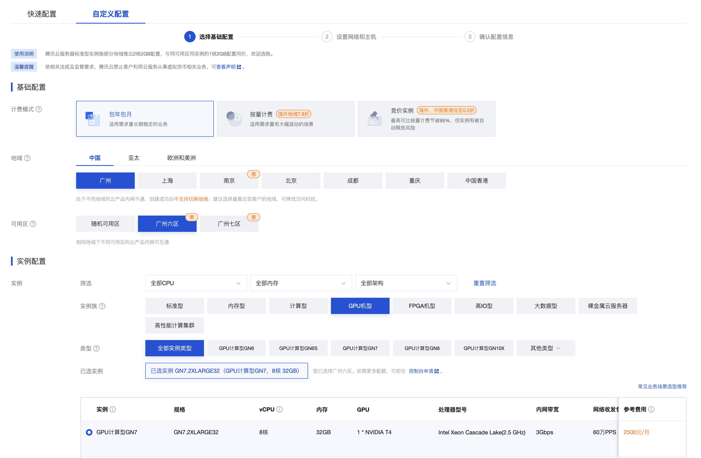
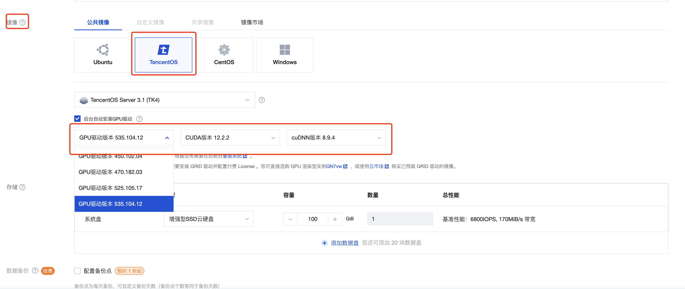
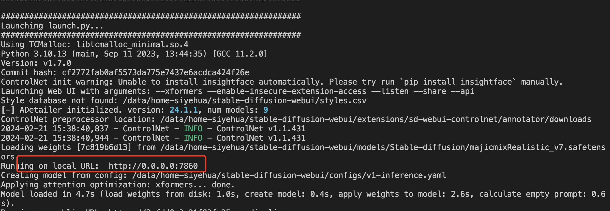
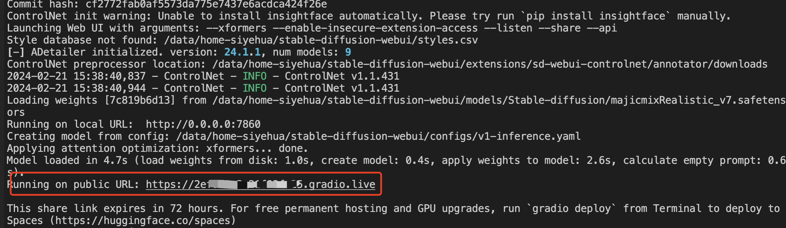
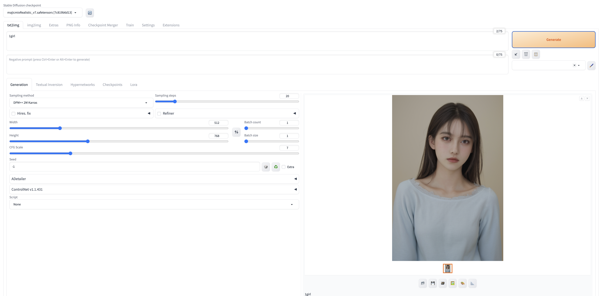

# 准备服务器

服务器购买：

[腾讯云 GPU 服务器](https://buy.cloud.tencent.com/cvm?tab=custom&step=1&devPayMode=monthly&regionId=1&templateCreateMode=createLt&isBackup=false&backupDiskType=ALL&backupDiskCustomizeValue=&backupQuotaSegment=1&backupQuota=1)<br>
[阿里云 GPU 服务器](https://www.aliyun.com/product/ecs/gpu?spm=5176.28989169.J_4VYgf18xNlTAyFFbOuOQe.150.55a31db8jHIeww&scm=20140722.S_product@@%E4%BA%91%E4%BA%A7%E5%93%81@@70261._.ID_product@@%E4%BA%91%E4%BA%A7%E5%93%81@@70261-RL_GPU-LOC_menu~UND~product-OR_ser-V_3-P0_0)


腾讯云跟阿里云差不多，还有一些现成的镜像就不再这里说明, 这里以腾讯云购买来讲解.

# 购买
1. 点击链接后，选择 GPU，一般选择 T4 ,有 16G 的 GPU，足够了：
   

2. 购买的时候选择系统与驱动：
   

镜像：一般在腾讯云就选 TencentOS，跟 CentOS 差不多，但是 CentOS 不维护了，而 TencentOS 还有一些 Tecent 专有的组件。
GPU 驱动： 这里建议自动安装 GPU 驱动，手动安装 GPU 驱动特别麻烦，一般选最新的驱动，cuda 即可。关于 GPU 驱动与 Cuda 的关系，可以看这里 [GPU 驱动, CUDA, Pytroch 之间关系](/blog/一文读懂-ai-项目环境基础知识)


# 初始化账号
购买好服务器之后，拿到 root 的用户名与密码，并以 root 用户登录


##  1. 新建 xxx 账户
为什么要新建账号？ 因为 StableDiffusion 不允许以 root 权限直接运行。虽然可以通过修改源码允许 root 方式运行，但是有一些 AI 项目是恶意脚本与病毒，为了安全，最好不要以 root 权限运行。

那为啥要以 root 用户登录，因为以 root 用户登录才能拿到更多的权限，比如给新建的账号赋予 root 权限。

那为啥要给新建的账户赋予 root 权限呢？因为StableDiffusion依赖特别多的组件与包，有些包必须使用 root 权限安装。举个例子，如果开头我们并没有后台安装渠道，那此时自己手动安装驱动，cuda，就必须要 root 权限。

总结：`我可以不是 root 用户，但是我不能没有 root 权限`

执行一下命令新建账号，其中`xxx` 替换成你自己喜欢的`英文用户名`

```shell
useradd -d /data/home-xxx xxx
echo '用户:密码' | chpasswd
```

## 2. 给刚才新建的用户增加 sudo 权限
编辑/etc/sudoers文件，找到 root ALL=(ALL) ALL 这一行，在此行下面添加一行代码，注意使用wq!强制改写保存文件

```shell
vi  /etc/sudoers
xxx  ALL=(ALL)  ALL
```

## 3. 切换到刚才新建的用户

```shell
su xxx
```

## 4. 切换到用户的账号目录

```shell
cd /data/home-xxx
```

其中，1,2步骤执行一次就可以，3，4 步骤每次登录服务器都要执行！！切换到自己新建的账户

# 安装必要的环境

首先我们要明白现在绝大多数的AI 项目，都是需要 Python 脚本去运行的，而 Python 的环境与各种依赖，又是出了名的难搞，所以我们请出了著名的 Python 环境管理工具：`Conda`，专治 Python 的各种不服.

## 1. conda 介绍
Conda 是一个开源的软件包管理系统和环境管理系统，用于安装和管理软件包及其依赖关系。它最初是作为 Python 语言的软件包管理器而开发的，但后来也扩展到支持其他语言和平台。

Conda 的主要功能包括：


1. 软件包管理：Conda 可以帮助用户安装、升级、删除和管理软件包。它有一个庞大的软件包仓库，用户可以从中选择他们需要的软件包。

2. 环境管理：Conda 允许用户创建多个独立的环境，每个环境都可以拥有自己的软件包集合和依赖关系。这使得不同项目可以使用不同版本的软件包，而不会相互干扰。

3. 跨平台支持：Conda 可以在 Windows、macOS 和 Linux 等多种操作系统上运行，因此可以为跨平台开发提供便利。

4. 软件包依赖解决：Conda 能够解决软件包之间的依赖关系，确保安装的软件包能够正常运行。

5. 扩展性：Conda 可以与其他工具集成，例如 Jupyter Notebook、Anaconda 等，使得它成为数据科学和科学计算领域的重要工具之一。


Conda 是 Anaconda 发行版的一部分，但也可以作为一个独立的工具来使用。通过 Conda，用户可以轻松地管理他们的软件包和环境，使得开发和部署应用程序变得更加简单和可靠。

## 2. 安装 conda 环境

```shell
wget https://repo.anaconda.com/miniconda/Miniconda3-latest-Linux-x86_64.sh
sh Miniconda3-latest-Linux-x86_64.sh
```

`安装好之后界面会提示你重启，记得一定要重启命令工具 shell，不然会提示找不到 conda`

## 创建 Stable diffusion

根据前文的介绍，Conda 主要是为了隔离不同项目之间的环境，假设我们有多个 AI 项目，依赖的环境都不太相同，而且都在同一个服务器，安装不同的版本就会报错，为了避免这个问题，我们单独给 Stable diffusion 创建一个独立的环境。

创建一个环境给 Stable diffusion， 安装 python=3.10.6 并命名为 py310 环境

```shell
conda create -n py310 python=3.10.6
```

切换到该环境，这一步也是每次都必须做的：

```shell
conda activate py310
```

## 3.下载并安装  stable-diffusion-webui

首先 stable diffusion 有多个可用的项目，这里主要介绍的是最经典的[AUTOMATIC1111](https://raw.githubusercontent.com/AUTOMATIC1111/stable-diffusion-webui), 该项目能打开一个 web界面，所以通常也叫 webui.


1.按照之前第一步创建账户步骤，我们创建一个目录`/data/home-xxx`, 这个时候我们进入到这个目录

```shell
cd /data/home-xxx
```

2.浏览器点击[web ui 自动安装脚本](https://raw.githubusercontent.com/AUTOMATIC1111/stable-diffusion-webui/master/webui.sh)，然后复制到剪切板

3. 新建一个文件 `webui.sh`:

```shell
touch webui.sh
```

打开 `webui.sh`:

```shell
vi webui.sh
```

按 `i` 进入编辑模式，把刚才复制的内容粘贴上，并按 `Esc` 退出编辑，按`shift + :`，输入：`wq` 保存并退出

接着开始安装, 执行刚才的文件，即可自动安装 `webui`：

```shell
sh webui.sh
```

# 初始化 webui

初始化完毕，进入 `stable-diffusion-webui` 目录：


```shell
cd stable-diffusion-webui
```

执行:

```
shellsh webui.sh
```


## 错误处理
```
Commit hash: cf2772fab0af5573da775e7437e6acdca424f26e
Launching Web UI with arguments:
no module 'xformers'. Processing without...
no module 'xformers'. Processing without...
No module 'xformers'. Proceeding without it.
xxxxx
xxxxx
ImportError: libGL.so.1: cannot open shared object file: No such file or directory
```

遇到这个错误是没有安装Mesa 与 xformers 库，安装一下就好了


```
sudo yum install mesa-libGL
```

至此，所以的步骤都已经完毕, 直接运行:

```shell
./webui.sh
```



一般运行后会有一个本地地址，这个本地地址通过浏览器就能直接访问，但是但是，我们这个是服务器，是没有浏览器的应该如何访问？

下文将讲解！！

# 运行

重点: 以后每次进到服务器，只需要执行下面步骤即可：

```shell
# 先切换到自己新建的账户
su xxx
```

```shell
# 进入到 sd 的目录
cd /data/home-xxx/stable-diffusion-webui
```


```shell
# 进入到 sd 的目录
cd /data/home-xxx/stable-diffusion-webui
```

```shell
# 激活 Stable Diffusion  环境
conda activate py310
```


```shell
# 启动 web ui
./webui.sh --xformers --share --enable-insecure-extension-access --listen

```

## 启动参数详解
`--xformers`： xformers 优化，出图效果更快更好<br>
`--share`: 分享到 `gradio.live`, 执行这个参数生成一个外链，这个外链的有效期是 72 小时，无论是谁拿到这个外链都能访问，有一定的安全隐患：<br>
<br>
前面说了，服务器是没有浏览器的，可以通过这个方法访问。<br>
`--enable-insecure-extension-access`: 这个意思是允许扩展执行脚本，有些扩展需要执行脚本的，一般这个功能是禁用的，如果有些插件无法安装，就考虑将运行它<br>
`--listen`: 内网穿透，比如你的服务器地址是：`8.123.34.108`, 执行之后，你就能通过：`http://8.123.34.108:7860` 来访问 `webui`<br>

正常情况下还是不能访问 webui 的，因为云服务一般仅开放有限的端口，默认的 7860 是不放开的，需要到设置端口页面设置放开，详见[腾讯云服务器,怎么开放端口](https://cloud.tencent.com/developer/information/%E8%85%BE%E8%AE%AF%E4%BA%91%E6%9C%8D%E5%8A%A1%E5%99%A8%2C%E6%80%8E%E4%B9%88%E5%BC%80%E6%94%BE%E7%AB%AF%E5%8F%A3%3F-album)


一切弄好之后，电脑就能愉快的访问了：



