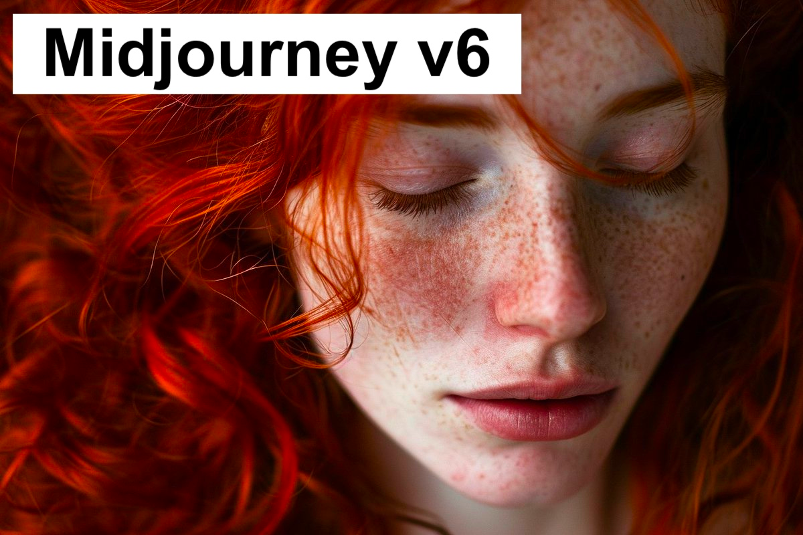
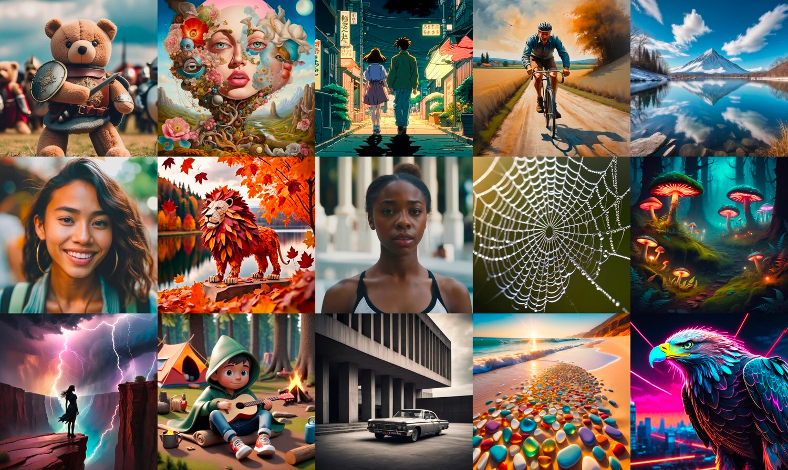
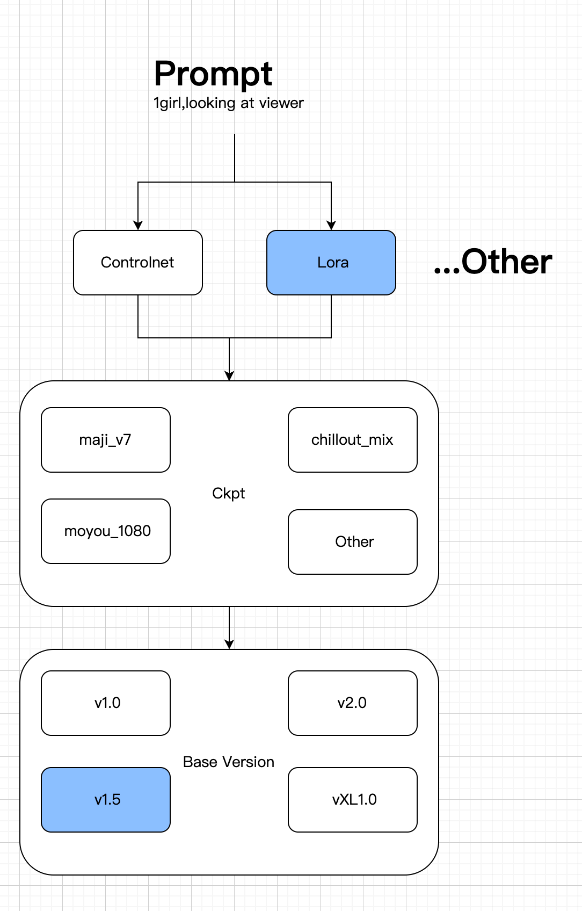
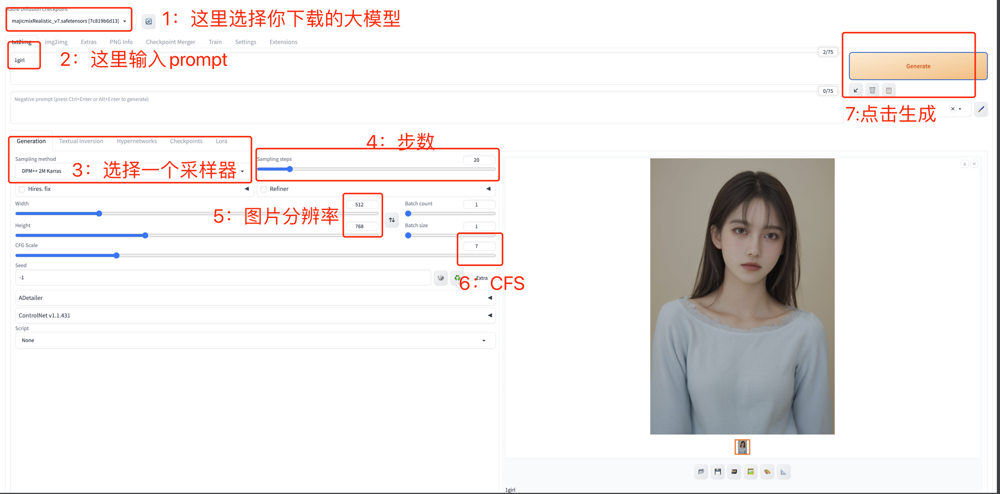
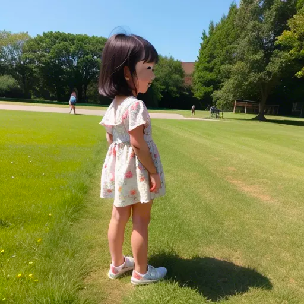
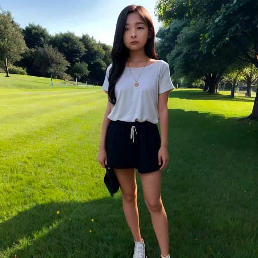
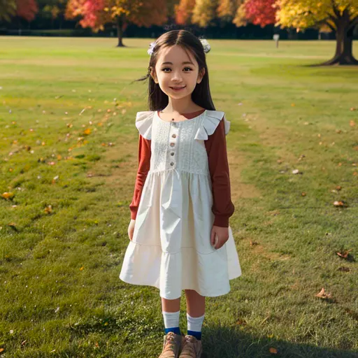
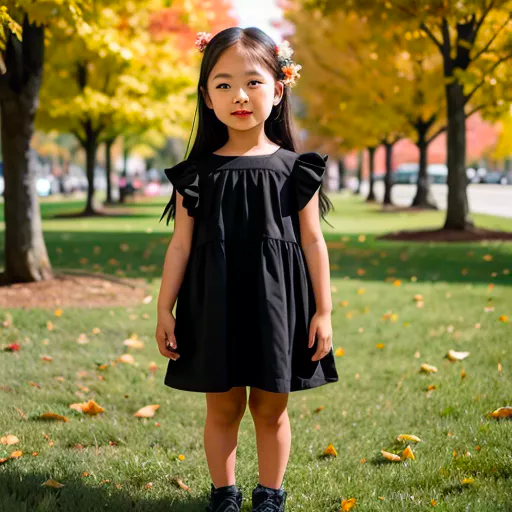
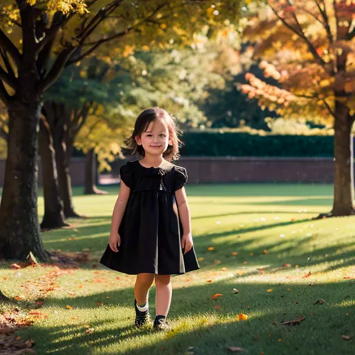
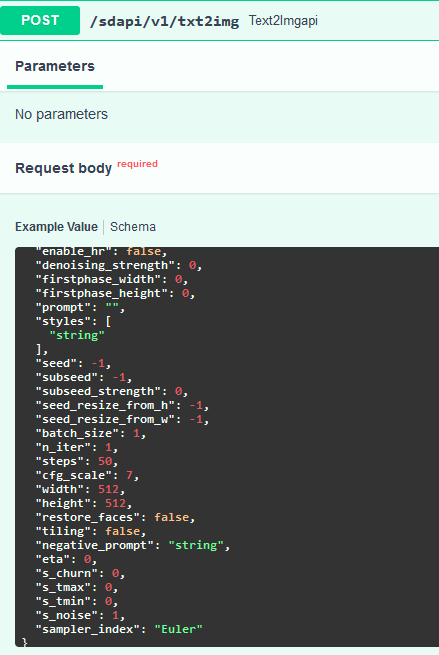

关于 AI 绘画的文章太多了，建议大家先直接从网上搜索，我这里就不展开了，这边文章主要是针对开发者的，设计，产品等同学可以在 B 站，知乎等地方搜索更多资料<br>

推荐一篇我看的：
[超详细！AI 绘画神器 Stable Diffusion 基础教程](https://www.uisdc.com/stable-diffusion-2)

## AI 绘画种类
AI 绘画领域包含了多种技术，每种技术都有其独特的应用场景和创作风格。主要的种类有：

* 生成对抗网络 (GANs): 通过对抗过程生成高质量的图像。
* 变分自编码器 (VAEs): 生成与训练数据类似的新图像，但带有变化。
* 神经风格迁移: 将一种艺术风格应用到其他图像上。
* Diffusion 模型: 通过模拟扩散过程来生成细节丰富的图像。
* Transform 模型: 利用自注意力机制生成高质量的图像。

这几类技术都有比较典型的代表，发展至今，目前市面上有三大主流绘画是比较好的，它们分别是：

### Stable Diffusion 技术

官方地址：[stable ai](https://stability.ai/stable-image)

* 技术原理：Stable Diffusion 是基于 Diffusion 模型的改进版本，它通过引入隐向量空间来解决原始 Diffusion 模型的速度瓶颈问题。Stable Diffusion 能够处理多种图像生成任务，包括文生图（text to image）、图生图（image to image）、特定角色刻画、超分辨率和上色等。
* 开源属性：Stable Diffusion 是一个完全开源的项目，包括模型、代码、训练数据、论文和生态等。这使得它能够快速构建一个强大且繁荣的上下游生态，吸引了众多 AI 绘画爱好者和行业从业者的参与。
* 应用范围：由于其开源和免费的特性，Stable Diffusion 被广泛应用于个人项目、研究和商业用途，促进了 AI 绘画技术的普及和发展。

**可以说，目前国内的绘画基本上都是基于 Stable Diffusion 的技术进行改造升级的。**

但是 Stable Diffusion 不能开箱即用，需要配置好用的模型以及参数设置，才能生成好看的图片，它是三个绘画中最复杂的，但是也是控制图片最精确的。

### Midjourney 技术

官方地址：[Midjourney](https://www.midjourney.com/home?utm_source=google&gad_source=1&gclid=Cj0KCQjwiMmwBhDmARIsABeQ7xR4T9C74fZWKfe4Or8gqUbBIjRpjXWHeHZ4H4fOtS1K7MrciEzRpYMaAi87EALw_wcB)

* 技术原理：Midjourney 是一个 AI 绘画平台，它使用自己的专有技术和算法来生成图像。虽然具体的技术细节没有公开，但它被认为在生成图像的艺术度方面表现出色。
* 用户体验：Midjourney 提供了一个用户友好的界面，允许用户通过简单的文本提示来生成图像。它在艺术创作和设计领域中得到了广泛的应用。
* 商业模型：Midjourney 是一个付费服务，用户需要订阅才能使用其全部功能。

Midjourney 是目前公认的最好的生图模型，生成的照片都非常漂亮，只需要使用非常简单的 prompt 与指令，就能生成非常好看的图片。


由于 Midjourney 不开源，在国内也无法使用，所以对于我们开发者来着，其实不太需要了解它，如果需要转接它的 API 就是另外一回事了。

### DALL·E 3 技术


官方地址：[DALL·E 3](https://openai.com/dall-e-3)


* 技术原理：DALL·E 3 是由 OpenAI 开发的 AI 系统，它使用了变分自编码器（VAE）和 Transformer 架构来生成图像。DALL·E 3 特别擅长理解复杂的文本提示，并生成与之相匹配的高质量图像。
* 图像质量：DALL·E 3 在图像的连续性和对提示词的理解方面表现出色，其生成的图像质量被认为是非常高的。
* 商业模型：DALL·E 3 是 OpenAI 提供的服务，用户可以通过 API 访问，但需要付费使用。

DALL·E 3 生成的图片并不是最好看的，由于它也是闭源的，对我们开发者来说也没什么好研究的，可以看看它的[原理](https://finance.sina.cn/blockchain/2023-10-24/detail-imzsemws3376148.d.html)


虽然 DALL·E 3 对比上面两个的优点它都没有，但是它对于文本的理解远超上面两个绘画。这是非常重要的，我们将会在下面详细讲解。

## 绘画基础知识
绘画目前主要有两种形式： `文生图` 或 `图生图`， 这里以 Stable Diffusion 为例，讲解一下文生图的大概原理：<br>
* 首先，输入 Prompt 提示词 “paradise, cosmic, beach”，经过 Text Encoder 组件的处理，将输入的 Prompt 提示词转换成 77×768 的 Token Embeddings，该 Embeddings 输入到 Image Information Creator 组件；
* 然后，Random image information tensor 是由一个 Latent Seed（Gaussian noise ~ N(0, 1)） 随机生成的 64×64 大小的图片表示，它表示一个完全的噪声图片，作为 Image Information Creator 组件的另一个初始输入；
* 接着，通过 Image Information Creator 组件的处理（该过程称为 Diffusion），生成一个包含图片信息的 64×64 的 Processed image tensor，该输出包含了前面输入 Prompt 提示词所具有的语义信息的图片的信息；
* 最后，上一步生成的 Processed image tensor 信息经过 Image Decoder 组件处理后生成最终的和输入 Prompt 提示词相关的 512×512 大小的图片输出。<br>

<br>简单点理解就是：<br>
用户输入一段文字描述：`Create a beautiful girl`，交给生图模型，然后生图模型根据对文本的理解，模型根据算法模型，生成了一张图片：<br>


`图生图` 也类似, 我们看一下大概的原理：


相关资料：<br>
http://shiyanjun.cn/archives/2212.html <br>
https://zhuanlan.zhihu.com/p/583124756 <br>
https://xie.infoq.cn/article/2c72b3695a030af45ac30acc5 <br>

### 底层流程


### 应用层流程




根据上面的介绍我们知道，AI 的模型是非常重要的，不同的 AI 生图模型处理的方式与技术，算法都不相同，对于 AIGC 的开发者来说，
我们首先要熟悉它的生图流程，而生图流程中，`prompt`,即文字提示，几乎是最重要的一环。<br>
关于如何写好 prompt，请看下面的介绍。

## 掌握哪个？

上面介绍了这么多，作为开发者，目前对于绘画来说，要么是将 DallE3 或者 Midjourney 的接口给扒出来，然后封装成 api，代理给国内使用，
要么就是玩 Stable Diffusion。

对于设计等岗位来说，绘画哪个好用就用哪个，但是对于开发者来说，一定要选好对应的路线，不然研究方向错了，就白学了。比如现在学移动客户端开发，虽然用 `49年入国军` 来
形同不太恰当，但是也差不多，现在移动客户端岗位真的很少了，有点类似于让你现在成立手机公司生产手机？？<br>
按照目前 AI 绘画的趋势，Stable Diffusion 目前，或者是很长一段时间 AI 绘画开发从业者必须掌握的技术。原因很简单：

1. Stable Diffusion 开源可控，可商用。其他的绘画就算再优秀，国内的使用，也只是代理，接口封装，再套壳，本身跟 AI 毫不相关，所以其他的 AI 绘画绝对不会是 AIGC 开发者的赛道。
2. 以 Stable Diffusion 开源的 1.5版本绘画项目， 已经大量应用在国内的 AI 绘画头部领域，包括妙鸭，一刻相机，美图，小红书等等。
3. 不仅仅是绘画项目，一些大模型，比如腾讯的混元，阿里的通义千问，底层基本上也是基于 Diffusion 绘画模型进行改造的。

所以掌握了 Stable Diffusion，不管是自己创业，亦或是应聘 AIGC 绘画岗位，都是必备的。尽管 Stable Diffusion 3 现在还没有开源，
传言它相关的公司没钱即将破产了，但其实这并不会影响我们研究 Stable Diffusion，以 Stable Diffusion 为的扩散绘画模型，我们国内
已经掌握了相关的技术，哪怕 3 不开源，也不影响我们研究绘画的未来技术。

说一点题外话，其实目前不管是 Stable Diffusion，Midjourney，还是 OpenAI，都是亏钱的，只不过是 SD 它没有找到投资，烧钱要烧不下去了。<br>
其次是对于国内来说，AI 的方向远比源码更加重要，比如说最近大火的 Sora，尽管 OpenAI 没有开源，但是国内的顶尖公司与高校，可以从它公布的的论文里，复刻
它的能力。可能论文对自媒体来说就是写文章的素材，但对于顶尖科学家来说，它真的就是通往宝藏的钥匙。<br>
同时大家可以看到腾讯，阿里，字节，小红书等国内大厂，每个一段时间就会发布一个 AI 的绘画的相关项目，其实就是基于对 Diffusion 扩散模型的研究与理解，在上面
进行了自己的创新。<br>
本人在国内某个大厂，工作中接触到了一点公司关于AI 绘画的研究，以及一些原理等，基本上都是基于 Diffusion 去调整与优化的。所以至少在目前为止，大家掌握 Stable Diffusion
还是必备的，如果想找相关的工作，想它准没错。

## 如何部署

那如何部署 Stable Diffusion 呢？目前 Stable Diffusion 使用与研究最广泛的研究是 SD1.5，如果没有特殊说明，我都是基于 SD 1.5 来讲解的。<br>

Stable Diffusion 1.5 地址：https://github.com/runwayml/stable-diffusion

如果需要直接使用该项目生图，需要 Python 环境，这也是我在前面的文章[《如何入门 AIGC 开发者》](/普通开发者应该如何入门-aigc-开发) 中已经讲过，Python 是基础，是必学的。


一次简单的生成：

```python
from diffusers import StableDiffusionPipeline
import torch

model_id = "runwayml/stable-diffusion-v1-5"
pipe = StableDiffusionPipeline.from_pretrained(model_id, torch_dtype=torch.float16)
pipe = pipe.to("cuda")

prompt = "a photo of an astronaut riding a horse on mars"
image = pipe(prompt).images[0]

image.save("astronaut_rides_horse.png")
```

上面是使用代码直接调用出图，我们当然可以将它的各种参数，能力封装成 api，这样就可以给业务调用了。但是 SD 非常的复杂，相关的参数也特别多，如果是直接这么搞，
我的这篇文章应该叫：《AI 绘画开发者从入门到放弃》。

入门一个陌生的领域，一定要从简单再到复杂，这也是我为什么建议大家先大家先看看 AI 绘画，它相对来说最成熟，最简单，然后又能很直观的出效果，有了效果，开发者
就有了进一步学习的动力。


### 目前主流 Stable Diffusion 封装
前面说了，由于 SD 比较复杂，所以一般来说我们可以先用别人封装好的。

目前主流的项目有两个，一个是 [WebUI](https://github.com/AUTOMATIC1111/stable-diffusion-webui), 一个是 [ComfyUI](https://github.com/comfyanonymous/ComfyUI),
这两个各有优缺点， WebUI 相对来说比较成熟，目前使用也比较广泛，它专注于 SD 绘画，而 ComfyUI 则相对来说比较灵活，它不仅仅是对 SD 的封装，它可以是任意的
工作流。

举个简单的例子，如果我需要需要生成一张写实人物照片，并将照片转成二次元动漫风格，使用 WebUI 的话，就必须自己手动处理，但是 ComfyUI 可以将这两个步骤
串联在一起，从而形成工作流。这对于普通来说，ComfyUI 就是神器，但对于开发者来说，这两者没有本质的区别，因为开发者会编程，将 AI 绘画的相关流程，使用代码
串联在一起即可，而且更加的灵活。

ComfyUI 没有解决 Python 复杂的环境问题，所以它对开发者来说，可以去研究它，但它无需花费太大的精力，无论是 ComfyUI 还是 WebUI，本质上还是基于 SD 的基础上
创建的。


我下面就以使用更加广泛的 WebUI 为例来举例应该如何使用与部署等。

### Windows
如果你使用的 Windows，那我强烈建议你使用秋叶大佬整合的一键安装包：[秋叶整合包](https://www.bilibili.com/video/BV1iM4y1y7oA/?spm_id_from=333.337.search-card.all.click),
千叶是一个非常出名的 AI 绘画大佬，他整合的 AI 绘画包，让很多人的电脑可以直接使用 SD，而无需理会复杂的安装环境
### Mac
Mac 的 intel 芯片，基本上很少能跑 SD 的，适配不好， ARM 系列的芯片，由于 SD 适配的也不是很好，很多东西都需要修改，最好还是用别人弄好的一键安装包。
这里提供一个地址：[diffusionbee](https://diffusionbee.com/)

### Linux/服务器

这个才是我们的需要掌握的重点，如果我们需要进行业务开发，那系统肯定是 Linux 系统无疑. 如果自己想部署的，可以有两条路径：
1. 购买各大厂商的云服务器，例如：腾讯云，阿里云等等。这些厂商还提供了一些临时的 SD 镜像，可以提供给个人用户做测试，尝鲜用途
2. 专注于 AI 赛道的一些公司或网站，例如：魔搭，里面有非常多镜像，可以一键启动，免部署

如果是后端同学，那服务器知识就比较熟悉了，这小节可以直接跳过，如果不熟悉的同学，可以看我这篇文章：[GPU云服务器安装StableDiffusion](/gpu云服务器安装stablediffusion)
,这篇文章详细讲讲了如何在服务器启动与运行一个 SD。
### 其他云端
对个人用，或者想尝鲜，试试 StableDiffusion 绘画的，上面的部署都非常麻烦，而且，很多的人电脑都无法达到最低的 GPU 性能要求。
而各个 AI 公司封装的绘画界面，又封装的太彻底，导致很多参数都没法设置。

所以如果又想尝试各种功能，又不想这么麻烦的，建议直接用上面提到的各个资源网站里的生图或者训练功能，它们提供了一定的免费额度可以让新用户尝试。

这里提供几个地址：<br>
国内1：https://www.liblib.art/<br>
国内2：https://tusiart.com/<br>
国外：https://civitai.com/<br>

## 简单使用

如果你已经成功的将 SD 跑起来，那么恭喜你，终于到了该该如何使用环节了，其实关于如何使用的文章网上非常多，我这里只说最简单的如何使用 WebUI 生成一张图片：


按照图中的步骤，一张图片就生成出来了。

## SD 是如何运行的？
按照上面的步骤，一张神奇的图片就出来了，那它是如何生成的呢？ 底层的原理我前面已经大概得讲过，那在应用层上呢？

1. 首先所有的一切，但是运行在 StableDiffusion 的模型基础上的，先有 SD 后有天。
2. WebUI 或 Comfy 是对 StableDiffusion的封装，更方便我们调用 SD，他们仅仅是调用工具。
3. SD 的运行，首先一个一个大模型，这个大模型就是我们常说的通过大数据训练集，训练出来的一个版本，比如上文说得 SD1.5 版本。
4. 由于 SD1.5 是一个全能的版本，全就意味着它不精，就需要我们人为的去调教它，在此基础上，就有很多人训练了自己的大模型 Checkpoint，比如非常出名的[麦橘](https://civitai.com/models/43331/majicmix-realistic),它就是擅长一个写实类的1.5 大模型 ，大模型一般都有一个大的方向的侧重，比如比较擅长画人物，或比较擅长画建筑等等
5. 在大模型的基础上，还会有一个小模型，通常叫：Lora, Lora 是基于大模型的基础上训练的，比如我需要训练一个迪丽热巴的人脸出来，如果直接写 prompt，SD 大概率是无法生成对应的人脸，毕竟它的训练量是有限的，而我们的现实世界的内容可以说是无限大的，所以我们就需要训练一个专门的迪丽热巴Lora
6. 在此基础上，我们再写上自己的 prompt，就能生成自己想要的人物，比如：`1 girl, looking at the viewer`, 这样就会出来一个女孩看着你

上面就是基本的运行原理，当然还有很多相关的参数，比如我上图中的3,4,6 步骤如果没有设置好，可能会出来让人非常不适的图片。还有更加复杂的 controlnet，
已经大模型Checkpoint，小模型 Lora 如何训练，这些大家可以自己在网上找相关的资料，不是说这些不重要，哪怕你是一个开发者，你也必须了解 SD 的大部分功能是如何使用的，
由于我们这里主要是强调开发者如何入门与使用 AI绘画，所以就不展开讲解，我这里推荐一篇：

[如何训练自己的 Lora](https://www.uisdc.com/stable-diffusion-lora)

## 理解 Diffusion 与 Transform

上文有多次提到了 Diffusion，可以说目前 Diffusion 就是 AI 绘画的未来，关于它的原理其实上面已经提到了一下，Transform 也是其中的关键步骤，OpenAI 的相关论文多次提到了
Transform 的重要性，我这里找到了更多资料，大家可以看看：

[人工智能Ai画画——stable diffusion 原理和使用方法详解](https://zhuanlan.zhihu.com/p/610094594)
[Diffusion 论文](https://arxiv.org/abs/1503.03585)

## 如何写绘画 prompt?

关于如何写好 Prompt，我在这边文章中已经给了相关的教程：[prompt-engineering](/普通开发者应该如何入门-aigc-开发/#prompt-engineering),但是
对于 AI 绘画来说，Prompt 是专有的，除了上面的基础知识，我们还需要更加精准的描述图片 Prompt，一般来说，对于 SD1.5，它对 prompt 的提示，更加倾向于
对单词的描述，而对于 SDXL，SD2.0 或以上，则对句子的描述理解更加到位，另外Midjourney，Dalle3 也是对句子的描述理解更为准确。

网上有一些教程，会教你使用一些单词，比如：`worst quality`, `realistic` 等等，实际上这些单词局限性太强了，目前只适应于 SD1.5，如果迁移到 Midjourney，Dalle3，
或者换 SD 版本，那一般没法很好的生成对应的图片。各种复杂的 prompt，造就了出图的不确定性，这也是为啥大部分人都称自己是`炼丹师`。不是说这些学了一点用都没有，
我认为大家只需要掌握一些常用的词汇，没必要刻意去学。<br>
通往 AGI 路这里有个链接，大家可以去看看，有用的话可以查阅：https://waytoagi.feishu.cn/wiki/Mhqiw44YMigBzYkD9yUcMAxfn3f

也就是说，未来 AI 绘画大概率是用自然语言句子的形式去描述一张图片应该怎么生成。那应该怎么组装句子呢？<br>
我们上学的时候，老师经常说句子的要素:时间，地点，人物，事件, 事件的起因，经过，结果。对于 AI 绘画来说，它一般也有固定的句式。

### 绘画 Prompt 句式

总结：主体 + 画风/风格/画家 + 额外细节 + 光照/色调

这里使用 lib 的在线生图功能：https://www.liblib.art/sd 选的大模型是`AbsoluteReality`, 采样器用 DPM++ 2M Karras, 其他参数都是默认的。

#### 主体
就是我们经常说的，描述一个完整的画面，比如描述一个小女孩在草地上，可以这些写：

`A girl was standing on the grass`



然后你就发现，这小女孩不对呀，我希望，能看到她的正脸，所以我们接着描述：

`A girl was standing on the grass, looking at the viewer`



#### 画风/风格/画家
这样就基本符合了，但是还不够，我们想换一个风格，比如我希望这画面是一个秋天的画面，穿着连衣裙：

`A little girl wearing a dress in the Fall is standing on the grass, looking at the viewer`




#### 额外细节

秋天的画面出来了，这时候我们需要加一些额外细节，比如我喜欢她连衣裙是黑色的，但不是黑色的也行. 额外细节与主体的区别是，它不放在句子前面，一般单独放后面，并且没
那么重要, AI 不一定会按照额外细节绘制：

`A little girl wearing a dress in the Fall is standing on the grass, looking at the viewer, black dress`




#### 光照/色调

最后我们希望画面是逆光：

`A little girl wearing a dress in the Fall is standing on the grass, looking at the viewer, black dress, backlighting`




可以看到，我们就是这样一步步的利用 prompt, 将我们想要的画面给呈现出来。

## 学习网站
更多的相关知识，推荐一个系列教程：
[SD 详细教程](https://waytoagi.feishu.cn/wiki/FUQAwxfH9iXqC9k02nYcDobonkf)

## 模型网站

[civitai](https://civitai.com/)
[liblib](https://www.liblib.art/)
[tusiart](https://tusi.cn/)

## API 调用

如果你想入门 AI 绘画，看到这里就基本差不多了，但你是一个 AI绘画开发者，你还要学会如何使用接口与调整参数。<br>
前文已经讲到，实际上我们可以直接将 SD 项目的能力封装成各种借口给业务调用，但是这非常复杂，好在 WebUI 本身已经封装好了，可以看[GPU云服务器安装StableDiffusion](/gpu云服务器安装stablediffusion)
里面讲到了如何开启 API，开启了之后，WebUI 的 API 就在网页的最下面，我们直接点击就会跳转到api 页面，假设你的地址是 `x.x.x.127:7860`， 则 api 地址是：
`http://x.x.x.127:7860/docs#`:



一个简单的文生图例子参数：

```shell

	文生图 json 例子
		{
  "prompt": "1girl", # prompt
  "negative_prompt": "", # negative_prompt
  "styles": [ # Lora
  ],
  "seed": -1, # 种子
  "subseed": -1,
  "subseed_strength": 0,
  "seed_resize_from_h": -1,
  "seed_resize_from_w": -1,
  "sampler_name": "Euler", # 采样器
  "batch_size": 1, # 生成批次
  "n_iter": 1,
  "steps": 20, # 步数
  "cfg_scale": 7, # CFg
  "width": 512,  # 宽
  "height": 768, # 高
  "restore_faces": false, # 是否重绘人脸
  "tiling": false,
  "do_not_save_samples": false,
  "do_not_save_grid": false,
  "eta": 0,
  "denoising_strength": 0,
  "s_min_uncond": 0,
  "s_churn": 0,
  "s_tmax": 0,
  "s_tmin": 0,
  "s_noise": 0,
  "override_settings": {},
  "override_settings_restore_afterwards": true,
  "refiner_checkpoint": "",
  "refiner_switch_at": 0,
  "disable_extra_networks": false,
  "comments": {},
  "enable_hr": false,
  "firstphase_width": 0,
  "firstphase_height": 0,
  "hr_scale": 2, # 放大倍率
  "hr_upscaler": "",
  "hr_second_pass_steps": 0,
  "hr_resize_x": 0,
  "hr_resize_y": 0,
  "hr_checkpoint_name": "", #大模型名字
  "hr_sampler_name": "string",
  "hr_prompt": "",
  "hr_negative_prompt": "",
  "sampler_index": "Euler",
  "script_name": "",
  "script_args": [],
  "send_images": true,
  "save_images": false,
  "alwayson_scripts": {}
}
```

最后返回的是一个 base64编码的图片流，可以用这个网站解码：[图片丢到这里解码](https://codebeautify.org/base64-to-image-converter)
这样就能看到自己的图片了

## 参考资料
[stable ai](https://stability.ai/stable-image) <br>
[stable-diffusion-1.5](https://huggingface.co/runwayml/stable-diffusion-v1-5) <br>
[stable-diffusion-1.5](https://github.com/runwayml/stable-diffusion) <br>
[stable-diffusion-2](https://huggingface.co/stabilityai/stable-diffusion-2) <br>
[stable-diffusion-2](https://github.com/Stability-AI/stablediffusion) <br>
